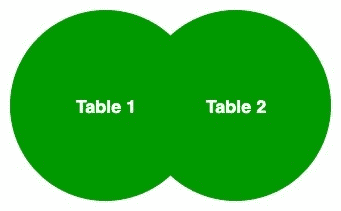

# 在 LINQ 交叉加入

> 原文:[https://www.geeksforgeeks.org/cross-join-in-linq/](https://www.geeksforgeeks.org/cross-join-in-linq/)

在 LINQ，交叉连接是一个过程，其中两个序列的元素相互组合意味着第一个序列或集合的元素与另一个序列或集合的元素组合，而没有任何键选择或任何过滤条件，并且结果序列中存在的元素数量等于两个源序列或集合中元素的乘积。或者换句话说，我们可以说交叉连接会产生笛卡尔乘积。交叉连接也称为完全连接。在交叉连接中，我们不要求在指定连接条件的关键字上有*。*



让我们借助给定的例子来讨论这个概念:

**例 1:**

```
// C# program to illustrate the concept
// of the cross join
using System;
using System.Linq;
using System.Collections.Generic;

// Employee details
public class Employee {

    public int emp_id
    {
        get;
        set;
    }

    public string emp_name
    {
        get;
        set;
    }
    public string emp_lang
    {
        get;
        set;
    }
    public int dpt_id
    {
        get;
        set;
    }
}

// Employee department details
public class Department {

    public int dpt_id
    {
        get;
        set;
    }

    public string emp_dept
    {
        get;
        set;
    }
}

class GFG {

    // Main method
    static public void Main()
    {
        List<Employee> emp = new List<Employee>() {

            new Employee() { emp_id = 101, emp_name = "Amit",
                             emp_lang = "Java", dpt_id = 1 },

                new Employee() { emp_id = 102, emp_name = "Mohit",
                                    emp_lang = "C#", dpt_id = 2 },

                new Employee() { emp_id = 103, emp_name = "Sona",
                                 emp_lang = "Java", dpt_id = 1 },

                new Employee() { emp_id = 104, emp_name = "Lana",
                                  emp_lang = "C++", dpt_id = 3 },

                new Employee() { emp_id = 105, emp_name = "Roma",
                                   emp_lang = "C#", dpt_id = 2 },

        };

        List<Department> Dpt = new List<Department>() {

            new Department() { dpt_id = 1, emp_dept = "Designing" },
            new Department() { dpt_id = 2, emp_dept = "Development" },
            new Department() { dpt_id = 3, emp_dept = "JE" },

        };

        // Implementing Cross join using query syntax
        var res = from first in emp
            from second in Dpt
                select new {
                    Employee_name = first.emp_name,
                    Department_name = second.emp_dept

                };

        // Display result
        foreach(var val in res)
        {

            Console.WriteLine(" Employee Name: {0} || Department Name: {1}",
                                    val.Employee_name, val.Department_name);
        }
    }
}
```

**输出:**

```
 Employee Name: Amit || Department Name: Designing
 Employee Name: Amit || Department Name: Development
 Employee Name: Amit || Department Name: JE
 Employee Name: Mohit || Department Name: Designing
 Employee Name: Mohit || Department Name: Development
 Employee Name: Mohit || Department Name: JE
 Employee Name: Sona || Department Name: Designing
 Employee Name: Sona || Department Name: Development
 Employee Name: Sona || Department Name: JE
 Employee Name: Lana || Department Name: Designing
 Employee Name: Lana || Department Name: Development
 Employee Name: Lana || Department Name: JE
 Employee Name: Roma || Department Name: Designing
 Employee Name: Roma || Department Name: Development
 Employee Name: Roma || Department Name: JE

```

**例 2:**

```
// C# program to illustrate the concept
// of cross join
using System;
using System.Linq;
using System.Collections.Generic;

// Employee details
public class Employee {

    public int emp_id
    {
        get;
        set;
    }

    public string emp_name
    {
        get;
        set;
    }
    public string emp_lang
    {
        get;
        set;
    }
    public int dpt_id
    {
        get;
        set;
    }
}

// Employee department details
public class Department {

    public int dpt_id
    {
        get;
        set;
    }

    public string emp_dept
    {
        get;
        set;
    }
}

class GFG {

    // Main method
    static public void Main()
    {
        List<Employee> emp = new List<Employee>() {

            new Employee() { emp_id = 101, emp_name = "Amit",
                              emp_lang = "Java", dpt_id = 1 },

            new Employee() { emp_id = 102, emp_name = "Mohit",
                                emp_lang = "C#", dpt_id = 2 },

        };

        List<Department> Dpt = new List<Department>() {

            new Department() { dpt_id = 1, emp_dept = "Designing" },
            new Department() { dpt_id = 2, emp_dept = "Development" },

        };

        // Implementing Cross join using 
        // SelectMany method and lambda
        // expression
        var res_1 = Dpt.SelectMany(e => emp,(x, y) => new {
                                Department_name = x.emp_dept,
                                  Employee_name = y.emp_name});

        // Display result
        foreach(var val in res_1)
        {

            Console.WriteLine(" Department Name: {0} || Employee Name: {1}",
                                    val.Department_name, val.Employee_name);
        }

        // Implementing Cross join using 
        // Join method and lambda expression
        var res_2 = Dpt.Join(emp, x => true, y => true, (x, y) => new {
                                          Department_name = x.emp_dept,
                                          Employee_name = y.emp_name});

        Console.WriteLine();

        // Display result
        foreach(var val in res_2)
        {

            Console.WriteLine(" Department Name: {0} || Employee Name: {1}",
                                    val.Department_name, val.Employee_name);
        }
    }
}
```

**输出:**

```
 Department Name: Designing || Employee Name: Amit
 Department Name: Designing || Employee Name: Mohit
 Department Name: Development || Employee Name: Amit
 Department Name: Development || Employee Name: Mohit

 Department Name: Designing || Employee Name: Amit
 Department Name: Designing || Employee Name: Mohit
 Department Name: Development || Employee Name: Amit
 Department Name: Development || Employee Name: Mohit

```