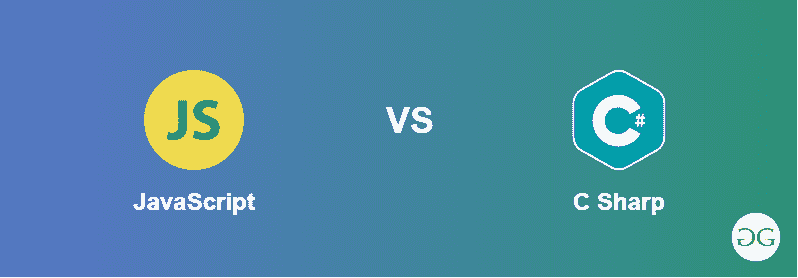

# 【JavaScript 和 C 夏普的区别

> 原文:[https://www . geesforgeks . org/JavaScript 和-c-sharp 之间的区别/](https://www.geeksforgeeks.org/difference-between-javascript-and-c-sharp/)

如今，没有人会因为学习一种方言而缺席，无论你从哪种方言开始。从长远来看，同时拥有 JavaScript 和 C# 的信息是有利的。一般来说，一个人必须像 Java 一样在 C# 中输入如此多的代码行来引导事情的完成，而在 JavaScript 中却不是这样。

[**JavaScript(JS):**](https://www.geeksforgeeks.org/javascript-tutorial/)JavaScript 可能是一种高级编程方言。它通常用于网络浏览器。除了 HTML 和 CSS，JavaScript 是万维网的建立。它使得客户端和服务器之间的交互变得可以想象。大量的网站使用 JavaScript，几乎所有尖端的网络浏览器都有一个 JavaScript 引擎。JavaScript 支持事件驱动的、有用的和基本的编程风格，它可能是一种多范例方言。它可以处理内容、集群、习惯表达式、日期，并且可以对文档对象模型(DOM)进行必要的控制。

[**C Sharp(c#)**](https://www.geeksforgeeks.org/csharp-programming-language/)T4:它可能是一种通用的、面向对象的编程方言。它期待一种简单、高级和通用的方言。已经计划构建一个从小功能扩展到扩展工作框架的程序。此外，它还是一种多范式方言，具有扎实的书面性、基础性、启示性、实用性和成分排列性。

【JavaScript 和 C 夏普的区别:

<figure class="table">

| Java Script 语言 | csharp |
| --- | --- |
| JavaScript 在没有插件先决条件的最大浏览器中运行。 | C# 需要一个插件。 |
| 它无法在客户端机器中检查或键入记录。 | 如果银光版允许，它可以检查和编写记录。 |
| JavaScript 是动态编写的。 | 静态写入。 |
| JavaScript 有独立的库来进行像下划线. js 这样的本地提问 | C# 有 LINQ，一个有效的。NET 组件，利用该组件可以进行本地提问。 |
| JavaScript 没有管理员，变化负担过重。 | C# 具有管理员和转换负担过重的能力。 |
| JavaScript 最主要的目的是直观地形成 web 应用程序。 | C# 可以用在众多广泛多样的应用程序中。 |
| JavaScript 的范围受到限制，这种方言有一些缺陷。 | C# 可能是一种真正充满活力的方言，工程师倾向于在全球范围内使用。 |
| Javascript 是一种单线程语言。 | c 夏普支持多线程。 |

</figure>