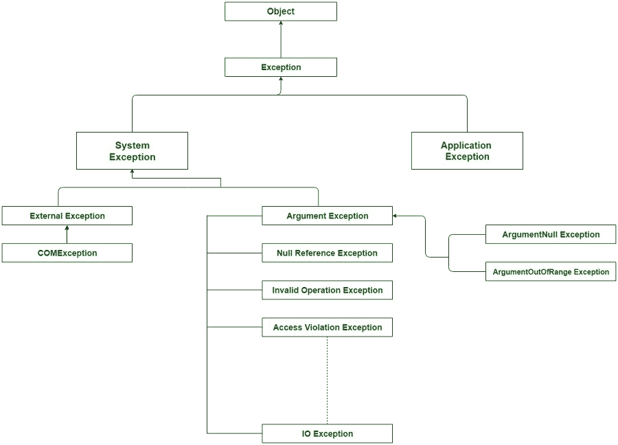

# c# 中系统级异常和应用级异常的区别

> 原文:[https://www . geeksforgeeks . org/系统级异常和应用程序级异常的区别-in-c-sharp/](https://www.geeksforgeeks.org/difference-between-system-level-exception-and-application-level-exception-in-c-sharp/)

异常是指在程序执行期间(即运行时)发生的不必要或意外的事件，它会中断程序指令的正常流动。有时在程序执行过程中，用户可能会面临程序在运行时执行过程中崩溃或显示意外事件的可能性。这种不需要的事件被称为异常，通常表示代码中有问题。在 C# 中，异常可以是*系统*或*应用程序*级别的异常。

**系统级异常:**

*   系统异常源自基类 *System。系统异常*本身就是系统异常的派生类。
*   当遇到致命或不可恢复的错误(如数据库崩溃、绑定错误等)时，会发生系统异常。

**应用级别异常:**

*   应用级异常源自基类*系统。ApplicationException* 也是 SystemException 的派生类。
*   当遇到可恢复的错误时，例如输入数据类型错误、算术异常等，就会发生应用程序级异常。
*   这些是应用程序抛出的用户定义的异常，在解决这种类型的异常后，程序通常可以恢复到正常的指令过程。
*   在任何典型的应用程序中，异常通常使用 try-catch 块在代码级别处理。如果代码对于发生的异常没有尝试和捕获块，那么它会传播到页面级别，在页面级别可以使用 Page_Error 例程来处理异常。如果错误仍然没有在页面级别处理，那么错误最终会传播到应用程序级别。
*   在应用程序级别，我们使用 *global.aspx* 文件覆盖 *Application_Error* 。