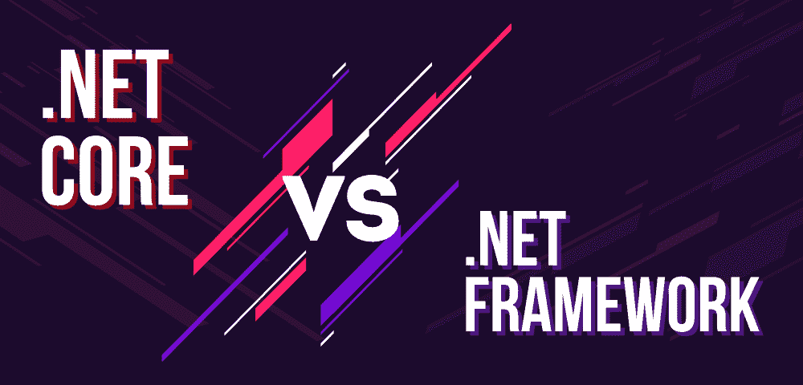

# 之间的差异。NET 核心和。NET 框架

> 原文:[https://www . geesforgeks . org/net-core-and-net-framework 之间的差异/](https://www.geeksforgeeks.org/differences-between-net-core-and-net-framework/)

**。NET Core** 是一个免费开源的，在 Windows、Linux、macOS 操作系统上开发现代基于云的软件应用的通用开发平台。它在多个平台上运行，并已进行了改进。NET 快速、可扩展且现代化。。NET Core 是微软的重大贡献之一，是在麻省理工学院许可下发布的。它提供以下功能:

*   跨平台
*   开放源码
*   高性能
*   多种环境和发展模式等。

**。NET** 是微软设计开发的软件**框架**。的第一个版本。Net 框架是 2002 年出现的 1.0。简单来说，它是一个虚拟机，用于编译和执行用 C#、VB.Net 等不同语言编写的程序。它用于开发基于表单的应用程序、基于 web 的应用程序和 web 服务。上有多种编程语言。Net 平台，VB.Net 和 C#是最常见的。它用于为 Windows、移动、web 等构建应用程序。它提供了很多功能，也支持行业标准。

。NET Framework 支持 60 多种编程语言，其中 11 种编程语言由微软设计开发。支持的其余非微软语言。NET 框架，但不是由微软设计和开发的。

**下面是之间的差异表。净核心和。网络框架:**

<figure class="table">

| 

**基于**

 | 

。**网芯**

 | 

**。NET 框架**

 |
| --- | --- | --- |
| **开源** | 。Net Core 是开源的。 | 的某些组件。Net 框架是开源的。 |
| **跨平台** | 遵循“一次建成，随处运行”的原则。它与各种操作系统兼容——视窗、Linux 和苹果操作系统，因为它是跨平台的。 | 。NET 框架与 windows 操作系统兼容。虽然，它是为了支持所有操作系统上的软件和应用程序而开发的。 |
| **应用模型** | 。Net Core 不支持桌面应用程序开发，而是专注于 web、windows mobile 和 windows store。 | 。Net Framework 用于开发桌面和网络应用程序，并且支持 windows 窗体和 WPF 应用程序。 |
| **安装** | 。NET Core 是独立于底层操作系统打包和安装的，因为它是跨平台的。 | 。NET Framework 是作为 Windows 操作系统的单个软件包安装的。 |
| **支持微服务和 REST 服务** | 。Net Core 支持微服务的开发和实现，用户必须为其实现创建一个 REST API。 | 。Net Framework 不支持微服务的开发和实现，但是支持 REST API 服务。 |
| **性能和可扩展性** | 。NET Core 提供了高性能和可扩展性。 | 。与相比，Net Framework 的效率较低。Net Core 在应用程序的性能和可伸缩性方面。 |
| **兼容性** | 。NET Core 兼容各种操作系统——Windows、Linux 和 Mac OS。 | 。NET Framework 只与 Windows 操作系统兼容。 |
| **安卓开发** | 。NET Core 通过。NET 标准库。开发人员使用 Xamarin 的工具为特定的移动设备(如 iOS、Android 和 Windows 手机)配置移动应用程序。 | 。NET Framework 不支持任何用于移动应用程序开发的框架。 |
| **包装和运输** | 。网芯作为掘金包裹的集合运输。 | 所有的图书馆。Net Framework 是打包在一起运输的。 |
| **部署模型** | 每当更新版本的。网络核心启动；它一次在一台机器上即时更新，从而在不影响现有应用程序的情况下在新的目录/文件夹中更新。因此，。NET Core 有一个好的、灵活的部署模型。 | 就……而言。Net Framework，当更新版本发布时，它首先仅部署在互联网信息服务器上。 |
| **命令行界面工具** | 。NET Core 为所有支持的平台提供轻量级编辑器和命令行工具。 | 。Net Framework 对于命令行界面来说很重，开发人员更喜欢使用轻量级的命令行界面。 |

</figure>