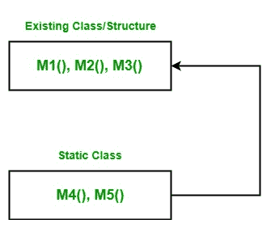

# c# 中的扩展方法

> 原文:[https://www.geeksforgeeks.org/extension-method-in-c-sharp/](https://www.geeksforgeeks.org/extension-method-in-c-sharp/)

在 C# 中，**扩展方法**的概念允许您在现有类或结构中添加新方法，而无需修改原始类型的源代码，并且您不需要原始类型的任何类型的特殊权限，也无需重新编译原始类型。在 *C# 3.0* 中介绍。

让我们借助一个例子来讨论这个概念。假设您有一个包含三个方法的类或结构，并且您想在这个类或结构中添加两个新方法，您没有该类/结构的源代码，或者没有该类/结构的权限，或者该类是一个密封类，但是您仍然想在其中添加新方法，那么您可以使用概念扩展方法在现有的类/结构中添加新方法。现在您创建了一个静态的新类，它包含了您想要添加到现有类中的两个方法，现在将这个类与现有类绑定。绑定后，您将看到现有的类可以访问两个新添加的方法。如下图所示的程序。



**示例:**首先我们在 *Program1.cs* 文件中创建一个名为 *Geek* 的类。包含*M1()**M2()**M3()*三种方法。

```cs
// C# program to illustrate the concept 
// of the extension methods
using System;

namespace ExtensionMethod {

// Here Geek class contains three methods
// Now we want to add two more new methods in it 
// Without re-compiling this class
class Geek {

  // Method 1
  public void M1() 
  {
      Console.WriteLine("Method Name: M1");
  }

  // Method 2
  public void M2()
  {
      Console.WriteLine("Method Name: M2");
  }

  // Method 3
  public void M3()
  {
      Console.WriteLine("Method Name: M3");
  }

 }

}
```

现在我们在 *Program2.cs* 文件中创建一个名为 NewMethodClass 的静态类。包含 *M4()* 和 *M5()* 两种方法。现在我们想在 *Geek* 类中添加这些方法，所以我们使用**绑定参数**将这些方法与 Geek 类绑定。之后，我们创建了另一个名为 GFG 的类，其中极客类访问所有五种方法。

```cs
// C# program to illustrate the concept
// of the extension methods
using System;

namespace ExtensionMethod {

// This class contains M4 and M5 method
// Which we want to add in Geek class.
// NewMethodClass is a static class
static class NewMethodClass {

    // Method 4
    public static void M4(this Geek g)
    {
        Console.WriteLine("Method Name: M4");
    }

    // Method 5
    public static void M5(this Geek g, string str)
    {
        Console.WriteLine(str);
    }
}

// Now we create a new class in which
// Geek class access all the five methods
public class GFG {

    // Main Method
    public static void Main(string[] args)
    {
        Geek g = new Geek();
        g.M1();
        g.M2();
        g.M3();
        g.M4();
        g.M5("Method Name: M5");
    }
}
}
```

**输出:**

```cs
Method Name: M1
Method Name: M2
Method Name: M3
Method Name: M4
Method Name: M5

```

**要点:**

*   Here, ***Binding parameters*** are those parameters which are used to bind the new method with the existing class or structure. It does not take any value when you are calling the extension method because they are used only for binding not for any other use. In the parameter list of the extension method binding parameter is always present at the first place if you write binding parameter to second, or third, or any other place rather than first place then the compiler will give an error. The binding parameter is created using this keyword followed by the name of the class in which you want to add a new method and the parameter name. For example:

    ```cs
    this Geek g
    ```

    这里，*这个*关键字是用来绑定的， *Geek* 是你要绑定的类名， *g* 是参数名。

*   扩展方法总是被定义为静态方法，但是当它们与任何类或结构绑定时，它们将转换为非静态方法。
*   当用现有方法的相同名称和签名定义扩展方法时，编译器将打印现有方法，而不是扩展方法。或者换句话说，扩展方法不支持[方法覆盖](https://www.geeksforgeeks.org/c-sharp-method-overriding/)。
*   您也可以在[密封类](https://www.geeksforgeeks.org/c-sharp-sealed-class/)中添加新方法，同样使用扩展方法概念。
*   它不能应用于字段、[属性](https://www.geeksforgeeks.org/c-sharp-properties/)或事件。
*   它必须在顶级静态类中定义。
*   不允许多个绑定参数意味着扩展方法只包含一个绑定参数。但是您可以在扩展方法中定义一个或多个正常参数。

**优势:**

*   扩展方法的主要优点是不使用[继承](https://www.geeksforgeeks.org/c-sharp-inheritance/)在现有类中添加新方法。
*   您可以在现有类中添加新方法，而无需修改现有类的源代码。
*   也可以配合[密封类](https://www.geeksforgeeks.org/c-sharp-sealed-class/)使用。