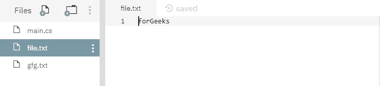
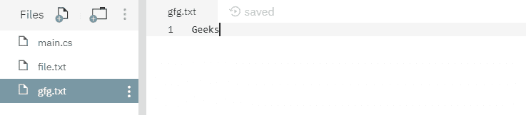
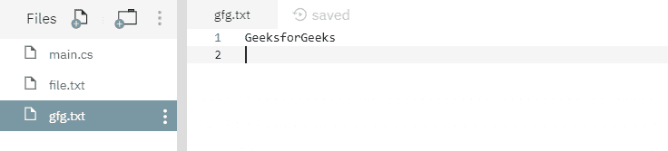
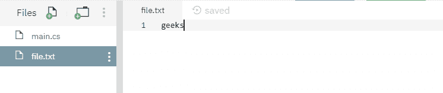
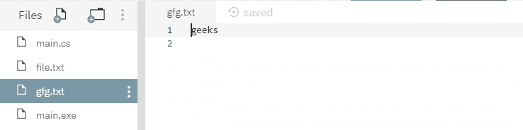

# 文件。C#中的 AppendAllLines(String，IEnumerable <string>)方法，示例</string>

> 原文:[https://www . geeksforgeeks . org/file-appendalllinestring-ienumerablesting-method-in-c-sharp-with-examples/](https://www.geeksforgeeks.org/file-appendalllinesstring-ienumerablestring-method-in-c-sharp-with-examples/)

**文件。追加行(字符串，IEnumerable <字符串> )** 是一个内置的文件类方法，用于向文件追加指定的行，然后关闭文件。

**语法:**

> 公共静态空追加行(字符串路径，系统。集合. Generic.IEnumerable <string>内容)；</string>

**参数:**该函数接受两个参数，如下图所示:

> *   **Path:** This is the file to append lines. If the file does not already exist, create it.
> *   **Directory:** This is the specified content to be added to the file.

**异常:**

*   **ArgumentException:***路径*是零长度字符串，只包含空格，或者包含一个或多个由 GetInvalidPathChars()方法定义的无效字符。
*   **参数空异常:**或者*路径*或者*内容*为空。
*   **目录不存在异常:***路径*无效，即目录不存在或位于未映射的驱动器上。
*   **文件未找到异常:**未找到由*路径*指定的文件。
*   **IOException:** 打开文件时出现输入/输出错误。
*   **路径工具异常:***路径*超过了系统定义的最大长度。
*   **notSupportDexception:***路径*的格式无效。
*   **安全性异常:**调用方没有写入文件的权限。
*   **未授权访问异常:***路径*指定了一个只读文件。或者当前平台不支持此操作。或者路径是一个目录。

下面是说明文件的程序。AppendAllLines()方法。

**程序 1:** 使用两个文件一个是 *file.txt* 另一个是 *gfg.txt* 运行程序前内容如下。





```
// C# program to illustrate the usage
// of File.AppendAllLines() method

// Using System, System.IO, and
// System.Linq namespaces
using System;
using System.IO;
using System.Linq;

// Creating class
class GfG {

    // Creating a file
    static string myfile = @"file.txt";

    // Main method
    static void Main(string[] args)
    {

        // Reading lines of the file created above
        var appendTofile = from line in File.ReadLines(myfile)

        // Using select statement
        select line;

        // Calling AppendAllLines() method with its
        // parameters
        File.AppendAllLines(@"gfg.txt", appendTofile);

        // Printed when the stated file is appended
        Console.WriteLine("All lines are appended");
    }
}
```

**执行:**

```
mcs -out:main.exe main.cs
mono main.exe
All lines are appended

```

运行上述代码后，将显示上述输出，文件 *gfg.txt* 的内容如下所示，这意味着文件 *gfg.txt* 中已添加了 *file.txt* 的内容



**程序 2:** 只创建了一个文件 *file.txt* ，其内容如下:



```
// C# program to illustrate the usage
// of File.AppendAllLines() method

// Using System, System.IO, and
// System.Linq namespaces
using System;
using System.IO;
using System.Linq;

// Creating class
class GfG {

    // Creating a file
    static string myfile = @"file.txt";

    // Main method
    static void Main(string[] args)
    {

        // Reading lines of the file created above
        var appendTofile = from line in File.ReadLines(myfile)

        // It only appends the line that starts with g
        where(line.StartsWith("g"))

        // Using select statement
        select line;

        // Calling AppendAllLines() method with its
        // parameters
        File.AppendAllLines(@"gfg.txt", appendTofile);

        // Printed when the stated file is appended
        Console.WriteLine("All lines are appended");
    }
}
```

**执行:**

```
mcs -out:main.exe main.cs
mono main.exe
All lines are appended

```

运行上述代码后，将显示上述输出，并创建一个名为 *gfg.txt* 的新文件，其内容与文件 *file.txt* 相同:

