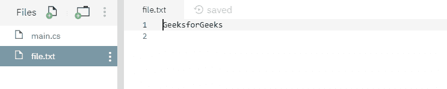
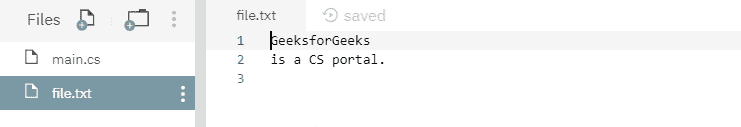
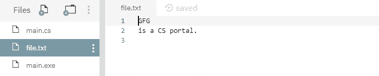

# 文件。C#中的 AppendAllText(字符串，字符串)方法及示例

> 原文:[https://www . geesforgeks . org/file-appendalltextstring-string-method-in-csharp-with-examples/](https://www.geeksforgeeks.org/file-appendalltextstring-string-method-in-csharp-with-examples/)

**文件。AppendAllText(String，String)** 是一个内置的 File 类方法，用于将指定的字符串追加到给定的文件中，如果该文件存在，则创建一个新文件，然后追加完成。它还会关闭文件。
**语法:**

```
public static void AppendAllText (string path, string contents);
```

**参数:**该函数接受两个参数，如下图所示:

> *   **Path:** This is the file to be appended with the given content.
> *   **Directory:** This is the specified content to be added to the file.

**例外:**

*   **ArgumentException:** 路径是零长度字符串，仅包含空格，或一个或多个无效字符，如 InvalidPathChars 所定义。
*   **ArgumentNullException:** 路径为空。
*   **路径工具异常:**给定的路径、文件名或两者都超过了系统定义的最大长度。
*   **directory ynotfoundexception:**给定的路径无效，即目录不存在或位于未映射的驱动器上。
*   **IOException:** 打开文件时出现输入/输出错误。
*   **未授权访问异常:**路径指定了一个只读文件。或者当前平台不支持此操作。或者路径指定了一个目录。或者呼叫者没有所需的权限。
*   **notSupportDexception:**路径的格式无效。
*   **安全性异常:**调用方没有所需的权限。

下面是说明文件的程序。方法。
**程序 1:** 在运行下面的代码之前，创建了一个文件，其内容如下所示:



## c sharp . c sharp . c sharp . c sharp

```
// C# program to illustrate the usage
// of File.AppendAllText() method

// Using System, System.IO,
// and System.Text namespaces
using System;
using System.IO;
using System.Text;

class GFG {
    // Main() method
    public static void Main()
    {
        // Creating a file
        string myfile = @"file.txt";

        // Adding extra texts
        string appendText = "is a CS portal." + Environment.NewLine;
        File.AppendAllText(myfile, appendText);

        // Opening the file to read from.
        string readText = File.ReadAllText(myfile);
        Console.WriteLine(readText);
    }
}
```

**执行:**

```
mcs -out:main.exe main.cs
mono main.exe
GeeksforGeeks
is a CS portal.
```

运行上述代码后，显示上述输出，文件内容如下所示:



**程序 2:** 最初没有创建文件，但是下面的代码本身创建了一个新文件并附加了指定的内容。

## c sharp . c sharp . c sharp . c sharp

```
// C# program to illustrate the usage
// of File.AppendAllText() method

// Using System, System.IO,
// and System.Text namespaces
using System;
using System.IO;
using System.Text;

class GFG {
    // Main() method
    public static void Main()
    {
        // Creating a file
        string myfile = @"file.txt";

        // Checking the existence of file
        if (!File.Exists(myfile)) {
            // Creating a file with below content
            string createText = "GFG" + Environment.NewLine;
            File.WriteAllText(myfile, createText);
        }

        // Adding extra contents
        string appendText = "is a CS portal." + Environment.NewLine;
        File.AppendAllText(myfile, appendText);

        // Opening the file to read from.
        string readText = File.ReadAllText(myfile);
        Console.WriteLine(readText);
    }
}
```

**执行:**

```
mcs -out:main.exe main.cs
mono main.exe
GFG
is a CS portal.
```

运行上述代码后，显示了上述输出，并创建了一个新文件，如下所示:

