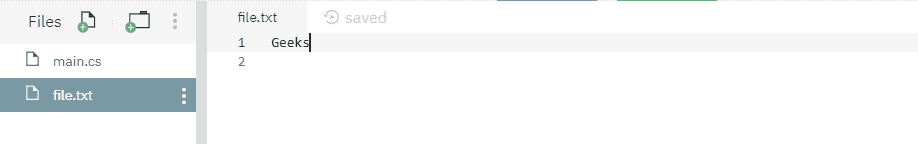
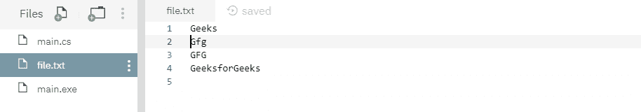
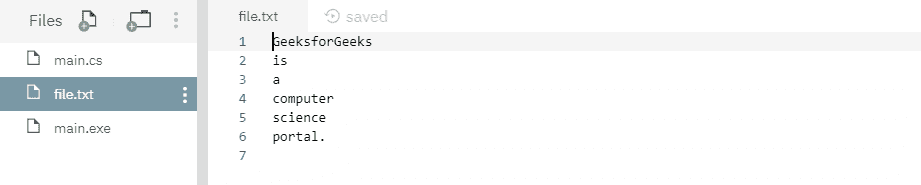

# 文件。C#中的 AppendText()方法，带示例

> 原文:[https://www . geesforgeks . org/file-appendtext-method-in-csharp-with-examples/](https://www.geeksforgeeks.org/file-appendtext-method-in-csharp-with-examples/)

**文件。AppendText()** 是一个内置的 File 类方法，用于创建一个 StreamWriter，它将 UTF-8 编码的文本追加到一个现有的文件中，否则如果指定的文件不存在，它将创建一个新文件。
**语法:**

```
public static System.IO.StreamWriter AppendText (string path);
```

**参数:**该函数接受一个参数，如下图所示:

> *   **Path:** This is the file to which UTF-8 encoded text will be appended. If the file does not already exist, create it.

**例外**T2】

*   **未授权访问异常:**调用方没有所需的权限。
*   **参数异常:***路径*是零长度字符串，仅包含空格，或者包含一个或多个无效字符，如 InvalidPathChars 所定义。
*   **ArgumentNullException:***路径*为空。
*   **路径工具异常:**给定的*路径*，文件名或两者都超过了系统定义的最大长度。
*   **目录不存在异常:**给定的*路径*无效，即该目录不存在或位于未映射的驱动器上。
*   **notSupportDexception:***路径*的格式无效。

**返回值:**返回一个流编写器，它将指定的 UTF-8 编码文本追加到指定的文件或新文件中。
以下是说明文件的程序。AppendText()方法。
**程序 1:** 在运行下面的代码之前，创建了一个文件 *file.txt* ，其内容如下所示:



## c sharp . c sharp . c sharp . c sharp

```
// C# program to illustrate the usage
// of File.AppendText() method

// Using System, System.IO namespaces
using System;
using System.IO;

class GFG {
    // Main method
    public static void Main()
    {
        // Creating a file
        string myfile = @"file.txt";

        // Appending the given texts
        using(StreamWriter sw = File.AppendText(myfile))
        {
            sw.WriteLine("Gfg");
            sw.WriteLine("GFG");
            sw.WriteLine("GeeksforGeeks");
        }

        // Opening the file for reading
        using(StreamReader sr = File.OpenText(myfile))
        {
            string s = "";
            while ((s = sr.ReadLine()) != null) {
                Console.WriteLine(s);
            }
        }
    }
}
```

**执行:**

```
mcs -out:main.exe main.cs
mono main.exe
Geeks
Gfg
GFG
GeeksforGeeks
```

运行上述代码后，显示上述输出，现有文件 *file.txt* 如下所示:



**程序 2:** 最初，没有创建任何文件，因此在代码本身下面创建一个名为 *file.txt*
的文件

## c sharp . c sharp . c sharp . c sharp

```
// C# program to illustrate the usage
// of File.AppendText() method

// Using System, System.IO namespaces
using System;
using System.IO;

class GFG {
    // Main method
    public static void Main()
    {
        // Creating a file
        string myfile = @"file.txt";

        // Checking the above file
        if (!File.Exists(myfile)) {
            // Creating the same file if it doesn't exist
            using(StreamWriter sw = File.CreateText(myfile))
            {
                sw.WriteLine("GeeksforGeeks");
                sw.WriteLine("is");
                sw.WriteLine("a");
            }
        }

        // Appending the given texts
        using(StreamWriter sw = File.AppendText(myfile))
        {
            sw.WriteLine("computer");
            sw.WriteLine("science");
            sw.WriteLine("portal.");
        }

        // Opening the file for reading
        using(StreamReader sr = File.OpenText(myfile))
        {
            string s = "";
            while ((s = sr.ReadLine()) != null) {
                Console.WriteLine(s);
            }
        }
    }
}
```

**执行:**

```
mcs -out:main.exe main.cs
mono main.exe
GeeksforGeeks
is
a
computer
science
portal.
```

运行上述代码后，会创建一个新文件 *file.txt* ，如下所示:

