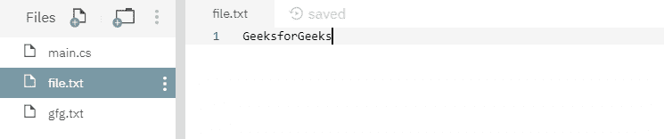
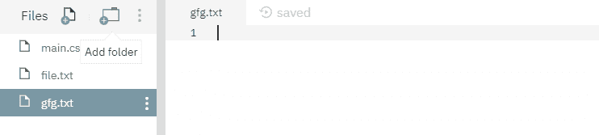
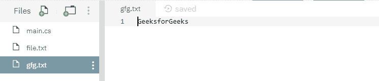
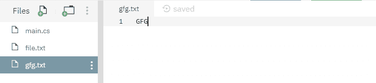

# 文件。C# 中复制(字符串、字符串、布尔)方法，示例

> 原文:[https://www . geesforgeks . org/file-copy string-string-boolean-method-in-c-sharp-with-examples/](https://www.geeksforgeeks.org/file-copystring-string-boolean-method-in-c-sharp-with-examples/)

**文件。Copy(String，String，Boolean)** 是一个内置的 File 类方法，用于将现有源文件内容的内容复制到另一个目标文件(如果存在)，否则创建一个新的目标文件，然后完成复制过程。
**语法:**

> 公共静态 void Copy(字符串 sourceFileName，字符串 destFileName，bool overwrite)；

**参数:**该函数接受三个参数，如下图所示:

> *   **Source file name:** This is the file for copying data.
> *   **destfilename:** This is the file where the data is pasted.
> *   **Overlay:** This is a Boolean value. Use true if the target file can be overwritten, otherwise use false.

**例外:**

*   **unauthorizedcessexception:**destFileName 为只读 OR 如果 destFileName 存在并隐藏，但源文件名未隐藏，则此处覆盖为真。
*   **ArgumentException:** 源文件名或 destFileName 是零长度字符串，仅包含空格，或包含一个或多个由 InvalidPathChars 定义的无效字符。或者源文件名或文件名指定一个目录。
*   **argumentNullException:**source filename 或 destFileName 为空。
*   **路径工具异常:**指定的路径、文件名或两者都超过了系统定义的最大长度。
*   **DirectoryNotFoundException:**源文件名或 destFileName 中指定的路径无效(例如，它位于未映射的驱动器上)。
*   **文件未找到异常:**找不到源文件名。
*   **IOException:**destFileName 存在，覆盖为假或出现输入/输出错误。
*   **notSupportDexception:**源文件名或设计文件名的格式无效。

下面是说明文件的程序。复制(字符串、字符串、布尔)方法。
**程序 1:** 在运行下面的代码之前，创建了两个文件，即源文件 *file.txt* 和目标文件 *gfg.txt* ，内容如下所示:





## C#

```cs
// C# program to illustrate the usage
// of File.Copy() method

// Using System, System.IO,
// System.Text and System.Linq namespaces
using System;
using System.IO;
using System.Text;
using System.Linq;

class GFG {
    // Main() method
    public static void Main()
    {
        // Specifying two files
        string sourceFile = @"file.txt";
        string destinationFile = @"gfg.txt";
        try {
            // Copying source file's contents to
            // destination file
            File.Copy(sourceFile, destinationFile, true);
        }
        catch (IOException iox) {
            Console.WriteLine(iox.Message);
        }
        Console.WriteLine("Copying process has been done.");
    }
}
```

**执行:**

```cs
mcs -out:main.exe main.cs
mono main.exe
Copying process has been done.
```

运行上述代码后，显示上述输出，目标文件内容如下所示:



**程序 2:** 在运行下面的代码之前，创建了两个文件，即源文件 *file.txt* 和目标文件 *gfg.txt* ，内容如下所示:




## C#

```cs
// C# program to illustrate the usage
// of File.Copy() method

// Using System, System.IO,
// System.Text and System.Linq namespaces
using System;
using System.IO;
using System.Text;
using System.Linq;

class GFG {
    // Main() method
    public static void Main()
    {
        // Specifying two files
        string sourceFile = @"file.txt";
        string destinationFile = @"gfg.txt";
        try {
            // Copying source file's contents to
            // destination file
            File.Copy(sourceFile, destinationFile, true);
        }
        catch (IOException iox) {
            Console.WriteLine(iox.Message);
        }
        Console.WriteLine("Copying process has been done.");
    }
}
```

**执行:**

```cs
mcs -out:main.exe main.cs
mono main.exe
Copying process has been done.
```

运行上述代码后，显示上述输出，目标文件内容被源文件 *file.txt* 的内容覆盖，如下所示:


**程序 3:** 在运行下面的代码之前，创建了两个文件，即源文件 *file.txt* 和目标文件 *gfg.txt* ，内容如下所示:


## C#

```cs
// C# program to illustrate the usage
// of File.Copy() method

// Using System, System.IO,
// System.Text and System.Linq namespaces
using System;
using System.IO;
using System.Text;
using System.Linq;

class GFG {
    // Main() method
    public static void Main()
    {
        // Specifying two files
        string sourceFile = @"file.txt";
        string destinationFile = @"gfg.txt";
        try {
            // Copying source file's contents to
            // destination file
            File.Copy(sourceFile, destinationFile, false);
        }
        catch (IOException iox) {
            Console.WriteLine(iox.Message);
        }
    }
}
```

**执行:**

```cs
mcs -out:main.exe main.cs
mono main.exe
Could not create file "/home/runner/NutritiousHeavyRegression/gfg.txt". File already exists.
```

运行上述代码后，抛出上述错误这是因为上述代码中使用的 *bool 覆盖*值为 *false* 。