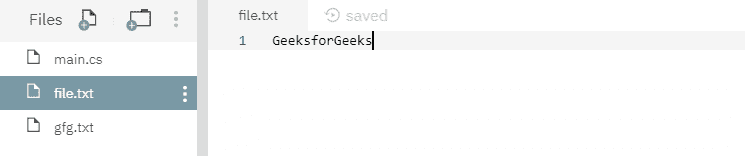

# 文件。C# 中的复制(字符串，字符串)方法，示例

> 原文:[https://www . geesforgeks . org/file-copy string-string-method-in-c-sharp-with-examples/](https://www.geeksforgeeks.org/file-copystring-string-method-in-c-sharp-with-examples/)

**文件。Copy(String，String)** 是一个内置的 File 类方法，用于将现有源文件内容复制到由该函数创建的另一个目标文件。

**语法:**

```cs
public static void Copy (string sourceFileName, string destFileName);
```

**参数:**该函数接受两个参数，如下图所示:

> *   **Source file name:** This is the file for copying data.
> *   **destfilename:** This is the file where the data is pasted. This cannot be an existing file or directory.

**异常:**

*   **未授权访问异常:**调用方没有所需的权限。
*   **ArgumentException:** 源文件名或 destFileName 是零长度字符串，仅包含空格，或包含一个或多个由 InvalidPathChars 定义的无效字符。或者源文件名或文件名指定一个目录。
*   **argumentNullException:**source filename 或 destFileName 为空。
*   **路径工具异常:**给定的路径、文件名或两者都超过了系统定义的最大长度。
*   **DirectoryNotFoundException:**源文件名或 destFileName 中给定的路径无效(例如，它位于未映射的驱动器上)。
*   **文件未找到异常:**找不到源文件名。
*   **IOException:**destFileName 存在。或者发生了输入/输出错误。
*   **NotSupportedException:** 源文件名或 destFileName 的格式无效。

下面是说明文件的程序。复制(字符串，字符串)方法。
**程序 1:** 在运行下面的代码之前，只创建了源文件 *file.txt* ，如下图所示。下面的代码自己创建一个目标文件 *gfg.txt* 并将源文件内容复制到目标文件。


## c sharp . c sharp . c sharp . c sharp

```cs
// C# program to illustrate the usage
// of File.Copy() method

// Using System, System.IO,
// System.Text and System.Linq namespaces
using System;
using System.IO;
using System.Text;
using System.Linq;

class GFG {
    // Main() method
    public static void Main()
    {
        // Creating two files
        string sourceFile = @"file.txt";
        string destinationFile = @"gfg.txt";
        try {
            // Copying source file's contents to
            // destination file
            File.Copy(sourceFile, destinationFile);
        }
        catch (IOException iox) {
            Console.WriteLine(iox.Message);
        }
        Console.WriteLine("Copying process has been done.");
    }
}
```

**执行:**

```cs
mcs -out:main.exe main.cs
mono main.exe
Copying process has been done.
```

运行上述代码后，显示了上述输出，并创建了一个新的目标文件 *gfg.txt* ，如下所示:


**程序 2:** 在运行下面的代码之前，创建了两个文件，内容如下所示:




## c sharp . c sharp . c sharp . c sharp

```cs
// C# program to illustrate the usage
// of File.Copy() method

// Using System, System.IO,
// System.Text and System.Linq namespaces
using System;
using System.IO;
using System.Text;
using System.Linq;

class GFG {
    // Main() method
    public static void Main()
    {
        // Specifying two files
        string sourceFile = @"file.txt";
        string destinationFile = @"gfg.txt";
        try {
            // Copying source file's contents to
            // destination file
            File.Copy(sourceFile, destinationFile);
        }
        catch (IOException iox) {
            Console.WriteLine(iox.Message);
        }
    }
}
```

**执行:**

```cs
mcs -out:main.exe main.cs
mono main.exe
Could not create file "/home/runner/NutritiousHeavyRegression/gfg.txt". File already exists.
```

运行上述代码后，会引发上述错误，因为目标文件是在运行程序之前创建的。