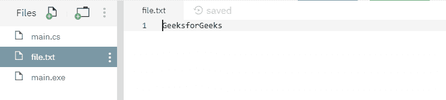
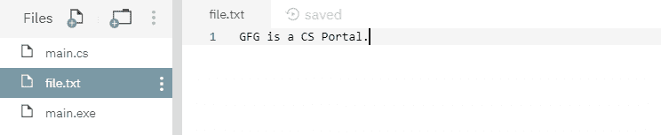

# 文件。在 C# 中创建(字符串、Int32、文件选项)方法，并举例

> 原文:[https://www . geesforgeks . org/file-createstring-int 32-file options-method-in-c-sharp-with-examples/](https://www.geeksforgeeks.org/file-createstring-int32-fileoptions-method-in-c-sharp-with-examples/)

**文件。Create(String，Int32，FileOptions)** 是一个内置的 File 类方法，用于覆盖现有文件，指定缓冲区大小和描述如何创建或覆盖文件的选项，如果指定的文件不存在，则创建新文件。
**语法:**

> 公共静态系统。创建文件流(字符串路径，内部缓冲区，系统。IO.FileOptions 选项)；

**参数:**该函数接受三个参数，如下图所示:

> *   **Path:** This is the specified file path.
> *   **Buffer size:** This is the specified buffer size.
> *   **Option:** This is one of the file option values that describe how to create or overwrite files.

**例外:**

*   **未授权访问异常:**调用方没有所需的权限。或者*路径*指定了一个只读文件。或者路径指定了一个隐藏的文件。
*   **ArgumentException:** 路径是零长度字符串，仅包含空格，或一个或多个无效字符，如 InvalidPathChars 所定义。
*   **ArgumentNullException:***路径*为空。
*   **路径工具异常:**指定的路径、文件名或两者都超过了系统定义的最大长度。
*   **DirectoryNotFoundException:**给定的*路径*无效。
*   **IOException:** 创建文件时出现输入/输出错误。
*   **notSupportDexception:***路径*的格式无效。

**返回值:**返回指定缓冲区大小的新文件。
以下是说明文件的程序。Create(String，Int32，FileOptions)方法。
**程序 1:** 最初，不创建文件。但是下面的代码本身用指定的内容创建了一个新的文件 *file.txt* 。

## C#

```cs
// C# program to illustrate the usage
// of File.Create(String, Int32, 
// FileOptions) method

// Using System, System.IO and
// System.Text namespaces
using System;
using System.IO;
using System.Text;

class GFG {
    public static void Main()
    {
        // Specifying a file
        string myfile = @"file.txt";

        // Calling the create() function
        using(FileStream fs = File.Create(myfile, 1024, FileOptions.RandomAccess))
        {
            // Adding the below contents into the file
            Byte[] info = new UTF8Encoding(true).GetBytes("GeeksforGeeks");
            fs.Write(info, 0, info.Length);
        }

        // Reading the file contents
        using(StreamReader sr = File.OpenText(myfile))
        {
            string s = "";
            while ((s = sr.ReadLine()) != null) {
                Console.WriteLine(s);
            }
        }
    }
}
```

**执行:**

```cs
mcs -out:main.exe main.cs
mono main.exe
GeeksforGeeks
```

运行上述代码后，显示上述输出，并创建一个新文件 *file.txt* ，其指定内容如下所示:



**程序 2:** 下面显示的文件 *file.txt* 是在运行下面的代码之前创建的。


## C#

```cs
// C# program to illustrate the usage
// of File.Create(String, Int32,
// FileOptions) method

// Using System, System.IO and
// System.Text namespaces
using System;
using System.IO;
using System.Text;

class GFG {
    public static void Main()
    {
        // Specifying a file
        string myfile = @"file.txt";

        // Calling the create() function
        using(FileStream fs = File.Create(myfile, 1024, FileOptions.RandomAccess))
        {
            // overwriting the below contents into the file
            Byte[] info = new UTF8Encoding(true).GetBytes("GFG is a CS Portal.");
            fs.Write(info, 0, info.Length);
        }

        // Reading the file contents
        using(StreamReader sr = File.OpenText(myfile))
        {
            string s = "";
            while ((s = sr.ReadLine()) != null) {
                Console.WriteLine(s);
            }
        }
    }
}
```

**执行:**

```cs
mcs -out:main.exe main.cs
mono main.exe
GFG is a CS Portal.
```

运行上述代码后，将显示上述输出，现有文件内容将被覆盖。

