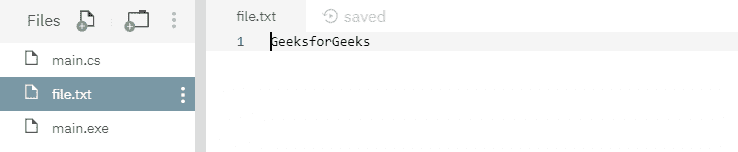
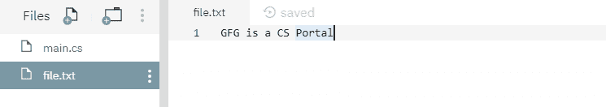

# 文件。用例子在 C# 中创建(字符串)方法

> 原文:[https://www . geesforgeks . org/file-createstring-method-in-c-sharp-with-examples/](https://www.geeksforgeeks.org/file-createstring-method-in-c-sharp-with-examples/)

**文件。Create(String)** 是一个内置的 File 类方法，用于覆盖现有文件，如果指定的文件不存在，则创建一个新文件。

**语法:**

```cs
public static System.IO.FileStream Create (string path);
```

**参数:**该函数接受如下所示的参数:

> *   **Path:** This is the specified file path.

**异常:**

*   **未授权访问异常:**调用方没有所需的权限。或者路径指定了一个只读文件。或者路径指定了一个隐藏的文件。
*   **参数异常:***路径*是一个零长度字符串，只包含空格或一个或多个无效字符，如 InvalidPathChars 所定义。
*   **ArgumentNullException:***路径*为空。
*   **路径工具异常:**给定的*路径*，文件名或两者都超过了系统定义的最大长度。
*   **DirectoryNotFoundException:**给定的*路径*无效。
*   **IOException:** 创建文件时出现输入/输出错误。
*   **notSupportDexception:**给定的*路径*格式无效。

下面是说明文件的程序。创建(字符串)方法。

**程序 1:** 最初，不创建文件。下面代码自己创建一个新文件 *file.txt* 指定内容。

## C#

```cs
// C# program to illustrate the usage
// of File.Create(String) method

// Using System, System.IO and
// System.Text namespaces
using System;
using System.IO;
using System.Text;

class GFG {
    public static void Main()
    {
        // Specifying a file path
        string file_path = @"file.txt";

        try {
            // Creating a new file, or overwrite
            // if the file already exists.
            using(FileStream fs = File.Create(file_path))
            {
                // Adding some info into the file
                byte[] info = new UTF8Encoding(true).GetBytes("GeeksforGeeks");
                fs.Write(info, 0, info.Length);
            }

            // Reading the file contents
            using(StreamReader sr = File.OpenText(file_path))
            {
                string s = "";
                while ((s = sr.ReadLine()) != null) {
                    Console.WriteLine(s);
                }
            }
        }

        catch (Exception ex) {
            Console.WriteLine(ex.ToString());
        }
    }
}
```

**执行:**

```cs
mcs -out:main.exe main.cs
mono main.exe
GeeksforGeeks
```

运行上述代码后，显示上述输出，并创建一个新文件 *file.txt* ，其指定内容如下所示:



**程序 2:** 下面显示的文件 *file.txt* 是在运行下面的代码之前创建的。


## C#

```cs
// C# program to illustrate the usage
// of File.Create(String) method

// Using System, System.IO and
// System.Text namespaces
using System;
using System.IO;
using System.Text;

class GFG {
    public static void Main()
    {
        // Specifying a file path
        string file_path = @"file.txt";

        try {
            // Overwriting the above file contents
            using(FileStream fs = File.Create(file_path))
            {
                // Adding some info into the file
                byte[] info = new UTF8Encoding(true).GetBytes("GFG is a CS Portal");
                fs.Write(info, 0, info.Length);
            }

            // Reading the file contents
            using(StreamReader sr = File.OpenText(file_path))
            {
                string s = "";
                while ((s = sr.ReadLine()) != null) {
                    Console.WriteLine(s);
                }
            }
        }

        catch (Exception ex) {
            Console.WriteLine(ex.ToString());
        }
    }
}
```

**执行:**

```cs
mcs -out:main.exe main.cs
mono main.exe
GFG is a CS Portal
```

运行上述代码后，将显示上述输出，现有文件内容将被覆盖。

