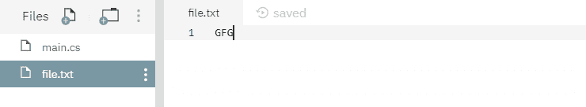
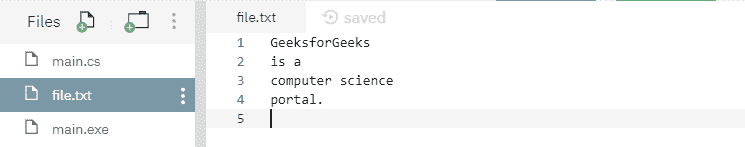
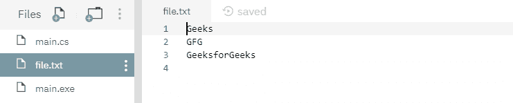

# 文件。用例子在 C#中创建 Text()方法

> 原文:[https://www . geesforgeks . org/file-create text-method-in-c-sharp-with-examples/](https://www.geeksforgeeks.org/file-createtext-method-in-c-sharp-with-examples/)

**文件。CreateText()** 是一个内置的 File 类方法，用于用给定的 UTF-8 编码文本覆盖现有文件的内容，如果文件尚未创建，此函数将创建一个具有指定内容的新文件。

**语法:**

```cs
public static System.IO.StreamWriter CreateText (string path);
```

**参数:**该函数接受如下所示的参数:

> *   **Path:** This is the file where UTF-8 encoded text will be overwritten. If the file does not already exist, create it.

**异常:**

*   **未授权访问异常:**调用方没有所需的权限。或者路径指定了一个只读文件。或者路径指定了一个隐藏的文件。
*   **ArgumentException:***路径*是零长度字符串，仅包含空格或一个或多个无效字符。
*   **ArgumentNullException:***路径*为空。
*   **路径工具异常:**指定的*路径*、文件名或两者都超过了系统定义的最大长度。
*   **DirectoryNotFoundException:**指定的路径无效，即它位于未映射的驱动器上。
*   **notSupportDexception:***路径*的格式无效。

**返回值:**返回使用 UTF-8 编码写入指定文件的 StreamWriter。
以下是说明文件的程序。CreateText()方法。

**程序 1:**
在运行下面的代码之前，创建了一个文件 *file.txt* ，内容如下所示:



## C#

```cs
// C# program to illustrate the usage
// of File.CreateText() method

// Using System, System.IO namespaces
using System;
using System.IO;

class GFG {
    // Main method
    public static void Main()
    {
        // Creating a file
        string myfile = @"file.txt";

        // Overwriting to the above existing file
        using(StreamWriter sw = File.CreateText(myfile))
        {
            sw.WriteLine("GeeksforGeeks");
            sw.WriteLine("is a");
            sw.WriteLine("computer science");
            sw.WriteLine("portal.");
        }

        // Opening the file for reading
        using(StreamReader sr = File.OpenText(myfile))
        {
            string s = "";
            while ((s = sr.ReadLine()) != null) {
                Console.WriteLine(s);
            }
        }
    }
}
```

**执行:**

```cs
mcs -out:main.exe main.cs
mono main.exe
GeeksforGeeks
is a
computer science
portal.
```

运行上述代码后，显示上述输出，现有文件 *file.txt* 如下所示:



**程序 2:** 最初，没有创建文件，因此在代码本身下面创建一个名为 *file.txt* 的文件

## C#

```cs
// C# program to illustrate the usage
// of File.CreateText() method

// Using System, System.IO namespaces
using System;
using System.IO;

class GFG {
    // Main method
    public static void Main()
    {
        // Creating a file
        string myfile = @"file.txt";

        // Checking the existence of above file
        if (!File.Exists(myfile)) {
            // Creating a new file with below contents
            using(StreamWriter sw = File.CreateText(myfile))
            {
                sw.WriteLine("Geeks");
                sw.WriteLine("GFG");
                sw.WriteLine("GeeksforGeeks");
            }
        }

        // Opening the file for reading
        using(StreamReader sr = File.OpenText(myfile))
        {
            string s = "";
            while ((s = sr.ReadLine()) != null) {
                Console.WriteLine(s);
            }
        }
    }
}
```

**执行:**

```cs
mcs -out:main.exe main.cs
mono main.exe
Geeks
GFG
GeeksforGeeks
```

运行上述代码后，会创建一个新文件 *file.txt* ，如下图所示:

