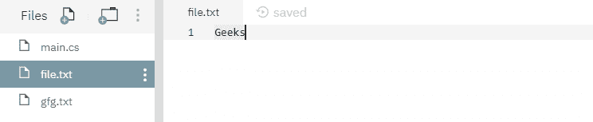
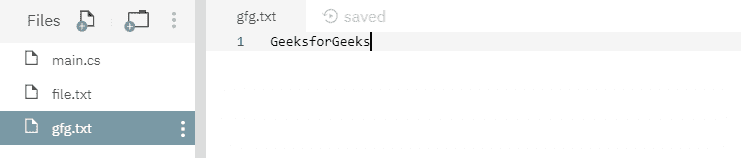

# 文件。用例子删除 C#中的()方法

> 原文:[https://www . geesforgeks . org/file-delete-method-in-c-sharp-with-examples/](https://www.geeksforgeeks.org/file-delete-method-in-c-sharp-with-examples/)

**文件。删除(字符串)**是一个内置的文件类方法，用于删除指定的文件。
**语法:**

```
public static void Delete (string path);
```

**参数:**该函数接受一个参数，如下图所示:

> *   **Path:** This is the specified file path to delete.

**例外:**

*   **参数异常:***路径*是一个零长度字符串，只包含空格或一个或多个无效字符，如 InvalidPathChars 所定义。
*   **ArgumentNullException:***路径*为空。
*   **DirectoryNotFoundException:**给定的*路径*无效。
*   **IOException:** 给定文件正在使用中。或者文件上有一个打开的句柄，操作系统是 Windows XP 或更早版本。枚举目录和文件会导致句柄打开。有关更多信息，请参见如何:枚举目录和文件。
*   **notSupportDexception:***路径*的格式无效。
*   **路径工具异常:**给定的*路径*，文件名或两者都超过了系统定义的最大长度。
*   **未授权访问异常:**调用方没有所需的权限。或者该文件是正在使用的可执行文件。或者路径是一个目录。或者路径指定了一个只读文件。

下面是说明文件的程序。删除(字符串)方法。
**程序 1:** 在运行下面的代码之前，创建了一个文件 *file.txt* ，内容如下所示:


## c sharp . c sharp . c sharp . c sharp

```
// C# program to illustrate the usage
// of File.Delete(String) method

// Using System and System.IO namespaces
using System;
using System.IO;

public class GFG {
    // Using main() function
    public static void Main()
    {
        // Specifying a file
        String myfile = @"file.txt";

        // Calling the Delete() function to
        // delete the file file.txt
        File.Delete(myfile);

        // Printing a line
        Console.WriteLine("Specified file has been deleted");
    }
}
```

**执行:**

```
mcs -out:main.exe main.cs
mono main.exe
Specified file has been deleted
```

运行上述代码后，显示上述输出，文件 *file.txt* 已被删除。
**程序 2:** 在运行下面的代码之前，已经创建了两个文件，如下所示:





## c sharp . c sharp . c sharp . c sharp

```
// C# program to illustrate the usage
// of File.Delete(String) method

// Using System and System.IO namespaces
using System;
using System.IO;

public class GFG {
    // Using main() function
    public static void Main()
    {
        // Specifying two files
        String myfile1 = @"file.txt";
        String myfile2 = @"gfg.txt";

        // Calling the Delete() function to
        // delete the file file.txt and gfg.txt
        File.Delete(myfile1);
        File.Delete(myfile2);

        // Printing a line
        Console.WriteLine("Specified files have been deleted.");
    }
}
```

**执行:**

```
mcs -out:main.exe main.cs
mono main.exe
Specified files have been deleted.
```

运行上述代码后，显示上述输出，两个现有文件 *file.txt* 和 *gfg.txt* 已被删除。