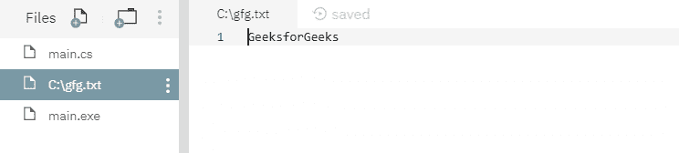

# 文件。C# 中的 Move()方法及示例

> 原文:[https://www . geesforgeks . org/file-move-method-in-c-sharp-with-examples/](https://www.geeksforgeeks.org/file-move-method-in-c-sharp-with-examples/)

**文件。Move()** 是一个内置的 File 类方法，用于将指定的文件移动到新的位置。此方法还提供了指定新文件名的选项。

**语法:**

```cs
public static void Move (string sourceFileName, string destFileName);
```

**参数:**该函数接受两个参数，如下图所示:

> *   **Source file name:** This is the specified source file to be moved. It can be an absolute path or a relative path.
> *   **destfilename:** This is the specified target file to which the source file will be moved.

**异常:**

*   **IOException:***destFileName*已经存在。
*   **文件未找到异常:***源文件名*未找到。
*   **参数空异常:***源文件名*或*文件名*为空。
*   **参数异常:***源文件名*或 *destFileName* 是零长度字符串，仅包含空格或无效字符，如 InvalidPathChars 中所定义。
*   **未授权访问异常:**调用方没有所需的权限。
*   **路径工具异常:**给定的路径、文件名或两者都超过了系统定义的最大长度。
*   **目录未找到异常:**在*源文件名*或*文件名*中指定的路径无效。
*   **notSupportDexception:***源文件名*或*文件名*的格式无效。

下面是说明文件的程序。Move()方法。

**程序 1:** 在运行下面的代码之前，创建了一个文件 *file.txt* ，内容如下-


```cs
// C# program to illustrate the usage
// of File.Move() method

// Using System and System.IO namespaces
using System;
using System.IO;

class GFG {
    static void Main()
    {
        try {
            // Moving the file file.txt to location C:\gfg.txt
            File.Move(@"file.txt", @"C:\gfg.txt");
            Console.WriteLine("Moved");
        }
        catch (IOException ex) {
            Console.WriteLine(ex);
        }
    }
}
```

**输出:**

```cs
Moved

```

运行上述代码后，显示上述输出，现有文件 *file.txt* 移动到新位置 *C:\gfg.txt* ，如下图-



**程序 2:** 最初没有创建文件。

```cs
// C# program to illustrate the usage
// of File.Move() method

// Using System and System.IO namespaces
using System;
using System.IO;

class GFG {
    static void Main()
    {
        try {
            // If file.txt is not found
            // then an exception will be shown
            File.Move(@"file.txt", @"C:\gfg.txt");
            Console.WriteLine("Moved");
        }
        catch (IOException ex) {
            Console.WriteLine(ex);
        }
    }
}
```

**运行时错误:**

> 系统。IO.FileNotFoundException:找不到文件“/home/runner/nutritioushavirgression/file . txt”。
> 文件名:‘/home/runner/nutritioushavyrgression/File . txt’
> 在 System。输入输出文件移动(系统。字符串源文件名，系统。字符串 destFileName)[0x 0007 c]in:0【GFG 的 T2】。Main () [0x00000] in :0