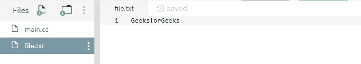

# 文件。C# 中的 OpenRead()方法，示例

> 原文:[https://www . geesforgeks . org/file-open read-method-in-csharp-with-examples/](https://www.geeksforgeeks.org/file-openread-method-in-csharp-with-examples/)

**文件。OpenRead(String)** 是一个内置的 File 类方法，用于打开一个现有文件进行读取。
**语法:**

```cs
public static System.IO.FileStream OpenRead (string path);
```

**参数:**该函数接受一个参数，如下图所示:

> *   **Path:** This is the specified file to be opened for reading.

**例外:**

*   **参数异常:***路径*是一个零长度字符串，只包含空格或一个或多个无效字符，如 InvalidPathChars 所定义。
*   **ArgumentNullException:***路径*为空。
*   **路径工具异常:**指定的*路径*、文件名或两者都超过了系统定义的最大长度。
*   **DirectoryNotFoundException:**指定的路径无效。
*   **未授权访问异常:***路径*指定了一个目录。或者呼叫者没有所需的权限。
*   **文件未找到异常:**在*路径*中指定的文件未找到。
*   **notSupportDexception:***路径*的格式无效。
*   **IOException:** 打开文件时出现输入/输出错误。

**返回值:**返回指定路径上的只读文件流。
以下是说明文件的程序。OpenRead(字符串)方法。
**程序 1:** 在运行下面的代码之前，会创建一个文件 *file.txt* ，其内容如下所示



下面代码打开文件 *file.txt* 进行读取。

## C#

```cs
// C# program to illustrate the usage
// of File.OpenRead(String) method

// Using System, System.IO and
// System.Text namespaces
using System;
using System.IO;
using System.Text;

class Test {
    public static void Main()
    {
        // Specifying a file
        string path = @"file.txt";

        // Opening the existing file for reading
        using(FileStream fs = File.OpenRead(path))
        {
            byte[] b = new byte[1024];
            UTF8Encoding temp = new UTF8Encoding(true);

            while (fs.Read(b, 0, b.Length) > 0) {
                // Printing the file contents
                Console.WriteLine(temp.GetString(b));
            }
        }
    }
}
```

**执行:**

```cs
GeeksforGeeks
```

**程序 2:** 最初创建一个文件 *file.txt* ，内容如下所示-


下面的代码将用其他指定的内容覆盖文件内容，然后打印最终内容。

## C#

```cs
// C# program to illustrate the usage
// of File.OpenRead(String) method

// Using System, System.IO and
// System.Text namespaces
using System;
using System.IO;
using System.Text;

class GFG {
    public static void Main()
    {
        // Specifying a file
        string path = @"file.txt";

        // Opening the file for overwriting with
        // another contents
        using(FileStream fs = File.OpenWrite(path))
        {
            Byte[] info = new UTF8Encoding(true).GetBytes("GFG is a CS portal.");
            fs.Write(info, 0, info.Length);
        }

        // Opening the existing file for reading
        using(FileStream fs = File.OpenRead(path))
        {
            byte[] b = new byte[1024];
            UTF8Encoding temp = new UTF8Encoding(true);

            while (fs.Read(b, 0, b.Length) > 0) {
                // Printing the file contents
                Console.WriteLine(temp.GetString(b));
            }
        }
    }
}
```

**执行:**

```cs
GFG is a CS portal.
```