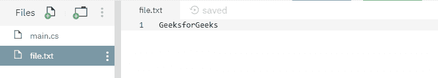

# 文件。C# 中的 OpenText()方法，示例

> 原文:[https://www . geesforgeks . org/file-open text-method-in-csharp-with-examples/](https://www.geeksforgeeks.org/file-opentext-method-in-csharp-with-examples/)

**文件。OpenText(String)** 是一个内置的 File 类方法，用于打开现有的 UTF-8 编码文本文件进行读取。
**语法:**

```cs
public static System.IO.StreamReader OpenText (string path);
```

**参数:**该函数接受如下所示的参数:

> *   **Path:** This is the specified text file to be opened for reading.

**异常:**

*   **未授权访问异常:**调用方没有所需的权限。
*   **参数异常:***路径*是一个零长度字符串，只包含空格或一个或多个无效字符，如 InvalidPathChars 所定义。
*   **ArgumentNullException:***路径*为空。
*   **路径工具异常:**指定的*路径*、文件名或两者都超过了系统定义的最大长度。
*   **DirectoryNotFoundException:**指定的*路径*无效。
*   **文件未找到异常:**在*路径*中指定的文件未找到。
*   **notSupportDexception:***路径*的格式无效。

**返回值:**返回指定路径上的 StreamReader。
以下是说明文件的程序。OpenText(字符串)方法。
**程序 1:** 在运行下面的代码之前，创建了一个文本文件 *file.txt* ，内容如下-



下面代码打开文本文件 *file.txt* 进行读取。

## C#

```cs
// C# program to illustrate the usage
// of File.OpenText(String) method

// Using System and System.IO
// namespaces
using System;
using System.IO;

class Test {
    public static void Main()
    {
        // Specifying a text file
        string path = @"file.txt";

        // Opening the file for reading
        using(StreamReader sr = File.OpenText(path))
        {
            string s = "";
            while ((s = sr.ReadLine()) != null) {
                // printing the file contents
                Console.WriteLine(s);
            }
        }
    }
}
```

**执行:**

```cs
GeeksforGeeks
```

**程序 2:** 最初创建一个文件 *file.txt* ，内容如下-


下面的代码将用其他指定的内容覆盖文件内容，然后打印最终内容。

## C#

```cs
// C# program to illustrate the usage
// of File.OpenText(String) method

// Using System and System.IO
// namespaces
using System;
using System.IO;

class Test {
    public static void Main()
    {
        // Specifying a text file
        string path = @"file.txt";

        // Checking the existence of file
        if (File.Exists(path)) {
            using(StreamWriter sw = File.CreateText(path))
            {
                // Overwriting the file with below
                // specified contents
                sw.WriteLine("GFG is a CS portal.");
            }
        }

        // Opening the file for reading
        using(StreamReader sr = File.OpenText(path))
        {
            string s = "";
            while ((s = sr.ReadLine()) != null) {
                // printing the overwritten content
                Console.WriteLine(s);
            }
        }
    }
}
```

**执行:**

```cs
GFG is a CS portal.
```