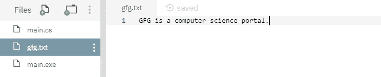

# 文件。C#中的 OpenWrite()方法，示例

> 原文:[https://www . geesforgeks . org/file-open write-method-in-csharp-with-examples/](https://www.geeksforgeeks.org/file-openwrite-method-in-csharp-with-examples/)

**文件。OpenWrite(String)** 是一个内置的 File 类方法，用于打开现有文件或创建新文件进行写入。

**语法:**

```cs
public static System.IO.FileStream OpenWrite (string path);
```

**参数:**该函数接受如下所示的参数:

*   **路径:**这是将要打开进行写入的指定文本文件。

**例外:**

*   **未授权访问异常:**调用方没有所需的权限。或者*路径*指定了只读文件或目录。
*   **参数异常:***路径*是一个零长度字符串，只包含空格或一个或多个无效字符，如 InvalidPathChars 所定义。
*   **ArgumentNullException:***路径*为空。
*   **路径工具异常:**指定的*路径*、文件名或两者都超过了系统定义的最大长度。
*   **DirectoryNotFoundException:**指定的*路径*无效。
*   **notSupportDexception:***路径*的格式无效。

**返回值:**返回指定路径上具有写访问权限的非共享文件流对象。
以下是说明*文件的程序。OpenWrite(字符串)方法*。
**程序 1:** 最初，不创建文件。在代码下面，自己创建一个文件 *gfg.txt* ，在里面写一些文字，打印出来。

## C#

```cs
// C# program to illustrate the usage
// of File.OpenWrite(String) method

// Using System, System.IO and
// System.Text namespaces
using System;
using System.IO;
using System.Text;

class GFG {
    public static void Main()
    {
        // Creating a file
        string path = @"gfg.txt";

        // Opening the file for writing
        using(FileStream fs = File.OpenWrite(path))
        {
            // Putting below specified contents
            Byte[] info = new UTF8Encoding(true).GetBytes("GFG is a computer science portal.");
            fs.Write(info, 0, info.Length);
        }

        // Opening the file for reading
        using(FileStream fs = File.OpenRead(path))
        {
            byte[] b = new byte[1024];
            UTF8Encoding temp = new UTF8Encoding(true);

            while (fs.Read(b, 0, b.Length) > 0) {
                // Printing the contents of the file
                Console.WriteLine(temp.GetString(b));
            }
        }
    }
}
```

**输出:**

```cs
GFG is a computer science portal.
```

上面的代码给出了上面的输出，并创建了一个文件，如下所示:



**程序 2:** 最初创建一个文件 *file.txt* ，内容如下所示-


下面的代码将用其他指定的内容覆盖文件内容，然后打印最终内容。

## c sharp . c sharp . c sharp . c sharp

```cs
// C# program to illustrate the usage
// of File.OpenWrite(String) method

// Using System, System.IO and
// System.Text namespaces
using System;
using System.IO;
using System.Text;

class GFG {
    public static void Main()
    {
        // Specifying a file
        string path = @"file.txt";

        // Opening the file for writing
        using(FileStream fs = File.OpenWrite(path))
        {
            // Overwriting the above file with below
            // specified contents
            Byte[] info = new UTF8Encoding(true).GetBytes("GFG is a CS portal.");
            fs.Write(info, 0, info.Length);
        }

        // Opening the file for reading
        using(FileStream fs = File.OpenRead(path))
        {
            byte[] b = new byte[1024];
            UTF8Encoding temp = new UTF8Encoding(true);

            while (fs.Read(b, 0, b.Length) > 0) {
                // Printing the final contents of the file
                Console.WriteLine(temp.GetString(b));
            }
        }
    }
}
```

**输出:**

```cs
GFG is a CS portal.
```