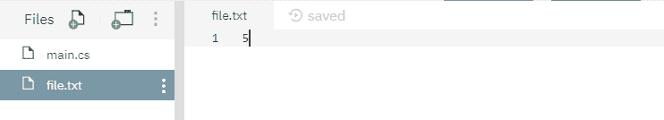

# 文件。C#中的 ReadAllBytes()方法，示例

> 原文:[https://www . geesforgeks . org/file-readall bytes-method-in-csharp-with-examples/](https://www.geeksforgeeks.org/file-readallbytes-method-in-csharp-with-examples/)

**文件。ReadAllBytes(String)** 是一个内置的 File 类方法，用于打开指定或创建的二进制文件，然后将文件内容读入字节数组，然后关闭文件。
**语法:**

```cs
public static byte[] ReadAllBytes (string path);
```

**参数:**该函数接受一个参数，如下图所示:

> *   **Path:** This is the specified file to open for reading.

**例外:**

*   **参数异常:***路径*是一个零长度字符串，只包含空格或一个或多个无效字符，如 InvalidPathChars 所定义。
*   **ArgumentNullException:***路径*为空。
*   **路径工具异常:**指定的*路径*、文件名或两者都超过了系统定义的最大长度。
*   **DirectoryNotFoundException:**指定的*路径*无效。
*   **IOException:** 打开文件时出现输入/输出错误。
*   **unauthorizedcessexception:**当前平台不支持此操作。或者*路径*指定了一个目录。或者呼叫者没有所需的权限。
*   **文件未找到异常:**在*路径*中指定的文件未找到。
*   **notSupportDexception:***路径*的格式无效。
*   **安全性异常:**调用方没有所需的权限。

**返回值:**返回包含文件内容的字节数组。
以下是说明文件的程序。ReadAllBytes(字符串)方法。
**程序 1:** 最初创建一个文件 *file.txt* ，内容如下所示-



## C#

```cs
// C# program to illustrate the usage
// of File.ReadAllBytes(String) method

// Using System and System.IO namespaces
using System;
using System.IO;

class GFG {
    public static void Main()
    {
        // Specifying a file
        string path = @"file.txt";

        // Calling the ReadAllBytes() function
        byte[] readText = File.ReadAllBytes(path);
        foreach(byte s in readText)
        {
            // Printing the binary array value of
            // the file contents
            Console.WriteLine(s);
        }
    }
}
```

**输出:**

```cs
53
```

**程序 2:** 最初没有创建文件。下面代码自己创建一个文件 *file.txt* 带有一些指定的内容。

## C#

```cs
// C# program to illustrate the usage
// of File.ReadAllBytes(String) method

// Using System and System.IO namespaces
using System;
using System.IO;

class GFG {
    public static void Main()
    {
        // Specifying a file
        string path = @"file.txt";

        // Adding below contents to the file
        string[] createText = { "GFG" };
        File.WriteAllLines(path, createText);

        // Calling the ReadAllBytes() function
        byte[] readText = File.ReadAllBytes(path);
        foreach(byte s in readText)
        {
            // Printing the binary array value of
            // the file contents
            Console.WriteLine(s);
        }
    }
}
```

**输出:**

```cs
71
70
71
10
```