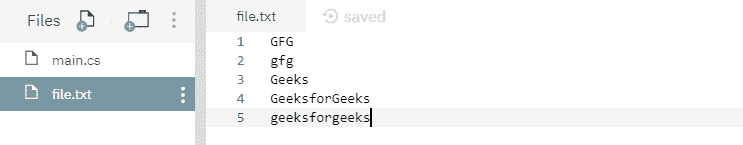

# 文件。C# 中的 ReadAllText(字符串，编码)方法，示例

> 原文:[https://www . geesforgeks . org/file-readalltextstring-encoding-method-in-c-sharp-with-examples/](https://www.geeksforgeeks.org/file-readalltextstring-encoding-method-in-c-sharp-with-examples/)

**文件。ReadAllText(String，Encoding)** 是一个内置的 File 类方法，用于打开一个文本文件，然后用指定的编码读取文件中的所有文本，然后关闭文件。
**语法:**

```cs
public static string ReadAllText (string path, System.Text.Encoding encoding);
```

**参数:**该函数接受一个参数，如下图所示:

> *   **Path:** This is the specified file to open for reading.
> *   **Code:** This applies to the contents of the file.

**例外:**

*   **参数异常:***路径*是一个零长度字符串，只包含空格或一个或多个无效字符，如 InvalidPathChars 所定义。
*   **ArgumentNullException:***路径*为空。
*   **路径工具异常:**指定的*路径*、文件名或两者都超过了系统定义的最大长度。
*   **DirectoryNotFoundException:**指定的*路径*无效。
*   **IOException:** 打开文件时出现输入/输出错误。
*   **未授权访问异常:***路径*指定了一个只读文件。或者当前平台不支持此操作。或者*路径*指定了一个目录。或者呼叫者没有所需的权限。
*   **文件未找到异常:**在*路径*中指定的文件未找到。
*   **notSupportDexception:***路径*的格式无效。
*   **安全性异常:**调用方没有所需的权限。

**返回值:**返回包含文件中所有文本的字符串。
以下是说明文件的程序。ReadAllText(字符串，编码)方法。
**程序 1:** 最初创建一个文件 *file.txt* ，内容如下所示-



## C#

```cs
// C# program to illustrate the usage
// of File.ReadAllText(String, Encoding) method

// Using System, System.IO and
// System.Text namespaces
using System;
using System.IO;
using System.Text;

class GFG {
    public static void Main()
    {
        // Specifying a file
        string path = @"file.txt";

        // Calling the ReadAllText(String, Encoding)
        // function
        string readText = File.ReadAllText(path, Encoding.UTF8);

        // Printing the file contents
        Console.WriteLine(readText);
    }
}
```

**输出:**

```cs
GFG
gfg
Geeks
GeeksforGeeks
geeksforgeeks
```

**程序 2:** 最初没有创建文件。下面代码自己创建一个文件 *file.txt* 带有一些指定的内容。

## C#

```cs
// C# program to illustrate the usage
// of File.ReadAllText(String, Encoding) method

// Using System, System.IO and
// System.Text namespaces
using System;
using System.IO;
using System.Text;

class GFG {
    public static void Main()
    {
        // Specifying a file
        string path = @"file.txt";

        // Adding below contents to the file
        string[] createText = { "GFG", "is a", "CS", "portal" };
        File.WriteAllLines(path, createText, Encoding.UTF8);

        // Calling the ReadAllText() function
        string readText = File.ReadAllText(path, Encoding.UTF8);

        // Printing the file contents
        Console.WriteLine(readText);
    }
}
```

**输出:**

```cs
GFG
is a
CS
portal
```