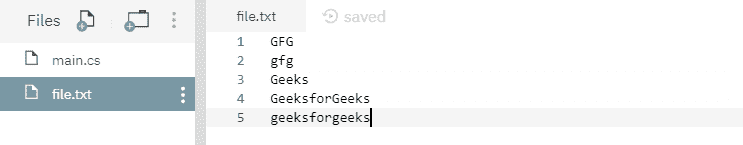

# 文件。C#中的 ReadLines(字符串)方法，示例

> 原文:[https://www . geesforgeks . org/file-readline string-method-in-c-sharp-with-examples/](https://www.geeksforgeeks.org/file-readlinesstring-method-in-c-sharp-with-examples/)

**文件。readline(String)**是一个内置的 File 类方法，用于读取文件的行。

**语法:**

```cs
public static System.Collections.Generic.IEnumerable ReadLines (string path);
```

**参数:**该函数接受如下所示的参数:

> *   **Path:** This is the specified file to be read.

**异常:**

*   **ArgumentException:***路径*是一个零长度字符串，只包含空格，或者一个或多个由 GetInvalidPathChars()方法定义的无效字符。
*   **ArgumentNullException:***路径*为空。
*   **DirectoryNotFoundException:***路径*无效。
*   **文件未找到异常:**未找到由*路径*指定的文件。
*   **IOException:** 打开文件时出现输入/输出错误。
*   **路径工具异常:***路径*超过了系统定义的最大长度。
*   **安全性异常:**调用方没有所需的权限。
*   **未授权访问异常:***路径*指定了一个只读文件。或者当前平台不支持此操作。或者*路径*是一个目录。或者呼叫者没有所需的权限。

**返回值:**返回指定文件的所有行。

下面是说明文件的程序。读取线(字符串)方法。

**程序 1:** 最初创建一个文件 *file.txt* ，内容如下-



```cs
// C# program to illustrate the usage
// of File.ReadLines(String) method

// Using System and System.IO namespaces
using System;
using System.IO;

public class GFG {
    public static void Main(String[] argv)
    {
        // Calling the ReadLines(String) function
        foreach(string line in File.ReadLines(@"file.txt"))
        {
            // Printing the file contents
            Console.WriteLine(line);
        }
    }
}
```

**输出:**

```cs
GFG
gfg
Geeks
GeeksforGeeks
geeksforgeeks

```

**程序 2:** 最初创建一个文件 *file.txt* ，内容如下-


下面的代码从文件中过滤一些内容并打印出来。

```cs
// C# program to illustrate the usage
// of File.ReadLines(String) method

// Using System and System.IO namespaces
using System;
using System.IO;

public class GFG {
    public static void Main(String[] argv)
    {
        // Calling the ReadLines(String) function
        foreach(string line in File.ReadLines(@"file.txt"))
        {
            // Filtering the file contents and printing
            if (line.Contains("GFG")) {
                Console.WriteLine(line);
            }
        }
    }
}
```

**输出:**

```cs
GFG

```