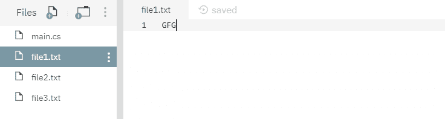
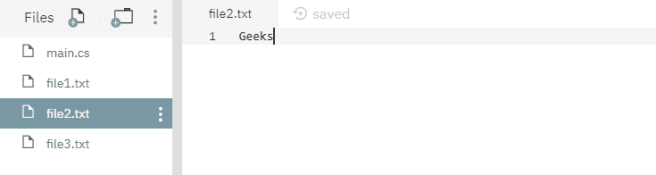
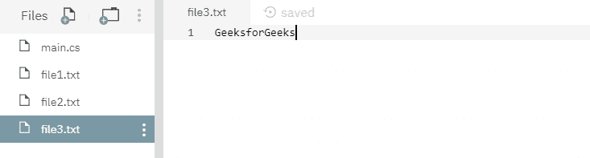

# 文件。用例子替换 C#中的(字符串、字符串、字符串、布尔)方法

> 原文:[https://www . geesforgeks . org/file-replace string-string-string-boolean-in-c-sharp-with-examples/](https://www.geeksforgeeks.org/file-replacestring-string-string-boolean-method-in-c-sharp-with-examples/)

**文件。Replace(String，String，String，Boolean)** 是一个内置的 File 类方法，用于用源文件的内容替换指定目标文件的内容，然后删除源文件，创建被替换文件的备份，并可选地忽略合并错误。

**语法:**

> 公共静态空替换(字符串源文件名、字符串目标文件名、字符串目标备份文件名、bool ignoredatadaerrors)；

**参数:**该函数接受四个参数，如下图所示:

> *   **Source file name:** This is the specified source file.
> *   **Target file name:** This is the specified target file, and its content is replaced by the content of the source file.
> *   **DestinationBackupfilename:** This file contains the backup of the contents of the replaced target file.
> *   [T0】 ignoreMetadataErrors: 【T1] This parameter contains a Boolean value, that is, true to ignore the merge errors from the replacement file to the replacement file (such as attributes and access control lists (ACLs))；); Otherwise, it is false.

**例外:**

*   **参数异常:**由*目的地文件名*参数描述的路径不是合法形式。或者*destinationBackupFileName*参数描述的路径不是合法形式。
*   **参数空异常:***目标文件名*参数为空。
*   **驱动器未找到异常:**指定了无效的驱动器。
*   **文件未找到异常:**找不到当前文件信息对象描述的文件。或者找不到*destinationBackupFileName*参数描述的文件。
*   **IOException:** 打开文件时出现输入/输出错误。或者*源文件名*和*目标文件名*参数指定相同的文件。
*   **路径工具异常:**指定的路径、文件名或两者都超过了系统定义的最大长度。
*   **PlatformNotSupportedException:**操作系统是 Windows 98 第二版或更早版本，文件系统不是 NTFS。
*   **未授权访问异常:***源文件名*或*目标文件名*参数指定了一个只读文件。或者当前平台不支持此操作。或源或目标参数指定目录而不是文件。或者呼叫者没有所需的权限。

下面是说明文件的程序。替换(字符串，字符串，字符串，布尔)方法。
**程序 1:** 在运行下面的代码之前，已经创建了三个文件，其中源文件为 *file1.txt* ，目标文件为 *file2.txt* ，备份文件为 *file3.txt* 。这些文件的内容如下所示-







## C#

```
// C# program to illustrate the usage
// of File.Replace(String, String,
// String, Boolean) method

// Using System and System.IO namespaces
using System;
using System.IO;

class GFG {
    public static void Main()
    {
        // Specifying 3 files
        string sourceFileName = "file1.txt";
        string destinationFileName = "file2.txt";
        string destinationBackupFileName = "file3.txt";

        // Calling the Replace() function
        File.Replace(sourceFileName, destinationFileName, 
                        destinationBackupFileName, true);

        Console.WriteLine("Replacement process has been done.");
    }
}
```