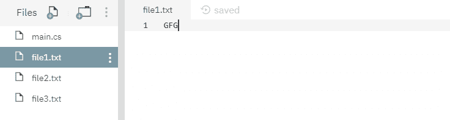
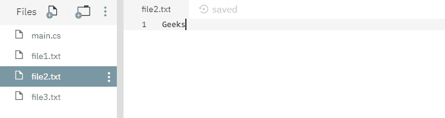
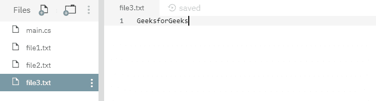
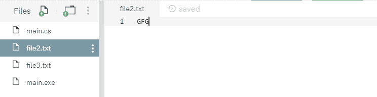
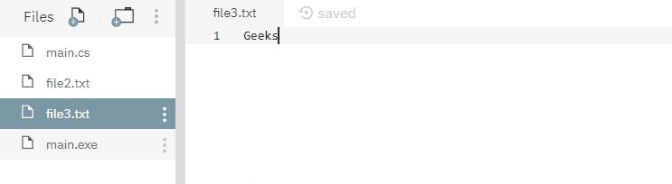
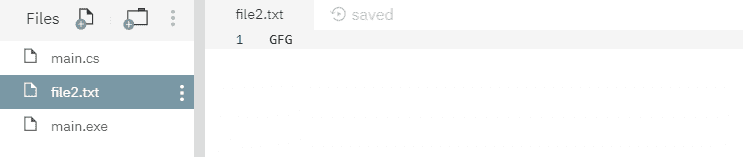

# 文件。用例子替换 C#中的(字符串，字符串，字符串)方法

> 原文:[https://www . geesforgeks . org/file-replace string-string-string-method-in-c-sharp-with-examples/](https://www.geeksforgeeks.org/file-replacestring-string-string-method-in-c-sharp-with-examples/)

**文件。Replace(String，String，String)** 是一个内置的 File 类方法，用于用源文件的内容替换指定目标文件的内容，然后删除源文件并创建被替换文件的备份。
**语法:**

> 公共静态空替换(字符串源文件名、字符串目标文件名、字符串目标备份文件名)；

**参数:**该函数接受三个参数，如下图所示:

> *   **Source file name:** This is the specified source file.
> *   **Target file name:** This is the specified target file, and its content is replaced by the content of the source file.
> *   **DestinationBackupfilename:** This file contains the backup of the contents of the replaced target file.

**例外:**

*   **参数异常:**由*目的地文件名*参数描述的路径不是合法形式。或者*destinationBackupFileName*参数描述的路径不是合法形式。
*   **参数空异常:***目标文件名*参数为空。
*   **驱动器未找到异常:**指定了无效的驱动器。
*   **文件未找到异常:**找不到当前文件信息对象描述的文件。或者找不到*destinationBackupFileName*参数描述的文件。
*   **IOException:** 打开文件时出现输入/输出错误。或者*源文件名*和*目标文件名*参数指定相同的文件。
*   **路径工具异常:**指定的路径、文件名或两者都超过了系统定义的最大长度。
*   **PlatformNotSupportedException:**操作系统为 Windows 98 第二版或更早版本，文件系统不是 NTFS。
*   **未授权访问异常:***源文件名*或*目标文件名*参数指定了一个只读文件。或者当前平台不支持此操作。或源或目标参数指定目录而不是文件。或者呼叫者没有所需的权限。

下面是说明文件的程序。替换(字符串，字符串，字符串)方法。
**程序 1:** 在运行下面的代码之前，已经创建了三个文件，其中源文件为 *file1.txt* ，目标文件为 *file2.txt* ，备份文件为 *file3.txt* 。这些文件的内容如下所示-







## c sharp . c sharp . c sharp . c sharp

// C# program to illustrate the usage// of File.Replace(String, String, String) method

//使用系统和系统。IO 命名空间
使用系统；
使用系统。IO；

GFG 类{
公共静态 void Main()
{
//指定 3 个文件
字符串 source filename = " file 1 . txt "；
字符串 destination filename = " file 2 . txt "；
字符串 destinationBackupFileName = " file 3 . txt "；

//调用 Replace()函数
文件。替换(源文件名，目标文件名，
目标备份文件名)；

控制台。写线(“替换过程已经完成。”);
}
}

**输出:**

```
Replacement process has been done.
```

运行上述代码后，显示上述输出，删除源文件，其余两个文件的内容如下所示-





**程序 2:** 在运行下面的代码之前，已经创建了两个文件，其中源文件是 *file1.txt* ，目标文件是 *file2.txt* ，没有备份文件，因为我们不想保留被替换文件的备份。这些文件的内容如下所示-


## C#

```
// C# program to illustrate the usage
// of File.Replace(String, String, String) method

// Using System and System.IO namespaces
using System;
using System.IO;

class GFG {
    public static void Main()
    {
        // Specifying 2 files
        string sourceFileName = "file1.txt";
        string destinationFileName = "file2.txt";

        // Calling the Replace() function with
        // null parameter inplace of backup file because
        // we do not want to keep backup of the
        // replaced file.
        File.Replace(sourceFileName, destinationFileName, null);

        Console.WriteLine("Replacement process has been done.");
    }
}
```

**输出:**

```
Replacement process has been done.
```

运行上述代码后，显示上述输出，删除源文件，目标文件内容如下所示-

