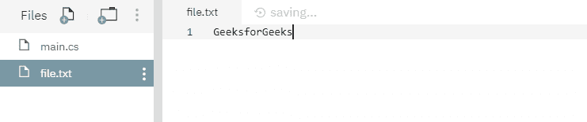

# 文件。C#中的 SetLastWriteTime()方法，示例

> 原文:[https://www . geesforgeks . org/file-setlastwritetime-method-in-csharp-with-examples/](https://www.geeksforgeeks.org/file-setlastwritetime-method-in-csharp-with-examples/)

**文件。SetLastWriteTime(String)** 是一个内置的 File 类方法，用于设置指定文件上次写入的日期和时间。

**语法:**

```cs
public static void SetLastWriteTime (string path, DateTime lastWriteTime);
```

**参数:**该函数接受两个参数，如下图所示:

> *   **Path:** This is the specified file for which date and time information is set.
> *   **Last write time:** This is the specified local last write date and time of the path.

**例外:**

*   **参数异常:***路径*是一个零长度字符串，只包含空格或一个或多个无效字符，如 InvalidPathChars 所定义。
*   **ArgumentNullException:***路径*为空。
*   **路径工具异常:**指定的*路径*、文件名或两者都超过了系统定义的最大长度。
*   **文件未找到异常:**未找到指定的*路径*。
*   **未授权访问异常:**调用方没有所需的权限。
*   **notSupportDexception:***路径*的格式无效。
*   **ArgumentOutOfRangeException:***最后写入时间*指定的值超出了此操作允许的日期或时间范围。

下面是说明文件的程序。方法。
**程序 1:** 在运行下面的代码之前，创建了一个文件 *file.txt* ，内容如下所示-



## c sharp . c sharp . c sharp . c sharp

```cs
// C# program to illustrate the usage
// of File.SetLastWriteTime() method

// Using System and System.IO namespaces
using System;
using System.IO;

class GFG {
    public static void Main()
    {
        // Specifying a file
        string myfile = @"file.txt";

        // Calling the SetLastWriteTime() function
        // to set last written date and time
        File.SetLastWriteTime(myfile, new DateTime(2020,
                                         5, 4, 4, 5, 7));

        // Getting the last written date and time
        // of the file
        DateTime dt = File.GetLastWriteTime(myfile);
        Console.WriteLine("The last written date and "+
                     "time for this file was {0}.", dt);
    }
}
```

**输出:**

```cs
The last written date and time for this file was 5/4/2020 4:05:07 AM.
```

**程序 2:** 最初没有创建文件。在代码下面，它自己创建了一个文件 *file.txt* 并打印最后一次写入的日期和时间。

## c sharp . c sharp . c sharp . c sharp

```cs
// C# program to illustrate the usage
// of File.SetLastWriteTime() method

// Using System and System.IO namespaces
using System;
using System.IO;

class GFG {
    public static void Main()
    {
        // Specifying a file
        string path = @"file.txt";

        // Checking the existence of the file
        if (!File.Exists(path)) {
            File.Create(path);
        }

        // Calling the SetLastWriteTime() function
        // to set last written date and time
        File.SetLastWriteTime(path, new DateTime(2019,
                                      5, 4, 4, 5, 7));

        // Getting the last written date and time
        // of the specified file
        DateTime dt = File.GetLastWriteTime(path);
        Console.WriteLine("The last written date and "+
                     "time for this file was {0}.", dt);
    }
}
```

**执行:**

```cs
The last written date and time for this file was 5/4/2019 4:05:07 AM.
```