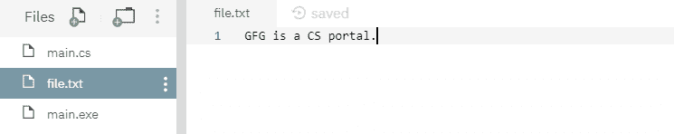
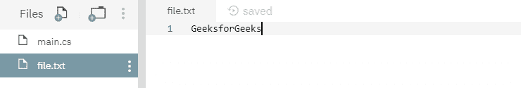

# 文件。C#中的 WriteAllBytes()方法，示例

> 原文:[https://www . geesforgeks . org/file-writelbytes-method-in-csharp-with-examples/](https://www.geeksforgeeks.org/file-writeallbytes-method-in-csharp-with-examples/)

**文件。writelbytes(String)**是一个内置的 File 类方法，用于创建新文件，然后将指定的字节数组写入文件，然后关闭文件。如果目标文件已经存在，它将被覆盖。

**语法:**

```
public static void WriteAllBytes (string path, byte[] bytes);
```

**参数:**该函数接受两个参数，如下图所示:

> *   **Path:** This is the specified file to which the byte array will be written.
> *   **Byte:** This is the specified byte to be written into the file.

**例外:**

*   **参数异常:***路径*是一个零长度字符串，只包含空格或一个或多个无效字符，如 InvalidPathChars 所定义。
*   **argumentNullException:***路径*为空或字节数组为空。
*   **路径工具异常:**指定的*路径*、文件名或两者都超过了系统定义的最大长度。
*   **DirectoryNotFoundException:**指定的*路径*无效。
*   **IOException:** 打开文件时出现输入/输出错误。
*   **未授权访问异常:***路径*指定了一个只读文件。或者*路径*指定了一个隐藏的文件。或者当前平台不支持此操作。或者*路径*指定了一个目录。或者呼叫者没有所需的权限。
*   **notSupportDexception:***路径*的格式无效。
*   **安全性异常:**调用方没有所需的权限。

下面是说明文件的程序。WriteAllBytes(字符串，字节[])方法。
**程序 1:** 最初，没有创建文件。在代码下面，它自己创建了一个文件 *file.txt* 并写入一些指定的字节数组，然后最终关闭该文件。

## c sharp . c sharp . c sharp . c sharp

```
// C# program to illustrate the usage
// of File.WriteAllBytes() method

// Using System, System.IO
// and System.Text namespaces
using System;
using System.IO;
using System.Text;

class GFG {
    static void Main(string[] args)
    {
        // Specifying a file name
        var path = @"file.txt";

        // Specifying a byte array
        string text = "GFG is a CS portal.";
        byte[] data = Encoding.ASCII.GetBytes(text);

        // Calling the WriteAllBytes() function
        // to write specified byte array to the file
        File.WriteAllBytes(path, data);
        Console.WriteLine("The data has been written to the file.");
    }
}
```

**输出:**

```
The data has been written to the file.
```

上面的代码给出了如上所示的输出，并创建了一个具有如下所示的一些指定内容的文件-



**程序 2:** 最初，创建了一个文件，内容如下所示:


下面的代码，用指定的字节数组数据覆盖上面的文件内容。

## c sharp . c sharp . c sharp . c sharp

```
// C# program to illustrate the usage
// of File.WriteAllBytes() method

// Using System, System.IO
// and System.Text namespaces
using System;
using System.IO;
using System.Text;

class GFG {
    static void Main(string[] args)
    {
        // Specifying a file name
        var path = @"file.txt";

        // Specifying a byte array data
        string text = "GeeksforGeeks";
        byte[] data = Encoding.ASCII.GetBytes(text);

        // Calling the WriteAllBytes() function
        // to overwrite the file contents with the
        // specified byte array data
        File.WriteAllBytes(path, data);
        Console.WriteLine("The data has been overwritten to the file.");
    }
}
```

**输出:**

```
The data has been overwritten to the file.
```

运行上述代码后，显示上述输出，文件内容被覆盖，如下图-

