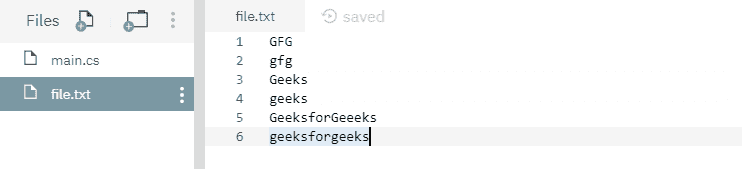
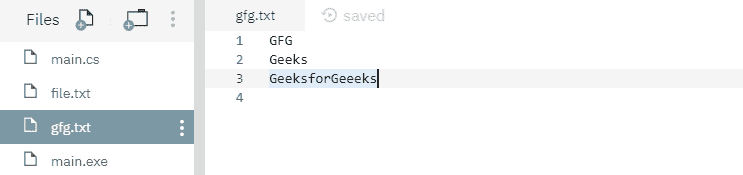
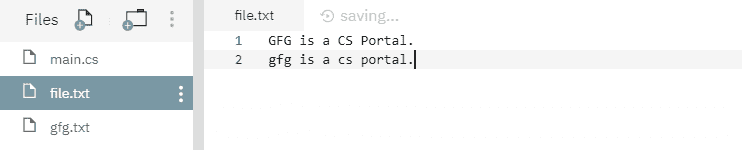
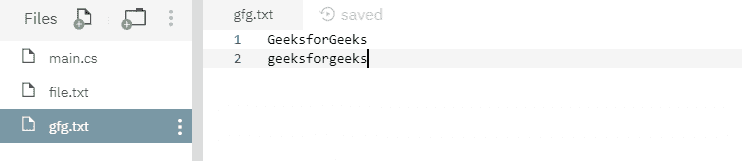
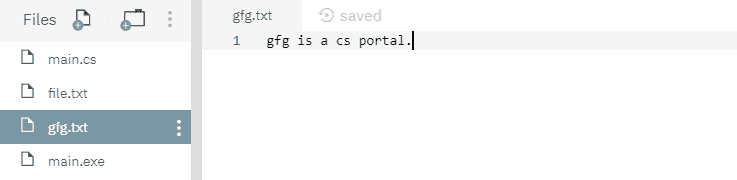

# 文件。C# 中的 writellines(String，IEnumerable <string>)方法，示例</string>

> 原文:[https://www . geesforgeks . org/file-writellinestring-ienumerablesting-method-in-c-sharp-with-examples/](https://www.geeksforgeeks.org/file-writealllinesstring-ienumerablestring-method-in-c-sharp-with-examples/)

**文件。writellines(String，IEnumerable < String > )** 是一个内置的 File 类方法，用于创建一个新文件，将一组字符串写入文件，然后关闭文件。

**语法:**

> 公共静态空写所有行(字符串路径，系统。集合. Generic.IEnumerable <string>内容)；</string>

**参数:**该函数接受两个参数，如下图所示:

> *   **Path:** This is the specified file to be written into the string set.
> *   **Content:** This is the specified line to be written into the file.

**异常:**

*   **ArgumentException:***路径*是一个零长度字符串，只包含空格，或者一个或多个由 GetInvalidPathChars()方法定义的无效字符。
*   **ArgumentNullException:** 或者*路径*或者内容为空。
*   **DirectoryNotFoundException:***路径*无效。
*   **IOException:** 打开文件时出现输入/输出错误。
*   **路径工具异常:***路径*超过了系统定义的最大长度。
*   **notSupportDexception:***路径*的格式无效。
*   **安全性异常:**调用方没有所需的权限。
*   **未授权访问异常:***路径*指定了一个只读文件。或者*路径*指定了一个隐藏的文件。或者当前平台不支持此操作。或者*路径*是一个目录。或者呼叫者没有所需的权限。

下面是说明文件的程序。writellines(String，IEnumerable)方法。

**程序 1:** 在运行下面的代码之前，创建一个文件 *file.txt* ，其内容将被过滤，如下所示-



在代码下面，它自己创建了一个新文件 *gfg.txt* ，其中包含过滤后的字符串。

```cs
// C# program to illustrate the usage
// of File.WriteAllLines(String, 
// IEnumerable<String>) method

// Using System, System.IO
// and System.Linq namespaces
using System;
using System.IO;
using System.Linq;

class GFG {
    // Specifying a file from where
    // some contents are going to be filtered
    static string Path = @"file.txt";

    static void Main(string[] args)
    {
        // Reading content of file.txt
        var da = from line in File.ReadLines(Path)

                 // Selecting lines started with "G"
                 where(line.StartsWith("G"))
                     select line;

        // Creating a new file gfg.txt with the
        // filtered contents
        File.WriteAllLines(@"gfg.txt", da);
        Console.WriteLine("Writing the filtered collection "+
                     "of strings to the file has been done.");
    }
}
```

**输出:**

```cs
Writing the filtered collection of strings to the file has been done.

```

运行上述代码后，显示上述输出，并创建一个新文件 *gfg.txt* ，如下所示-



**程序 2:** 在运行下面的代码之前，创建了两个文件 *file.txt* 和 *gfg.txt* ，内容如下-





下面的代码用文件*文件. txt* 的选定内容覆盖文件 *gfg.txt* 。

```cs
// C# program to illustrate the usage
// of File.WriteAllLines(String,
// IEnumerable<String>) method

// Using System, System.IO
// and System.Linq namespaces
using System;
using System.IO;
using System.Linq;

class GFG {
    // Specifying a file from where
    // some contents are going to be filtered
    static string Path = @"file.txt";

    static void Main(string[] args)
    {
        // Reading the contents of file.txt
        var da = from line in File.ReadLines(Path)

                 // Selecting lines started with "g"
                 where(line.StartsWith("g"))
                     select line;

        // Overwriting the file gfg.txt with the
        // selected string of the file file.txt
        File.WriteAllLines(@"gfg.txt", da);
        Console.WriteLine("Overwriting the selected collection"+
                      " of strings to the file has been done.");
    }
}
```

**输出:**

```cs
Overwriting the selected collection of strings to the file has been done.

```

运行上述代码后，显示上述输出，文件 *gfg.txt* 内容如下所示:

