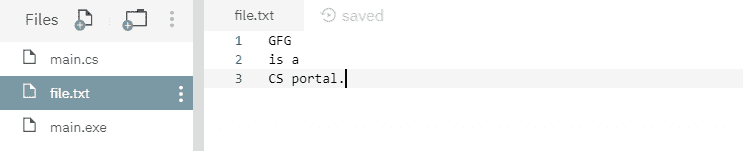
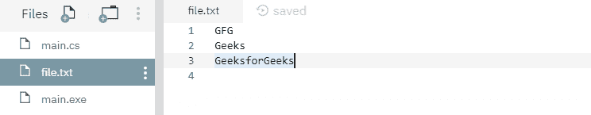

# 文件。C# 中的 WriteAllLines(字符串，字符串[]，编码)方法，示例

> 原文:[https://www . geesforgeks . org/file-writellinestring-string-encoding-method-in-c-sharp-with-examples/](https://www.geeksforgeeks.org/file-writealllinesstring-string-encoding-method-in-c-sharp-with-examples/)

**文件。writellines(String，String[]，Encoding)** 是一个内置的 File 类方法，用于创建新文件，使用指定的编码将指定的字符串数组写入文件，然后关闭文件。
**语法:**

> 公共静态 void WriteAllLines(字符串路径，字符串[]内容，系统。文本.编码编码)；

**参数:**该函数接受三个参数，如下图所示:

> *   **Path:** This is the specified file to which the specified string array will be written.
> *   **Directory:** This is an array of strings to be written to the file.
> *   **Encoding:** This indicates the character encoding applied to the string array.

**例外:**

*   **参数异常:***路径*是一个零长度字符串，只包含空格或一个或多个无效字符，如 InvalidPathChars 所定义。
*   **参数空异常:**或者*路径*或者*内容*为空。
*   **路径工具异常:**指定的*路径*、文件名或两者都超过了系统定义的最大长度。
*   **DirectoryNotFoundException:**指定的*路径*无效。
*   **IOException:** 打开文件时出现输入/输出错误。
*   **未授权访问异常:***路径*指定了一个只读文件。或者*路径*指定了一个隐藏的文件。或者当前平台不支持此操作。或者*路径*指定了一个目录。或者呼叫者没有所需的权限。
*   **notSupportDexception:***路径*的格式无效。
*   **安全性异常:**调用方没有所需的权限。

下面是说明文件的程序。writellines(String，String[])方法。
**程序 1:** 最初，没有创建文件。下面代码自己创建一个文件 *file.txt* 并将指定的字符串数组写入文件。

## C#

```cs
// C# program to illustrate the usage
// of File.WriteAllLines(String, String[], 
// Encoding) method

// Using System, System.IO and
// System.Text namespaces
using System;
using System.IO;
using System.Text;

class GFG {
    public static void Main()
    {
        // Specifying a file
        string path = @"file.txt";

        // Creating some string array to
        // write into the file
        string[] createText = { "GFG", "is a", "CS portal." };

        // Calling WriteAllLines() function to write
        // the specified string array into the file
        File.WriteAllLines(path, createText, Encoding.UTF8);

        // Reading the file contents
        string[] readText = File.ReadAllLines(path, Encoding.UTF8);
        foreach(string s in readText)
        {
            Console.WriteLine(s);
        }
    }
}
```

**输出:**

```cs
GFG
is a
CS portal.
```

运行上述代码后，显示上述输出，并创建一个新文件 *file.txt* ，如下所示-



**程序 2:** 最初创建一个文件 *file.txt* ，内容如下所示-


下面的代码用指定的字符串数组覆盖文件内容。

## C#

```cs
// C# program to illustrate the usage
// of File.WriteAllLines(String, 
// String[], Encoding) method

// Using System, System.IO and
// System.Text namespaces
using System;
using System.IO;
using System.Text;

class GFG {
    public static void Main()
    {
        // Specifying a file
        string path = @"file.txt";

        // Creating some string array to
        // write into the file
        string[] createText = { "GFG", "Geeks", "GeeksforGeeks" };

        // Calling WriteAllLines() function to overwrite
        // the specified string array into the file
        File.WriteAllLines(path, createText, Encoding.UTF8);

        // Reading the file contents
        string[] readText = File.ReadAllLines(path, Encoding.UTF8);
        foreach(string s in readText)
        {
            Console.WriteLine(s);
        }
    }
}
```

**输出:**

```cs
GFG
Geeks
GeeksforGeeks
```

运行上述代码后，显示上述输出，文件 *file.txt* 内容如下所示-

