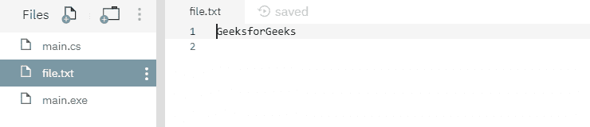
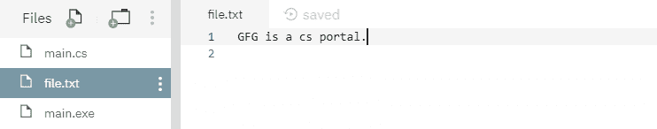

# 文件。C#中的 WriteAllText(字符串，字符串)方法，示例

> 原文:[https://www . geesforgeks . org/file-writeltextstring-string-method-in-c-sharp-with-examples/](https://www.geeksforgeeks.org/file-writealltextstring-string-method-in-c-sharp-with-examples/)

**文件。writeltext(String，String)** 是一个内置的 File 类方法，用于创建新文件，将指定的字符串写入文件，然后关闭文件。如果目标文件已经存在，它将被覆盖。

**语法:**

```cs
public static void WriteAllText (string path, string contents);
```

**参数:**该函数接受两个参数，如下图所示:

> *   **Path:** This is the specified file to which the specified string will be written.
> *   **Directory:** This is a string that specifies the file to be written.

**异常:**

*   **参数异常:***路径*是一个零长度字符串，只包含空格或一个或多个无效字符，如 InvalidPathChars 所定义。
*   **ArgumentNullException:***路径*为空。
*   **路径工具异常:**指定的*路径*、文件名或两者都超过了系统定义的最大长度。
*   **DirectoryNotFoundException:**指定的*路径*无效。
*   **IOException:** 打开文件时出现输入/输出错误。
*   **未授权访问异常:***路径*指定了一个只读文件。或者*路径*指定了一个隐藏的文件。或者当前平台不支持此操作。或者路径指定了一个目录。或者呼叫者没有所需的权限。
*   **notSupportDexception:***路径*的格式无效。
*   **安全性异常:**调用方没有所需的权限。

下面是说明文件的程序。方法。

**程序 1:** 最初，没有创建文件。下面代码自己创建一个文件 *file.txt* 并将指定的字符串数组写入文件。

```cs
// C# program to illustrate the usage
// of File.WriteAllText(String, String) method

// Using System, System.IO and
// System.Text namespaces
using System;
using System.IO;
using System.Text;

class GFG {
    public static void Main()
    {
        // Specifying a file
        string path = @"file.txt";

        // Creating a string
        string createText = "GeeksforGeeks" + Environment.NewLine;

        // Writing the string to the file
        File.WriteAllText(path, createText);

        // Reading the contents of the file
        string readText = File.ReadAllText(path);
        Console.WriteLine(readText);
    }
}
```

**输出:**

```cs
GeeksforGeeks

```

运行上述代码后，显示上述输出，并创建一个新文件 *file.txt* ，如下所示-



**程序 2:** 最初创建一个文件 *file.txt* ，内容如下-


下面的代码用指定的字符串覆盖文件内容。

```cs
// C# program to illustrate the usage
// of File.WriteAllText(String, String) method

// Using System, System.IO and
// System.Text namespaces
using System;
using System.IO;
using System.Text;

class GFG {
    public static void Main()
    {
        // Specifying a file
        string path = @"file.txt";

        // Creating a string
        string createText = "GFG is a cs portal." + Environment.NewLine;

        // Overwriting the string to the file
        File.WriteAllText(path, createText);

        // Reading the contents of the file
        string readText = File.ReadAllText(path);
        Console.WriteLine(readText);
    }
}
```

**输出:**

```cs
GFG is a cs portal.

```

运行上述代码后，显示上述输出，文件 *file.txt* 内容如下图所示:

