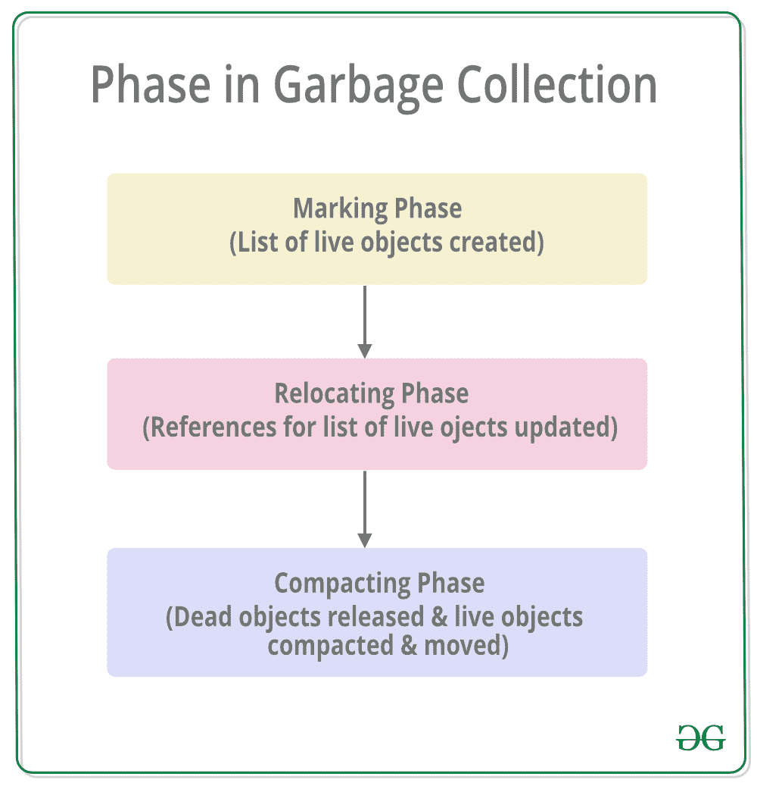
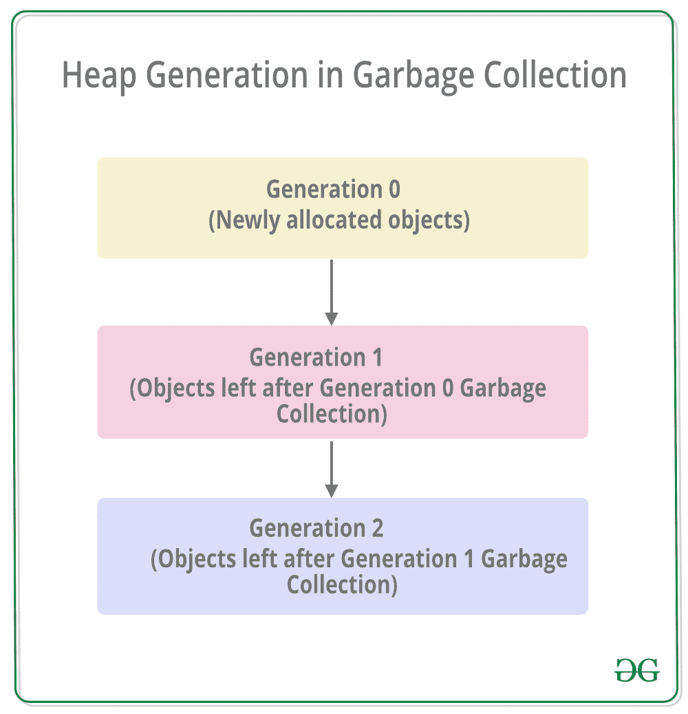

# c#中的垃圾收集|。NET 框架

> 原文:[https://www . geesforgeks . org/垃圾收集-in-c-sharp-dot-net-framework/](https://www.geeksforgeeks.org/garbage-collection-in-c-sharp-dot-net-framework/)

通过中的**垃圾收集，自动内存管理成为可能。NET 框架**。当一个类对象在运行时被创建时，一定的内存空间在堆内存中被分配给它。然而，在程序中完成与对象相关的所有操作后，分配给它的内存空间是一种浪费，因为它无法使用。在这种情况下，垃圾收集非常有用，因为它会在不再需要内存空间后自动释放内存空间。
垃圾收集将始终在**托管堆**上工作，内部有一个引擎，称为**优化引擎**。
如果满足多个条件中的至少一个，则发生垃圾收集。这些条件如下:

*   如果系统的物理内存很低，那么垃圾收集是必要的。
*   如果分配给堆内存中各种对象的内存超过预设阈值，就会发生垃圾收集。
*   如果 *GC。调用 Collect* 方法，然后发生垃圾收集。但是，该方法仅在异常情况下调用，因为通常垃圾收集器会自动运行。

#### 垃圾收集的阶段

垃圾收集主要有 **3** 阶段。详情如下:



1.  **标记阶段:**在标记阶段创建所有活动对象的列表。这是通过遵循所有根对象的引用来完成的。所有不在活动对象列表中的对象都有可能从堆内存中删除。
2.  **重新定位阶段:**在重新定位阶段，所有活动对象列表中的所有对象的引用都会更新，以便它们指向在压缩阶段对象将被重新定位到的新位置。
3.  **压缩阶段:**堆在压缩阶段被压缩，因为死对象占据的空间被释放，剩余的活对象被移动。垃圾收集后剩余的所有活动对象都按照其原始顺序移向堆内存的旧端。

#### 垃圾收集中的堆代

堆内存被组织成 3 代，以便在垃圾收集期间可以适当地处理具有不同生存期的各种对象。根据项目规模，每一代的内存将由[](https://www.geeksforgeeks.org/common-language-runtime-clr-in-c-sharp/)**公共语言运行库提供。在内部，优化引擎将调用*收集方式方法*来选择哪些对象将进入第 1 代或第 2 代。** 

****

*   ****第 0 代:**临时变量等所有短命对象都包含在堆内存的第 0 代中。所有新分配的对象也是第 0 代对象，除非它们是大型对象。一般来说，垃圾收集的频率在 0 代最高。**
*   ****第 1 代:**如果空间被一些在垃圾收集运行中没有释放的第 0 代对象占用，那么这些对象被移动到第 1 代。这一代中的对象是第 0 代中的短期对象和第 2 代中的长期对象之间的一种缓冲区。**
*   ****第 2 代:**如果一些第 1 代对象占用的空间在下一次垃圾收集运行中没有释放，那么这些对象将被移动到第 2 代。第 2 代中的对象是长期存在的，例如静态对象，因为它们在整个进程期间都保留在堆内存中。**

****注:**一代人的垃圾收集意味着其所有年轻一代的垃圾收集。这意味着，在那个特定的一代和它的年轻一代的所有对象被释放。因为这个原因，第 2 代的垃圾收集被称为完全垃圾收集，因为堆内存中的所有对象都被释放了。此外，分配给第 2 代的内存将大于第 1 代的内存，类似地，第 1 代的内存将大于第 0 代的内存(**第 2 代>第 1 代>第 0 代**)。
一个演示垃圾收集中使用垃圾收集器的堆生成数量的程序。GC 类的 MaxGeneration 属性如下:** 

## **c sharp . c sharp . c sharp . c sharp**

```cs
using System;

public class Demo {

    // Main Method
    public static void Main(string[] args)
    {
        Console.WriteLine("The number of generations are: " +
                                           GC.MaxGeneration);
    }
}
```

****Output:** 

```cs
The number of generations are: 2
```** 

**在上面的程序中， *GC。MaxGeneration* 属性用于查找系统支持的最大代数**，即 2。如果你将在在线编译器上运行这个程序，那么你可能会得到不同的输出，因为这取决于系统。**** 

#### **气相色谱类方法**

**GC 类控制系统的垃圾收集器。GC 类中的一些方法给出如下:
**GC。GetGeneration()方法:**该方法返回目标对象的生成号。它需要一个参数，即需要生成号的目标对象。
演示 *GC 的程序。GetGeneration()* 方法如下:** 

## **c sharp . c sharp . c sharp . c sharp**

```cs
using System;

public class Demo {

    public static void Main(string[] args)
    {
        Demo obj = new Demo();
        Console.WriteLine("The generation number of object obj is: "
                                          + GC.GetGeneration(obj));
    }
}
```

****Output:** 

```cs
The generation number of object obj is: 0
```** 

****GC。GetTotalMemory()方法:**此方法返回系统中分配的字节数。它需要一个布尔参数，其中 true 表示方法在返回之前等待垃圾收集的发生，false 表示相反。
演示 *GC 的程序。GetTotalMemory()方法*给出如下:** 

## **c sharp . c sharp . c sharp . c sharp**

```cs
using System;

public class Demo {

    public static void Main(string[] args)
    {
        Console.WriteLine("Total Memory:" + GC.GetTotalMemory(false));

        Demo obj = new Demo();

        Console.WriteLine("The generation number of object obj is: "
                                           + GC.GetGeneration(obj));

        Console.WriteLine("Total Memory:" + GC.GetTotalMemory(false));
    }
}
```

****Output:** 

```cs
Total Memory:4197120
The generation number of object obj is: 0
Total Memory:4204024
```** 

****注意:**输出可能因系统而异。
T3】GC。Collect()方法:可以使用 *GC 在系统中强制进行垃圾收集。收集()方法*。此方法需要一个参数，即发生垃圾收集的最早的一代的数量。
演示 *GC 的程序。收集()方法*如下:** 

## **c sharp . c sharp . c sharp . c sharp**

```cs
using System;

public class Demo {

    public static void Main(string[] args)
    {
        GC.Collect(0);
        Console.WriteLine("Garbage Collection in Generation 0 is: "
                                          + GC.CollectionCount(0));
    }
}
```

****Output:** 

```cs
Garbage Collection in Generation 0 is: 1
```** 

****垃圾收集的好处**** 

*   **垃圾收集成功地使用几代垃圾收集在堆内存上有效地分配对象。**
*   **不需要手动释放内存，因为垃圾收集会在不再需要内存空间后自动释放内存空间。**
*   **垃圾收集安全地处理内存分配，这样就不会有对象错误地使用另一个对象的内容。**
*   **新创建的对象的构造函数不必初始化所有的数据字段，因为垃圾收集会清除先前释放的对象的内存。**