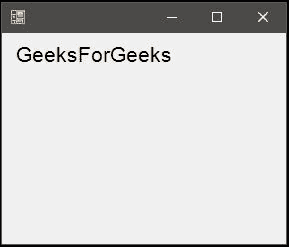
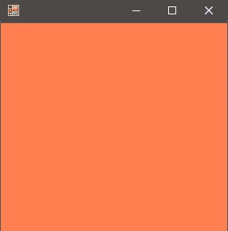

# 图形。C#中的 Clear()方法，示例

> 原文:[https://www . geeksforgeeks . org/graphics-clear-method-in-c-sharp-with-examples/](https://www.geeksforgeeks.org/graphics-clear-method-in-c-sharp-with-examples/)

**图形。清除(颜色)方法**用于清除画布，并用指定的背景颜色将其绘制出来。

> **语法:**公共虚空清除(系统。绘图.颜色颜色)；
> **参数:**
> **颜色:**包含 RGB 值的颜色标识符，给画布的背景上色。

**例 1:**

```
// C# snippet to print GeeksForGeeks
using System;
using System.Drawing;
using System.Drawing.Printing;
using System.Windows.Forms;
namespace GFG {

class PrintableForm : Form {

    // Main Method
    public static void Main()
    {
        Application.Run(new PrintableForm());
    }
    public PrintableForm()
    {
        ResizeRedraw = true;
    }

    protected override void OnPaint(PaintEventArgs e)
    {
        Font font = new Font("Arial", 16);
        SolidBrush brush = new SolidBrush(Color.Black);
        PointF point = new PointF(10.0F, 10.0F);
        e.Graphics.DrawString("GeeksForGeeks", font, brush, point);
    }
}
}
```

**输出:**



**例 2:**

```
// C# program to illustrate the Clear Method
// C# snippet to print GeeksForGeeks
using System;
using System.Drawing;
using System.Drawing.Printing;
using System.Windows.Forms;
namespace GFG {

class PrintableForm : Form {

    // Main Method
    public static void Main()
    {
        Application.Run(new PrintableForm());
    }
    public PrintableForm()
    {
        ResizeRedraw = true;
    }

    protected override void
    OnPaint(PaintEventArgs e)
    {
        e.Graphics.Clear(Color.Coral);
    }
}
}
```

**输出:**



**参考:**

*   [https://docs . Microsoft . com/en-us/dotnet/API/system . drawing . graphics . clear？视图=netframework-4.7.2](https://docs.microsoft.com/en-us/dotnet/api/system.drawing.graphics.clear?view=netframework-4.7.2)