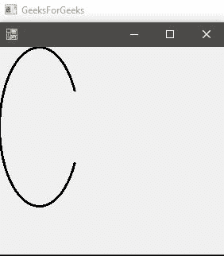
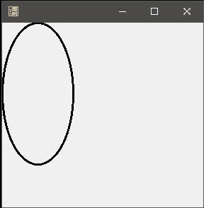
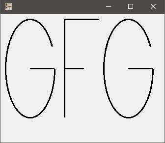

# 图形。C#中的 DrawArc()方法，带示例

> 原文:[https://www . geesforgeks . org/graphics-draw arc-method-in-c-sharp-with-examples/](https://www.geeksforgeeks.org/graphics-drawarc-method-in-c-sharp-with-examples/)

**图形。绘制圆弧法**用于绘制一条圆弧，该圆弧代表由一对坐标、宽度和高度指定的椭圆的一部分。该方法的过载列表中有 **4** 种方法，如下:

*   **绘图弧(钢笔、矩形、单个、单个)方法**
*   **绘图弧(钢笔，矩形，单个，单个)方法**
*   **DrawArc(Pen，Int32，Int32，Int32，Int32，Int32，Int32)方法**
*   **绘图弧(钢笔，单，单，单，单，单，单，单)方法**

#### **绘图弧(钢笔、矩形、单、单)**

**此方法用于绘制代表矩形结构指定的椭圆的一部分的弧。**

> ****语法:**公共 void DrawArc(系统。绘图。钢笔，系统。绘图。矩形矩形，浮动起始角，浮动扫描)**
> 
>  ****参数:**
> **笔**:决定弧线的颜色、宽度和样式。
> **矩形**:确定椭圆刚好完美适合的最小矩形。
> **起始角度**:从 x 轴到圆弧起点顺时针测量的角度，单位为度。
> **扫掠角度**:从弧的起点角度参数到终点顺时针测量的角度。**

****异常:**如果笔为空，这个方法会给出 *ArgumentNullException* 。**

****示例:****

```cs
// C# program to illustrate the 
// DrawArc(Pen, Rectangle, Single,
// Single) Method
using System;
using System.Drawing;
using System.Drawing.Printing;
using System.Windows.Forms;

namespace GFG {

class PrintableForm : Form {

    // Main Method
    public static void Main()
    {
        Application.Run(new PrintableForm());
    }
    public PrintableForm()
    {
        ResizeRedraw = true;
    }

    protected override void OnPaint(PaintEventArgs e)
    {
        // Create pen.
        Pen blackPen = new Pen(Color.Black, 3);

        // Reactangle with specifies x1,
        // y1, x2, y2 respectively
        Rectangle rect = new Rectangle(0, 0, 100, 200);

        // Create start and sweep angles on ellipse.
        float startAngle = 45.0F;
        float sweepAngle = 270.0F;

        // Draw arc to screen.
        e.Graphics.DrawArc(blackPen, rect, 
                  startAngle, sweepAngle);
    }
}
}
```

****输出:****

****

#### **绘图弧(钢笔，直角，单，单)**

**此方法用于绘制一条弧，该弧表示由矩形结构指定的椭圆的一部分。**

> ****语法:**公共 void DrawArc(系统。绘图。钢笔，系统。Drawing.RectangleF rect，float startAngle，float sweepAngle)；**
> 
> ****参数:**
> **笔**:决定弧线的颜色、宽度和样式。
> **矩形**:确定椭圆刚好完美适合的最小矩形。
> **起始角度**:从 x 轴到圆弧起点顺时针测量的角度，单位为度。**扫描角度**:从弧的起点角度参数到终点顺时针测量的角度。**

****异常:**如果笔为空，这个方法会给出 *ArgumentNullException* 。**

****例 1:****

```cs
// C# program to illustrate the 
// DrawArc(Pen, RectangleF, 
// Single, Single) Method
using System;
using System.Drawing;
using System.Drawing.Printing;
using System.Windows.Forms;

namespace GFG {

class PrintableForm : Form {

    // Main Method
    public static void Main()
    {

        Application.Run(new PrintableForm());
    }

    public PrintableForm()
    {
        ResizeRedraw = true;
    }

    protected override void OnPaint(PaintEventArgs e)
    {
        // Create pen
        Pen blackPen = new Pen(Color.Black, 3);

        // Reactangle with specifies x1,
        // y1, x2, y2 respectively
        RectangleF rect = new RectangleF(0.0F, 
                        0.0F, 100.0F, 200.0F);

        // Create start and sweep
        // angles on an ellipse.
        float startAngle = 45.0F;
        float sweepAngle = 270.0F;

        // Draw arc to screen.
        e.Graphics.DrawArc(blackPen, rect,
                  startAngle, sweepAngle);
    }
}
}
```

****输出:****

****

#### **绘图弧(钢笔，单，单，单，单，单，单，单，单)**

**此方法用于绘制代表椭圆一部分的圆弧，椭圆由一对坐标、宽度和高度指定。**

> ****语法:**公共 void DrawArc(系统。Drawing.Pen pen，float x，float y，float width，float height，float startAngle，float sweepAngle)；**
> 
> ****参数:**
> **笔**:笔决定线条的颜色、宽度和样式。
> **x** :定义椭圆的矩形左上角的横坐标。
> **y** :定义椭圆的矩形左上角的纵坐标。
> **宽度**:定义椭圆的矩形的宽度或者更具体的我们可以说横坐标中椭圆的直径。
> **高度**:定义椭圆的矩形的高度，或者更具体地说，我们可以用纵坐标表示椭圆的直径。
> **起始角度**:从 x 轴到圆弧起点顺时针测量的角度，单位为度。
> **扫掠角度**:从起始角度参数到圆弧终点顺时针测量的角度。**

****异常:**如果笔为空，这个方法会给出 *ArgumentNullException* 。**

****例 1:****

```cs
// C# program to draw a circle
using System;
using System.Drawing;
using System.Drawing.Printing;
using System.Windows.Forms;

namespace GFG {

class PrintableForm : Form {

    // Main Method
    public static void Main()
    {
        Application.Run(new PrintableForm());
    }

    public PrintableForm()
    {
        ResizeRedraw = true;
    }

    protected override void OnPaint(PaintEventArgs e)
    {
        // Create pen.
        Pen blackPen = new Pen(Color.Black, 3);

        // Create coordinates of the rectangle
        // to the bound ellipse.
        int x = 0;
        int y = 0;
        int width = 100;
        int height = 200;

        // Create start and sweep 
        // angles on ellipse.
        int startAngle = 0;
        int sweepAngle = 360;

        // Draw arc to screen.
        e.Graphics.DrawArc(blackPen, x, y, width,
                 height, startAngle, sweepAngle);
    }
}
}
```

****输出:****

****

****例 2:****

```cs
// C# program to draw GFG
using System;
using System.Drawing;
using System.Drawing.Printing;
using System.Windows.Forms;

namespace GFG {

class PrintableForm : Form {

    // Main Method
    public static void Main()
    {
        Application.Run(new PrintableForm());
    }

    public PrintableForm()
    {
        ResizeRedraw = true;
    }

    protected override void OnPaint(PaintEventArgs e)
    {
        // Create pen.
        Pen blackPen = new Pen(Color.Black, 3);

        // Creates letter G
        e.Graphics.DrawArc(blackPen, 10,
                  10, 100, 200, 0, 315);

        e.Graphics.DrawLine(blackPen,
                  60, 110, 110, 110);

        // Creates letter F
        e.Graphics.DrawLine(blackPen,
                  130, 10, 130, 210);

        e.Graphics.DrawLine(blackPen,
                   130, 10, 200, 10);

        e.Graphics.DrawLine(blackPen, 
                 130, 110, 170, 110);

        // Creates the next letter G
        e.Graphics.DrawArc(blackPen,
         210, 10, 100, 200, 0, 315);

        e.Graphics.DrawLine(blackPen,
                 260, 110, 310, 110);
    }
}
}
```

****输出:****

****

#### **绘图弧(钢笔，Int32，Int32，Int32，Int32，Int32，Int32，Int32)**

**此方法用于绘制代表椭圆一部分的圆弧，椭圆由一对坐标、宽度和高度指定。**

> ****语法:**公共 void DrawArc(系统。Drawing.Pen pen，int x，int y，int width，int height，int startAngle，int sweepAngle)；**
> 
> ****参数:**
> **笔**:笔决定线条的颜色、宽度和样式。
> **x** :定义椭圆的矩形左上角的横坐标。
> **y** :定义椭圆的矩形左上角的纵坐标。
> **宽度**:定义椭圆的矩形的宽度或者更具体的我们可以说横坐标中椭圆的直径。
> **高度**:定义椭圆的矩形的高度，或者更具体地说，我们可以说椭圆的直径是不规则的。
> **起始角度**:从 x 轴到圆弧起点顺时针测量的角度，单位为度。
> **扫掠角度**:从弧的起点角度参数到终点顺时针测量的角度。**

****异常:**如果笔为空，这个方法会给出 *ArgumentNullException* 。**

****示例:****

```cs
// C# program to draw a circle
using System;
using System.Drawing;
using System.Drawing.Printing;
using System.Windows.Forms;

namespace GFG {

class PrintableForm : Form {

    // Main Method
    public static void Main()
    {
        Application.Run(new PrintableForm());
    }
    public PrintableForm()
    {
        ResizeRedraw = true;
    }
    protected override void OnPaint(PaintEventArgs e)
    {
        // Create pen.
        Pen blackPen = new Pen(Color.Black, 3);

        // Create coordinates of the rectangle
        // to the bound ellipse.
        float x = 0.0F;
        float y = 0.0F;
        float width = 100.0F;
        float height = 200.0F;

        // Create start and sweep
        // angles on the ellipse.
        float startAngle = 0.0F;
        float sweepAngle = 360.0F;

        // Draw arc to screen.
        e.Graphics.DrawArc(blackPen, x, y, width,
                 height, startAngle, sweepAngle);
    }
}
}
```

****输出:****

****

****参考:****

*   **[https://docs . Microsoft . com/en-us/dotnet/API/system . drawing . graphics . draw arc？视图=netframework-4.7.2](https://docs.microsoft.com/en-us/dotnet/api/system.drawing.graphics.drawarc?view=netframework-4.7.2)**