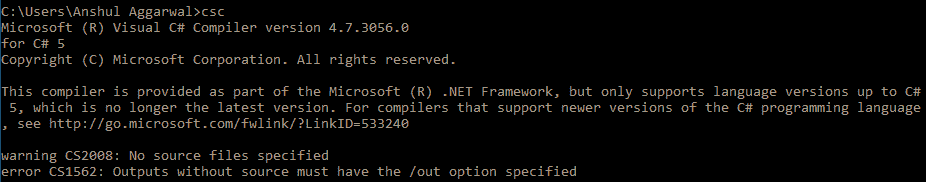
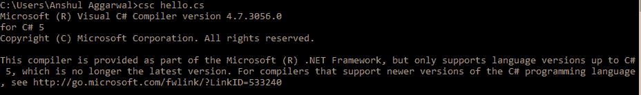
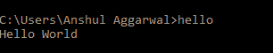

# c#中的 Hello World

> 原文:[https://www.geeksforgeeks.org/hello-world-in-c-sharp/](https://www.geeksforgeeks.org/hello-world-in-c-sharp/)

你好世界！当你钻研一门新的编程语言时，程序是最基本的，也是第一个程序。这只是打印你好世界！在输出屏幕上。在 [C#](https://www.geeksforgeeks.org/introduction-to-c-sharp/) 中，一个基本程序由以下内容组成:

*   **命名空间声明**
*   **类别声明和定义**
*   **类成员(如变量、方法等。)**
*   **主要方法**
*   **语句或表达式**

****示例:****

```
// C# program to print Hello World!
using System;

// namespace declaration
namespace HelloWorldApp {

    // Class declaration
    class Geeks {

        // Main Method
        static void Main(string[] args) {

            // statement
            // printing Hello World!
            Console.WriteLine("Hello World!");

            // To prevents the screen from 
            // running and closing quickly
            Console.ReadKey();
        }
    }
}
```

****Output:**

```
Hello World!

```** 

****说明:****

*   ****使用 System:** System 是一个 **[命名空间](https://www.geeksforgeeks.org/c-namespaces/)** ，里面包含了常用的类型。使用系统指令通过**指定。****
*   ****namespace hellowordapp:**这里的 namespace 是用来定义名字空间的关键字。*hellowordapp*是给命名空间的用户定义名称。更多详情可参考**T5】c# |命名空间 T7】****
*   ****类极客:**这里*类*是用于申报类的关键字。*极客*是用户自定义的班级名称。**
*   ****static void Main(string[]args):**这里 *static* 关键字告诉我们这个方法不需要实例化类就可以访问。 *void* 关键字告诉我们这个方法不会返回任何东西。 *Main()* 方法是我们应用的切入点。在我们的程序中， *Main()* 方法用语句 *Console 指定其行为。写线(“你好世界！”);*。**
*   ****控制台。WriteLine():** 这里 *WriteLine()* 是在系统命名空间中定义的控制台类的一个方法。**
*   ****控制台。ReadKey():** 这是给 VS.NET 用户的。这使得程序等待按键，并阻止屏幕快速运行和关闭。**

#### **如何运行 C#程序？**

**一般有 **3 种方式**编译执行 C#程序如下:**

*   ****使用在线 C#编译器:**可以使用各种在线 **[IDE](https://ide.geeksforgeeks.org/ZVr7YapAeH)** 。它可以用来运行 C#程序而无需安装。**
*   ****使用 Visual Studio IDE:** 微软提供了一款名为 Visual Studio 的 IDE(集成开发环境)工具，使用 C#、VB(Visual Basic)等不同编程语言开发应用。为了商业目的安装和使用 Visual Studio，它必须从微软购买许可证。出于学习(非商业)目的，微软提供了免费的 Visual Studio 社区版。要了解如何在 Visual Studio 中运行程序，可以参考 **[这个](https://www.geeksforgeeks.org/setting-environment-c/)** 。**
*   ****使用命令行:**也可以使用命令行选项运行 C#程序。以下步骤演示了如何在 Windows 操作系统中的命令行上运行 C#程序:

    *   首先，打开一个文本编辑器，如记事本或记事本++。
    *   在文本编辑器中写入代码，用**保存文件。cs** 分机。
    *   打开 cmd(命令提示符)，运行命令 **csc** 检查编译器版本。它指定您是否安装了有效的编译器。如果您确认安装了编译器，则可以避免此步骤。
        [](https://media.geeksforgeeks.org/wp-content/uploads/Step3.png)
    *   To compile the code type **csc filename.cs** on cmd. If your program has no error then it will create a filename.exe file in the same directory where you have saved your program. Suppose you saved the above program as *hello.cs*. So you will write *csc hello.cs* on cmd. This will create a *hello.exe*.

        [](https://media.geeksforgeeks.org/wp-content/uploads/step4-2.png)

    *   Now you have to ways to execute the *hello.exe*. First, you have to simply type the filename i.e hello on the cmd and it will give the output. Second, you can go to the directory where you saved your program and there you find *filename.exe*. You have to simply double-click that file and it will give the output.

        [](https://media.geeksforgeeks.org/wp-content/uploads/step5-1.png)**