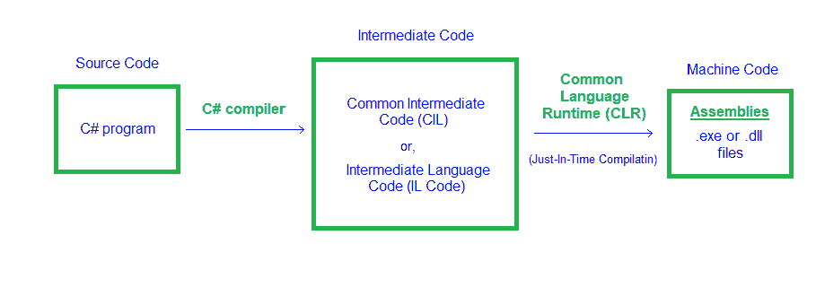

# c# 代码是如何编译和执行的？

> 原文:[https://www . geesforgeks . org/how-c-sharp-code-get-compiled-and-executed/](https://www.geeksforgeeks.org/how-c-sharp-code-gets-compiled-and-executed/)

C# 是一种通用的、强类型的、词汇范围的、函数式的、面向对象的和面向组件的编程语言。在本文中，我们将学习如何编译和执行 C# 代码。

**c# 代码编译的分步过程:**

**第一步:**写一个 C# 代码。

**第二步:**用 C# 编译器编译代码。

**步骤 3:** 现在编译器检查代码是否包含错误。如果没有发现错误，那么编译器进入下一步。或者如果编译器发现错误，那么它会立即告诉开发人员在给定的行中发现了错误，以便开发人员可以纠正它们。纠正错误后，当您再次运行代码时，编译器再次检查错误，如果没有发现错误，它将进入下一步，或者如果发现错误，编译器将向开发人员发出消息。在 C# 中，有两种类型的错误:

**编译器错误:**当开发人员违反编写语法的规则时发生的错误称为编译时错误。此编译器错误表明在编译代码之前必须修复一些问题。所有这些错误通常由编译器检测到，因此被称为编译时错误。例如，缺少分号、缺少括号等。

**运行时错误:**成功编译后程序执行过程中(运行时)发生的错误称为运行时错误。最常见的运行时错误之一是除以零，也称为除法错误。这些类型的错误很难找到，因为编译器不会指向错误发生的那一行。

**第四步:**Java 或 C# 等语言不直接转换或编译成机器级语言或机器指令。这些语言需要先转换成中间代码，这是部分半编译的代码。对于 C#，源代码转换为中间代码，称为 [**【通用中间语言(CIL)**](https://www.geeksforgeeks.org/common-language-runtime-clr-in-c-sharp/) 或**中间语言代码(ILC 或 IL 代码)**。这个 CIL 或伊尔代码可以在任何操作系统上运行，因为 C# 是一种*平台无关的*语言。

**第五步:**将 C# 源代码转换为通用中间语言(CIL)或中间语言代码(ILC 或 IL 代码)后，中间代码需要转换为机器可理解的代码。C# 使用了*。NET 框架*并且作为这个的一部分。NET 框架中，*虚拟机组件*管理使用。NET 框架。这个虚拟机组件被称为 [**【公共语言运行时】**](https://www.geeksforgeeks.org/common-language-runtime-clr-in-c-sharp/) ，它将 CIL 或伊尔代码翻译成本机代码或机器可理解的代码或机器指令。这个过程被称为 [**准时制编译**](https://www.geeksforgeeks.org/what-is-just-in-time-jit-compiler-in-dot-net/) 或**动态编译**，这是一种仅在运行时程序执行过程中编译代码的方式。

**步骤 6:** 一旦 C# 程序被编译，它们就被物理打包成**程序集**。程序集是包含一个或多个命名空间和类的文件。随着程序中类和命名空间数量的增长，它在物理上被相关的命名空间分隔成单独的程序集。程序集通常具有文件扩展名**。exe** 或**。dll、**取决于它们分别实现的是应用还是库，其中 EXE 代表*可执行*，DLL 代表*动态链接库*。EXE(可执行)文件代表可以执行的程序，DLL(动态链接库)文件包含可以在不同程序中重用的代码(如:库)。

**步骤 7:** 现在，C# 编译器返回给定 c# 代码的输出。

C# 代码的编译过程

这就是 C# 代码编译和执行的整个过程。