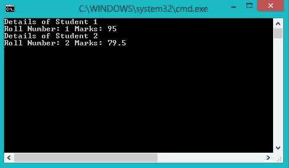
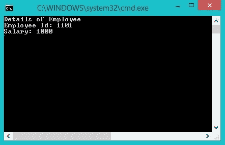

# 如何在 C# 中使用指针访问结构元素

> 原文:[https://www . geeksforgeeks . org/如何访问结构元素-使用 c-sharp 中的指针/](https://www.geeksforgeeks.org/how-to-access-structure-elements-using-pointers-in-c-sharp/)

与 C/C++不同，C# 中的[结构](https://www.geeksforgeeks.org/c-sharp-structures-set-1/)可以有方法、字段、索引器、运算符方法、属性或事件等成员。成员可以有公共、私有和内部访问说明符。
指针是存储同一类型变量的地址的变量，即 int 指针可以存储整数的地址，char 指针可以存储 char 的地址，类似地，对于所有其他数据类型，无论是基本的还是用户定义的。

您可以使用指针访问结构成员，类型为结构，方法如下:

**1)使用箭头操作符**:如果结构的成员是公共的，那么您可以使用箭头操作符(- >)直接访问它们。如果它们是私有的，那么您可以定义访问这些值的方法，并使用指针来访问这些方法。箭头操作符可以用来访问结构变量和方法。

**语法:**

```cs
PointerName->memberName;
```

**示例:**

```cs
// C# Program to show the use of 
// pointers to access struct members
using System;

namespace GFG {

// Defining a struct Student
struct Student
{
    // With members
    // roll number and marks
    public int rno;
    public double marks;

    // Constructor to initialize values
    public Student(int r, double m)
    {
        rno = r;
        marks = m;
    }
}; // end of struct Student

class Program {

    // Main Method
    static void Main(string[] args)
    {
        // unsafe so as to use pointers
        unsafe
        {
            // Declaring two Student Variables
            Student S1 = new Student(1, 95.0);
            Student S2 = new Student(2, 79.5);

            // Declaring two Student pointers
            // and initializing them with addresses
            // of S1 and S2
            Student* S1_ptr = &S1;
            Student* S2_ptr = &S2;

            // Displaying details of Student using pointers
            // Using  the arrow ( -> ) operator
            Console.WriteLine("Details of Student 1");

            Console.WriteLine("Roll Number: {0} Marks: {1}", 
                            S1_ptr -> rno, S1_ptr -> marks);

            Console.WriteLine("Details of Student 2");
            Console.WriteLine("Roll Number: {0} Marks: {1}",
                            S2_ptr -> rno, S2_ptr -> marks);

        } // end unsafe

    } // end main

} // end class

}
```

**输出:**



**2)使用取消引用运算符:**也可以使用指针上的取消引用运算符来访问结构元素，即使用星号来取消引用指针，然后使用点运算符来指定结构元素。

**语法:**

```cs
(*PointerName).MemberName;
```

**示例:**

```cs
// C# Program to illustrate the use 
// of dereferencing operator
using System;

namespace GFG {

// Defining struct Employee
struct Employee{

    // Elements Eid and Salary
    // With properties get and set
    public int Eid 
    {     
        get;
        set;
    }

public double Salary
{
    get;
    set;
}
}
; // Employee ends

class Program {

    // Main Method
    static void Main(string[] args)
    {
        // unsafe so as to use pointers
        unsafe
        {
            // Declaring a variable of type Employee
            Employee E1;

            // Declaring pointer of type Employee
            // initialized to point to E1
            Employee* ptr = &E1;

            // Accessing struct elements using
            // dereferencing operator
            // calls the set accessor
            (*ptr).Eid = 1101;
            (*ptr).Salary = 1000.00;

            Console.WriteLine("Details of Employee");
            // calls the get accessor
            Console.WriteLine("Employee Id: {0}\nSalary: {1}",
                                   (*ptr).Eid, (*ptr).Salary);

        } // end unsafe

    } // end Main

} // end class

}
```

**输出:**



**注意:**要在 Visual Studio (2012)上编译不安全代码，请转到项目–>项目名称属性–>构建–>选中“允许不安全代码”框。