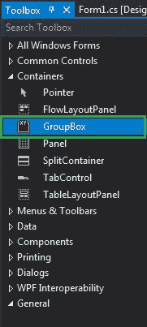
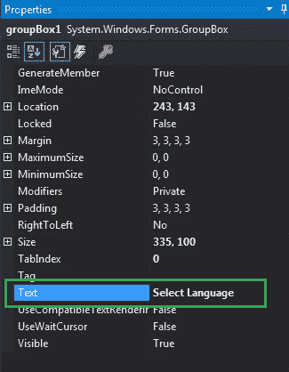
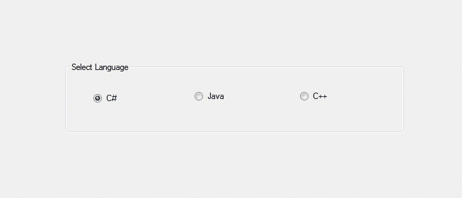
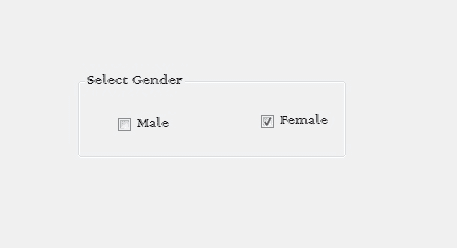

# 如何在 C# 中的 GroupBox 中添加文本？

> 原文:[https://www . geeksforgeeks . org/如何添加 c-sharp 中的 groupbox 中的文本/](https://www.geeksforgeeks.org/how-to-add-text-in-the-groupbox-in-c-sharp/)

在 Windows 窗体中，GroupBox 是一个容器，其中包含多个控件，这些控件相互关联。或者换句话说，GroupBox 是一组控件周围的框架显示，带有合适的可选标题。或者使用一个组框对一个组中的相关控件进行分类。在组框中，可以使用**文本属性**在表单的组框中添加文本。您可以通过两种不同的方式设置此属性:

**1。设计时:**在组框中添加文本是最简单的方法，如以下步骤所示:

*   **第一步:**创建如下图所示的窗口表单:
    **Visual Studio->File->New->Project->windows formpp**
    
*   **Step 2:** Next, drag and drop the GroupBox control from the toolbox on the form as shown in the below image:

    

*   **Step 3:** After drag and drop you will go to the properties of the GroupBox and add text in the GroupBox as shown in the below image:

    

    **输出:**

    

**2。运行时:**比上面的方法稍微复杂一点。在此方法中，您可以在给定语法的帮助下，以编程方式在 GroupBox 控件中添加文本:

```cs
public override string Text { get; set; }
```

以下步骤显示了如何在组框中动态添加文本:

*   **步骤 1:** 使用 GroupBox 类提供的 GroupBox()构造函数创建一个 GroupBox。

    ```cs
    // Creating a GroupBox
    GroupBox gbox = new GroupBox(); 

    ```

*   **第二步:**创建完 GroupBox 后，设置 GroupBox 类提供的 GroupBox 的 Text 属性。

    ```cs
    // Adding text
    gbox.Text = "Select Gender";

    ```

*   **Step 3:** And last add this GroupBox control to the form and also add other controls on the GroupBox using the following statements:

    ```cs
    // Adding groupbox in the form
    this.Controls.Add(gbox);

    and 

    // Adding this control to the GroupBox
    gbox.Controls.Add(c2);

    ```

    **示例:**

    ```cs
    using System;
    using System.Collections.Generic;
    using System.ComponentModel;
    using System.Data;
    using System.Drawing;
    using System.Linq;
    using System.Text;
    using System.Threading.Tasks;
    using System.Windows.Forms;

    namespace WindowsFormsApp46 {

    public partial class Form1 : Form {

        public Form1()
        {
            InitializeComponent();
        }

        private void Form1_Load(object sender, EventArgs e)
        {
            // Creating and setting properties
            // of the GroupBox
            GroupBox gbox = new GroupBox();
            gbox.Location = new Point(179, 145);
            gbox.Text = "Select Gender";
            gbox.Name = "Mybox";
            gbox.Font = new Font("Colonna MT", 12);
            gbox.Visible = true;
            gbox.AutoSize = true;
            gbox.AutoSizeMode = AutoSizeMode.GrowAndShrink;

            // Adding groupbox in the form
            this.Controls.Add(gbox);

            // Creating and setting 
            // properties of the CheckBox
            CheckBox c1 = new CheckBox();
            c1.Location = new Point(40, 42);
            c1.Size = new Size(69, 20);
            c1.Text = "Male";

            // Adding this control 
            // to the GroupBox
            gbox.Controls.Add(c1);

            // Creating and setting 
            // properties of the CheckBox
            CheckBox c2 = new CheckBox();
            c2.Location = new Point(183, 39);
            c2.Size = new Size(79, 20);
            c2.Text = "Female";

            // Adding this control
            // to the GroupBox
            gbox.Controls.Add(c2);
        }
    }
    }
    ```

    **输出:**

    