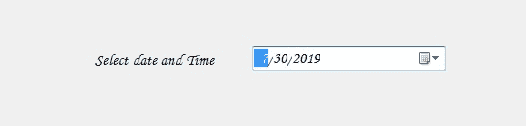
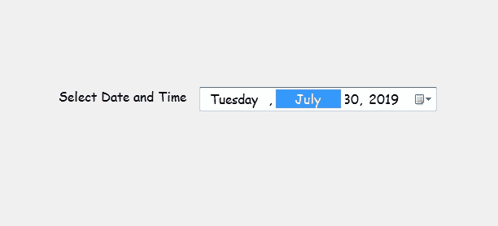

# 如何在 C#的 DateTimePicker 中显示当前日期/时间？

> 原文:[https://www . geeksforgeeks . org/how-display-current-date-time-in-datetime picker-in-c-sharp/](https://www.geeksforgeeks.org/how-to-display-current-date-time-in-the-datetimepicker-in-c-sharp/)

在 Windows 窗体中，DateTimePicker 控件用于在窗体中选择和显示具有特定格式的日期/时间。在日期时间选择器控件中，可以使用**值属性**设置当前日期/时间。或者换句话说，我们可以说 Value 属性用于为 DateTimePicker 控件分配一个日期/时间值。此属性的默认值是当前日期/时间。您可以通过两种不同的方式设置此属性:

**1。设计时间:**设置日期时间选择器的值是最简单的方法，如以下步骤所示:

*   **第一步:**创建如下图所示的窗口表单:
    **Visual Studio->File->New->Project->windows formpp**
    
*   **Step 2:** Next, drag and drop the DateTimePicker control from the toolbox to the form as shown in the below image:

    

*   **Step 3:** After drag and drop you will go to the properties of the DateTimePicker and set the value for the DateTimePicker as shown in the below image:

    

    **输出:**

    

**2。运行时:**比上面的方法稍微复杂一点。在此方法中，您可以在给定语法的帮助下，以编程方式为 DateTimePicker 控件设置日期和时间值:

```cs
public DateTime Value { get; set; }
```

如果该属性的值小于 MinDate 或大于 MaxDate，它将抛出*argumentout of range exception*。以下步骤显示了如何动态设置日期时间选择器的值:

*   **步骤 1:** 使用 DateTimePicker 类提供的 DateTimePicker()构造函数创建一个 DateTimePicker。

    ```cs
    // Creating a DateTimePicker
    DateTimePicker dt = new DateTimePicker();

    ```

*   **步骤 2:** 创建日期选择器后，设置由日期选择器类提供的日期选择器的值属性。

    ```cs
    // Setting the value
    dt.Value = DateTime.Today;

    ```

*   **第 3 步:**最后使用下面的语句将这个 DateTimePicker 控件添加到表单中:

    ```cs
    // Adding this control to the form
    this.Controls.Add(dt);

    ```

**示例:**

```cs
using System;
using System.Collections.Generic;
using System.ComponentModel;
using System.Data;
using System.Drawing;
using System.Linq;
using System.Text;
using System.Threading.Tasks;
using System.Windows.Forms;

namespace WindowsFormsApp48 {

public partial class Form1 : Form {

    public Form1()
    {
        InitializeComponent();
    }

    private void Form1_Load(object sender, EventArgs e)
    {
        // Creating and setting the
        // properties of the Label
        Label lab = new Label();
        lab.Location = new Point(183, 162);
        lab.Size = new Size(172, 20);
        lab.Text = "Select Date and Time";
        lab.Font = new Font("Comic Sans MS", 12);

        // Adding this control to the form
        this.Controls.Add(lab);

        // Creating and setting the 
        // properties of the DateTimePicker
        DateTimePicker dt = new DateTimePicker();
        dt.Location = new Point(360, 162);
        dt.Size = new Size(292, 26);
        dt.MaxDate = new DateTime(2500, 12, 20);
        dt.MinDate = new DateTime(1753, 1, 1);
        dt.Format = DateTimePickerFormat.Long;
        dt.Name = "MyPicker";
        dt.Font = new Font("Comic Sans MS", 12);
        dt.Visible = true;
        dt.Value = DateTime.Today;

        // Adding this control 
        // to the form
        this.Controls.Add(dt);
    }
}
}
```

**输出:**

