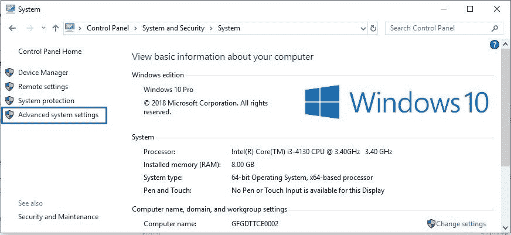

# 如何在 cmd(命令行)上执行 C# 程序？

> 原文:[https://www . geesforgeks . org/如何执行-c-sharp-program on-cmd-命令行/](https://www.geeksforgeeks.org/how-to-execute-c-sharp-program-on-cmd-command-line/)

C# 是一种通用、现代和面向对象的编程语言，发音为**“C sharp”**。C# 是公共语言基础设施的语言之一，当前版本的 [C# ](https://www.geeksforgeeks.org/csharp-programming-language/) 是 8.0 版本。C# 在语法上与 Java 有很多相似之处，对于了解 [C](https://www.geeksforgeeks.org/c-programming-language/) 、 [C++](https://www.geeksforgeeks.org/c-plus-plus/) 或 [Java](https://www.geeksforgeeks.org/java/) 的用户来说很容易。

由于 C# 在语法上与其他广泛使用的语言非常相似，所以用 C# 进行编码和学习更容易。
程序可以在任何广泛使用的文本编辑器中用 C# 编写，如 Notepad++、gedit 等。或者在任何编译器上。写完程序后保存扩展名为**的文件。cs** 。网上有各种各样的 ide，比如[极客 forGeeks ide](https://ide.geeksforgeeks.org/) ，CodeChef ide 等。它可以用来运行 C# 程序而无需安装。还可以使用命令行选项来运行 C# 程序。

**命令行执行的 C# 程序示例:**

```cs
// C# program to print Hello World!
using System;

// namespace declaration
namespace HelloWorldApp {

// Class declaration
class Geeks {

    // Main Method
    static void Main(string[] args)
    {

        // statement
        // printing Hello World!
        Console.WriteLine("Hello World!");

        // To prevents the screen from
        // running and closing quickly
        Console.ReadKey();
    }
}
}
```

### 为 C# 编译器设置环境

**第一步:**转到**控制面板- >系统和安全- >系统**。在**高级系统设置**选项下，点击**环境变量**，如下图:




**第二步:**现在，我们必须更改系统变量下的**“路径”**变量，使其也包含到**的路径。NET 框架**环境。选择**“路径”**变量，点击**编辑**按钮，如下图:


**第三步:**我们会看到不同路径的列表，点击**新建**按钮，然后添加**所在的路径。NET 框架**安装完毕。


**第四步:**点击**确定**，保存设置完成！！现在要检查环境设置是否正确，请打开命令提示符并键入 **csc** 。


### 在 cmd 上执行 C# 程序的步骤

**第一步:**像记事本或 Notepad++一样打开文本编辑器，写下想要执行的代码。现在用**保存文件。cs** 分机。


**步骤 2:** 使用命令编译 C# 源代码:

```cs
csc File_name.cs
```

如果你的程序没有错误，那么它会在你保存程序的同一目录下创建一个 filename.exe 文件。假设您将上述程序保存为 Hello.cs，那么您将在 cmd 上编写 **csc Hello.cs** 。这将创建一个*Hello.exe*文件。


**第三步:**现在有两种方法可以执行 H*ello.exe*。首先，您只需在 cmd 上键入文件名，即 Hello，它就会给出输出。其次，你可以去保存你的程序的目录，在那里你可以找到 filename.exe。您只需双击该文件，它就会给出输出。

*   **使用命令:**
    
*   **使用。exe 文件:**
    