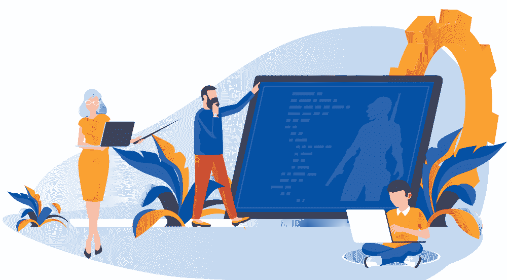

# 如何开始游戏开发？

> 原文:[https://www . geesforgeks . org/如何开始游戏开发/](https://www.geeksforgeeks.org/how-to-get-started-with-game-development/)

如果你能改变你的现实，创造一个全新的现实，你会有什么感受？一个可能基于太空的现实，小行星攻击宇宙飞船！或者可能是一个基于现实的海洋中，你试图打击海盗！
好吧，创造新的现实在现实世界中是不可能的，但在**游戏开发**的世界中绝对是可能的。而游戏开发的普及也只是在增加。这可能是因为电子游戏越来越受欢迎，人们现在不仅想参与这些世界，还想创造它们！！！

因此，如果你想知道如何开始游戏开发，这篇文章对你来说是完美的，因为它将教你基础知识，并为你提供各种资源，将带你在旅途中走得更远。

让我们从理解什么是游戏开发开始，然后进入更复杂的主题。

### 什么是游戏开发？

简单来说，游戏开发就是创建视频游戏的整个过程。如果你认为制作一个电子游戏和玩一个一样容易，那么它不是！！！创建游戏时有许多组件，如**故事、角色、音频、艺术、灯光等。**最终融合在一起创造一个全新的电子游戏世界！！！这个商业游戏的游戏开发过程是由一个发行商(一个有钱的公司！)但是独立的电子游戏相对来说更便宜更小，所以它们也可以由个人资助(那可以是你！).

现在有一个关于游戏开发的普遍疑问，那就是只有好的游戏玩家才能成为好的游戏开发者。现在让我们解决这个问题。

### 成为一名优秀的游戏玩家是游戏开发所必需的吗？

有很多人认为，如果他们是优秀的游戏玩家，那么他们在游戏开发方面肯定会很优秀。好吧，别犯那个错误！！！如果你是一个好的游戏玩家，那么你就有一些优势，因为你已经知道一些关于游戏故事，玩家，水平等。但就是这样！其实游戏玩法和游戏开发是非常不同的领域，你在前一个领域获得的技能在后一个领域不一定对你有帮助。比如:如果你热爱电影，那并不一定意味着你会成为一名优秀的电影导演！！！因此，只有当你对游戏编程充满热情，并且真的想开发一款有趣的游戏时，才可以进入游戏开发(热爱游戏只是一种奖励！).

### 游戏开发中有哪些不同的组件？

游戏开发中有许多不同的组件，可以由一个单独创建游戏的开发人员来处理(谁是天才！！！)或通常由多人组成的团队。因此，如果你想开始游戏开发，最好首先了解这个领域的各种组件，这样你就可以确定你最感兴趣的组件。

**1。故事:**万物皆有故事，电竞也是如此！！！你的故事可以有一个相对轻松的*线性结构*，甚至可以有一个根据人物动作进行各种情节变化的*非线性结构*。主要是应该有一个有趣的故事来勾你的玩家！！！

**2。人物:**你知道没有人物的故事吗？不要。那是因为，在故事之后，角色是任何电子游戏的基本部分。你要决定人物的*长相和性格*，他们应该移动多快*，应该是什么样的*举止和特征*等等。*

***3。音频:**是电竞的脊梁！！！这意味着它应该支持游戏，但不要太明显！你必须决定游戏世界中的各种声音，比如*玩家的声音，背景音乐*等等。一起创造了一个逼真可信的电子游戏。*

***4。艺术:**可以说，电子游戏基本上只是反应性的艺术！！！所以艺术非常重要，因为它决定了游戏的感觉。通常，电子游戏中的艺术可以包括各种各样的东西，如游戏纹理、游戏灯光、角色和物体的 3D 建模、创建火、雾、雪等的粒子系统。*

***5。灯光:**电竞中所有的灯光明显都是人为的，对于情绪设定非常重要。较少的照明可以用于恐怖或惊悚游戏，而增加的照明可以表示更多的冒险或有趣的游戏。此外，照明也是*隐身挑战*的一个重要因素，黑暗区域为角色提供掩护。*

***6。等级:**所有好的电玩都有各种等级，随着时间的推移难度会增加。等级在游戏中可以用*多层、不同建筑甚至不同国家*来表示(取决于你玩的游戏！)并且每个级别都可以有许多潜在的路径，最终通向下一个级别。而为不同级别设计多种可能路径组合的游戏，是游戏开发的一大因素。*

### *如何开始学习游戏开发？*

*现在您已经了解了游戏开发中涉及的所有组件，这里提供的主题是一个路线图，足以让您了解学习游戏开发的基础知识。在学习了这些之后，你可以做一个不错的游戏，然后随着你的进步，继续创造越来越复杂的世界。*

***1。学习计算机编程:**游戏中有趣的世界观都是用计算机编程创造的。所以，你有理由知道编程，以防你想进入这个世界！现在如果你有一些编程语言的编码基础知识，比如**[c#](https://www.geeksforgeeks.org/csharp-programming-language/)[Python](https://www.geeksforgeeks.org/python-programming-language/)[Java](https://www.geeksforgeeks.org/java/)**等。那就太好了，否则最好先学编程，再继续前进。*

*没有专门用于游戏开发的特定编程语言。但是 *C++* 是游戏开发中最流行的，也是编写游戏引擎最常用的语言。用 C++制作的热门游戏有《反击》、《王者任务》、《魔兽世界》等。另一种流行的语言是 *Java* ，因为它有多线程和套接字。一款用 Java 制作的流行游戏是愤怒的小鸟 Chrome。*

***注:**如果你是完全初学者，可以参考哈佛大学的 [**【计算机科学导论】**](https://online-learning.harvard.edu/course/cs50-introduction-computer-science) ，对计算机编程有一个基本的了解。*

***2。选择已知的游戏引擎:**作为游戏开发的初学者，最好从已知的游戏引擎开始。它们通常非常有用，因为它们为您的游戏提供了各种功能，如 3D 和 2D 图形渲染、音频支持、动画、碰撞检测、人工智能、网络等。*

*最受欢迎的游戏引擎是[**【Unity】**](https://unity.com/)，因为它相当容易学习，而且还有免费的个人版！另一个流行的游戏引擎是 [**虚幻引擎**](https://www.unrealengine.com/en-US/) ，它可以被修改以创建独特的游戏。然而，最终你使用什么游戏引擎并不重要，重要的是你坚持使用那个游戏引擎，这样你就能很好地理解它，以便在未来的项目中使用它。
从侧面来看，使用游戏引擎并不是绝对必要的。事实上，不使用游戏引擎意味着你必须自己做大部分的技术工作，这很难，但会给你提供很多学习机会。如果你将来需要自己开发游戏编程的设计模式，这甚至会很有用！*

***3。创建一个基本游戏:**现在你对游戏开发有了一些想法，创建一个基本游戏。现在你可能想得意忘形，希望创造一个杰作，但相信我，从小做起！！尽量把你的项目保持在一周左右，因为现在最重要的不是你一夜之间成为大师，而是你了解基础知识。*

*一个常见的第一款游戏是 [**【俄罗斯方块】**](https://tetris.com/) ，因为它很容易制作，但它会向你介绍游戏开发中的许多概念。它将教你游戏循环中的三个步骤，即初始化、更新和绘制，这是你未来可能进行的任何游戏开发的核心。*

*但是如果你对从俄罗斯方块开始不感兴趣，你可以选择任何足够容易的游戏(或者困难的，这是你的选择！！！)但要确保游戏不混乱不复杂，有明确的目标和终点。*

***4。了解游戏设计模式:**游戏设计模式是事情变得有点复杂的地方，因为你已经了解了制作视频游戏的基本知识。但是第一个问题是，*什么是游戏设计模式？**

*假设你必须在太空电子游戏中放入多个摧毁宇宙飞船的小行星。在这种情况下，拥有一个可以为小行星重复使用的代码模块比专注于单个小行星要明智得多。这是一个被称为**对象池**的游戏设计模式。同样，有许多游戏设计模式基本上只是创建模块化代码的模板，可以作为游戏开发中任何问题的重复解决方案。*

*其他一些常见的游戏设计模式有*飞重、原型、观察者*等。最好先了解这些游戏模式，然后在各种小游戏中应用。这将帮助你理解游戏设计模式对游戏开发的各种影响和好处。*

****注* :** 一本学习游戏设计模式的奇书是 [**由**罗伯特·尼斯特罗姆**编写的【游戏编程模式】**](https://www.amazon.in/Game-Programming-Patterns-Robert-Nystrom/dp/0990582906) ，它将详细阐述各种设计模式以优化你的游戏。*

***5。学习 3D 图形和相关数学:**没有图形是不可能制作视频游戏的，所以你现在需要了解它们。虽然 2D 图形在 20 世纪 90 年代中期相当受欢迎，但今天大多数著名的游戏都需要可以在*固定 3D、第一人称视角、第三人称视角*等中渲染的 3D 图形。这为游戏提供了逼真的感觉。所以如果你想成为一名顶尖的游戏程序员，你应该知道计算机图形学以及它背后的数学。如果你不打算使用已经制作好的游戏引擎，这一点就更重要了。*

*三维图形常用的数学是*线性代数*，主要处理线性方程、矩阵、向量等。如果你理解了这些概念，你就可以轻松操纵你游戏的 3D 世界，达到神奇的效果！！！*

****注* :** 你可以使用 [**【图形与游戏开发 3D 数学入门】**](https://www.amazon.in/Math-Primer-Graphics-Game-Development-ebook/dp/B008KZU548) 书和 [**麻省理工学院开放课件《线性代数》**](https://www.youtube.com/watch?v=ZK3O402wf1c) 课程中的《基本线性代数》来学习游戏开发中的 3D 图形。*

### *学习游戏开发有哪些在线资源？*

*有很多书、课程、文章等。可以用来学习游戏开发的各个方面。但是为了您的方便，这里提供了一些流行的资源:*

*   *学习游戏设计基础的热门书籍是杰西·谢尔的《游戏设计艺术:镜头之书》 。这本书将教你从许多角度或镜头观看电子游戏的艺术，这是好的游戏设计的关键。*
*   *如果你想要一个游戏开发的在线课程，那么由密歇根州立大学在 Coursera 上提供的 [**【游戏开发入门】**](https://www.coursera.org/learn/game-development) 是最理想的。另一个这样的课程是卡拉茨提供的游戏设计入门。*
*   *基于使用 Unity 的游戏开发的课程是 [**Unity 游戏开发在 Udemy 上构建 2D & 3D 游戏**](https://www.udemy.com/devslopes-unity3d/) ，如果您希望专注于 Unity，您可以选择该课程。*
*   *关于游戏开发的免费文章和有趣信息，可以参考 [**Gamasutra:制作游戏的艺术&商业**](https://www.gamasutra.com/) ，这是一个基本言出必行的网站！*