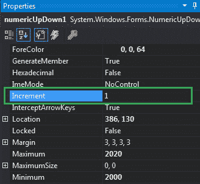
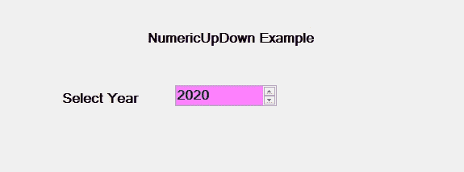
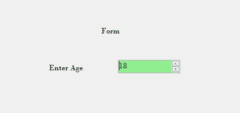

# 如何增加 C#中 NumericUpDown 的值？

> 原文:[https://www . geeksforgeeks . org/如何提高 c-sharp 中 numericupdown 的价值/](https://www.geeksforgeeks.org/how-to-increase-the-values-of-the-numericupdown-in-c-sharp/)

在 Windows 窗体中，NumericUpDown 控件用于提供显示数值的 Windows 旋转框或上下控件。或者换句话说，NumericUpDown 控件提供了一个使用上下箭头移动并保存一些预定义数值的界面。在 NumericUpDown 控件中，您可以使用**增量属性**设置一个值，当单击上下控件中的上下按钮时，该值将“值”属性增加或减少到最大值和最小值。您可以通过两种不同的方式设置此属性:

**1。设计时间:**最简单的方法是在 NumericUpDown 中设置增量值，如下步骤所示:

*   **第一步:**创建如下图所示的窗口表单:
    **Visual Studio->File->New->Project->windows formpp**
    
*   **Step 2:** Next, drag and drop the NumericUpDown control from the toolbox on the form as shown in the below image:

    

*   **Step 3:** After drag and drop you will go to the properties of the NumericUpDown and set the increment of the NumericUpDown as shown in the below image:

    

    **输出:**

    

**2。运行时:**比上面的方法稍微复杂一点。在此方法中，您可以借助给定的语法以编程方式设置 NumericUpDown 控件的增量值:

```
public decimal Increment { get; set; }
```

这里，该属性的值表示当单击 NumericUpDown 控件的向上和向下按钮时，value 属性的增量或减量。此属性的默认值为 1。以下步骤显示了如何在 NumericUpDown 中动态设置增量值:

*   **步骤 1:** 使用 numericpdown()构造函数创建 numericpdown，该构造函数由 numericpdown 类提供。

    ```
    // Creating a NumericUpDown
    NumericUpDown n = new NumericUpDown();

    ```

*   **第二步:**创建 numericpdown 后，设置 numericpdown 类提供的 numericpdown 的 Increment 属性。

    ```
    // Setting the increment
    n.Increment = 1;

    ```

*   **Step 3:** And last add this NumericUpDown control to the form using the following statement:

    ```
    // Adding NumericUpDown 
    // control on the form
    this.Controls.Add(n);

    ```

    **示例:**

    ```
    using System;
    using System.Collections.Generic;
    using System.ComponentModel;
    using System.Data;
    using System.Drawing;
    using System.Linq;
    using System.Text;
    using System.Threading.Tasks;
    using System.Windows.Forms;

    namespace WindowsFormsApp42 {

    public partial class Form1 : Form {

        public Form1()
        {
            InitializeComponent();
        }

        private void Form1_Load(object sender, EventArgs e)
        {
            // Creating and setting the 
            // properties of the labels
            Label l1 = new Label();
            l1.Location = new Point(348, 61);
            l1.Size = new Size(215, 20);
            l1.Text = "Form";
            l1.Font = new Font("Bodoni MT", 12);
            this.Controls.Add(l1);

            Label l2 = new Label();
            l2.Location = new Point(242, 136);
            l2.Size = new Size(103, 20);
            l2.Text = "Enter Age";
            l2.Font = new Font("Bodoni MT", 12);
            this.Controls.Add(l2);

            // Creating and setting the 
            // properties of NumericUpDown
            NumericUpDown n = new NumericUpDown();
            n.Location = new Point(386, 130);
            n.Size = new Size(126, 26);
            n.Font = new Font("Bodoni MT", 12);
            n.Value = 18;
            n.Minimum = 18;
            n.Maximum = 30;
            n.BackColor = Color.LightGreen;
            n.ForeColor = Color.DarkGreen;
            n.Increment = 1;
            n.Name = "MySpinBox";

            // Adding this control
            // to the form
            this.Controls.Add(n);
        }
    }
    }
    ```

    **输出:**

    