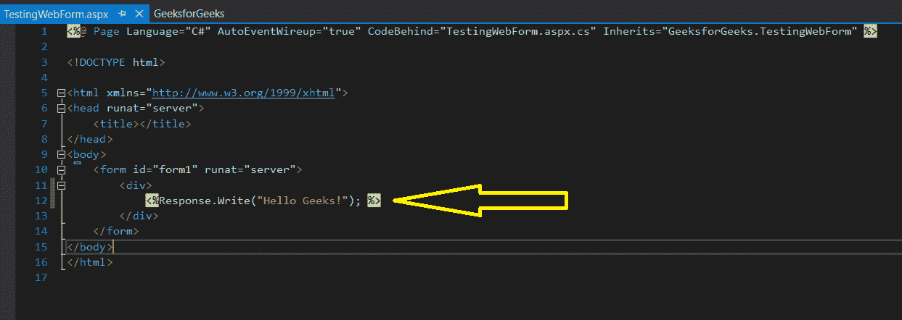

# 如何为 ASP.NET 安装和设置 Visual Studio？

> 原文:[https://www . geeksforgeeks . org/如何安装和设置-visual studio-for-ASP-net/](https://www.geeksforgeeks.org/how-to-install-and-setup-visual-studio-for-asp-net/)

Visual Studio 是微软开发的集成开发环境(IDE)，用于开发 GUI(图形用户界面)、web 应用程序、控制台、web 应用程序、移动应用程序、云和 Web 服务等。为了商业目的安装和使用 Visual Studio，必须从微软购买许可证。出于学习(非商业)目的，微软提供了免费的 Visual Studio 社区版。我们将使用 Visual Studio 社区版本 2019。最新版本的 Visual Studio 使整个过程对于 ASP.NET 应用程序来说非常容易。安装和设置 Visual Studio 集成开发环境的步骤可能会有一些变化。所以我们建议安装最新版本的 Visual Studio。

### 安装和设置 Visual Studio 2019 的步骤

<font size="3">**第一步:**</font> 下载 **[**Visual Studio 社区版 2019**](https://www.visualstudio.com/downloads/)**

[](https://media.geeksforgeeks.org/wp-content/uploads/20190521154529/download-visual-studio-community-version.png)

<font size="3">**第二步:**</font> 跑**。exe** 文件，并按照说明在系统上安装 Visual Studio 社区版。

[](https://media.geeksforgeeks.org/wp-content/uploads/20190521154649/run-vs-exe-file.jpg)

<font size="3">**第三步:**</font> 从选项中选择**ASP.NET 和网页开发**，点击右下角安装，如下图。我们也可以选择**。NET 桌面开发**选项，用于 windows 窗体和控制台应用程序等。这里我们选择了两个选项。我们也可以在安装后进行修改。

[](https://media.geeksforgeeks.org/wp-content/uploads/20190521160652/selecting-options-in-visual-studio.png)

[](https://media.geeksforgeeks.org/wp-content/uploads/20190521160936/installation-vs-2019.png)

<font size="3">**第四步:**</font> 点击启动，系统会提示首次登录。登录步骤是可选的，因此可以跳过。该对话框将仅第一次出现，并要求选择显影设置和颜色主题。选择所需选项后，单击开始 Visual Studio 选项。在某些版本中，此步骤是可选的。

<font size="3">**第五步:**</font> 要创建新的 ASP.NET Web 应用程序，**转到文件–>新建–>项目**如下所示:

[](https://media.geeksforgeeks.org/wp-content/uploads/20190606125010/vs2-11.png)

<font size="3">**第六步:**</font> 我们一选择项目，就会注意到项目的不同选项。我们可以根据自己的选择进行过滤。在下面给定的截图中，我们可以在搜索栏的右侧看到 *3 个过滤器(语言、平台、项目类型)*。这里我们不使用过滤器。我们只是选择**ASP.NET 网络应用(*)。NET Framework* )** 点击*下一步*。我们可以在所选项目下面看到 C#、Windows 和库的选项。有两种选择，我们也可以找到*ASP.NET 网络应用程序(。NET 框架)*使用 VB(Visual Basic)。

[](https://media.geeksforgeeks.org/wp-content/uploads/20190606125255/selecting-asp-net-web-application.png)

<font size="3">**第七步:**</font> 下一步是项目配置。在这里，我们必须选择项目名称和解决方案名称，并点击创建按钮。我们还可以更改项目的位置。项目名称是解决方案名称的子集。我们可以给这个解决方案取一个不同的名字。换句话说，解决方案就像项目的容器。

[](https://media.geeksforgeeks.org/wp-content/uploads/20190606125412/project-configure-1.png)

我们将项目名和解决方案名设为 *GeeksforGeeks* ，如下图所示。

[](https://media.geeksforgeeks.org/wp-content/uploads/20190606125638/project-configure-2.png)

<font size="3">**第八步:**</font> 这里，我们要选择 ASP.NET Web 应用的类型。我们正在创建一个 web 应用程序，所以首先，选择项目类型为*空*来理解一个简单的应用程序。然后选择*网络表单*，它将添加基本文件夹来创建网络表单应用程序。之后点击*创建*按钮。

[](https://media.geeksforgeeks.org/wp-content/uploads/20190606125907/project-configure-3.png)

在下图的右侧，默认情况下解决方案资源管理器是打开的。在那里我们可以看到一个文件 *Global.asax.cs* ，这是整个应用程序的通用文件。该文件包含与应用程序相关的特定信息，用于将应用程序特定变量初始化为默认值。

[](https://media.geeksforgeeks.org/wp-content/uploads/20190606130345/after-project-configure.png)

<font size="3">**第 9 步:**</font> 现在向项目“GeeksforGeeks”添加一个 Web Form 文件，其中包含项目的特定于 Web 的代码。只需在解决方案资源管理器中的极客地图上单击鼠标右键。**选择添加**，然后**从菜单中选择网页表单**，如下图。

[](https://media.geeksforgeeks.org/wp-content/uploads/20190606130422/Creating-Web-Form.png)

它将提示输入网页表单的名称。我们将名称设为*测试网络表单*，点击*确定*。

[](https://media.geeksforgeeks.org/wp-content/uploads/20190606130915/naming-web-form.png)

*测试网络表单*的默认代码如下所示:

[](https://media.geeksforgeeks.org/wp-content/uploads/20190606130502/default-web-form-code.png)

<font size="3">**第 10 步:**</font> 现在在 *TestingWebForm.aspx* 文件中写一个示例代码，显示“你好极客！”作为输出。将进一步讨论代码的解释。

[](https://media.geeksforgeeks.org/wp-content/uploads/20190606130703/Executing-the-hello-geeks-code.png)

```cs
<%@ Page Language="C#" AutoEventWireup="true" CodeBehind="TestingWebForm.aspx.cs" Inherits="GeeksforGeeks.TestingWebForm" %>

<!DOCTYPE html>

<html xmlns="http://www.w3.org/1999/xhtml">
<head runat="server">
    <title></title>
</head>
<body>
    <form id="form1" runat="server">
        <div>
            <%Response.Write("Hello Geeks!"); %>
        </div>
    </form>
</body>
</html>
```

现在要执行代码，点击运行按钮，如下图所示。第一次，我们可能需要设置浏览器配置。

[](https://media.geeksforgeeks.org/wp-content/uploads/20190606130740/how-to-run-the-asp-net-web-form-code.png)

**最后输出:**

[](https://media.geeksforgeeks.org/wp-content/uploads/20190606130817/output78.png)