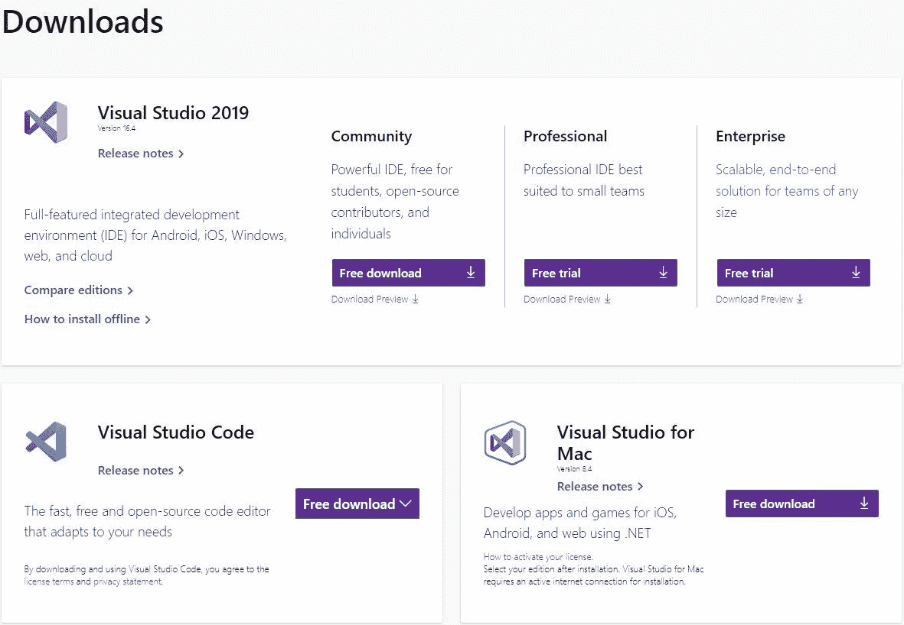
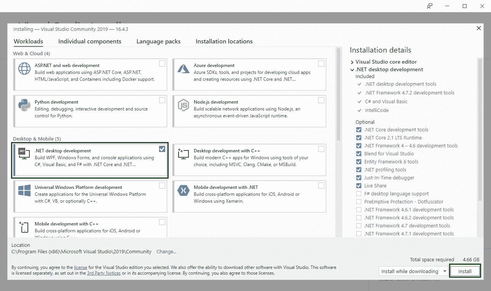
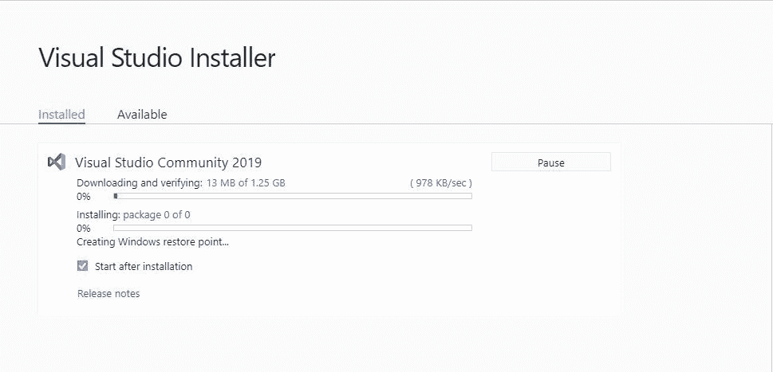
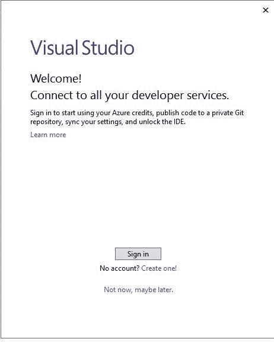
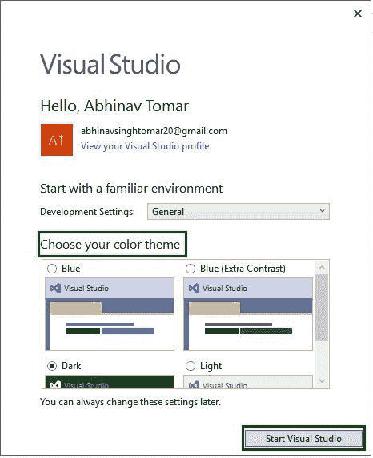
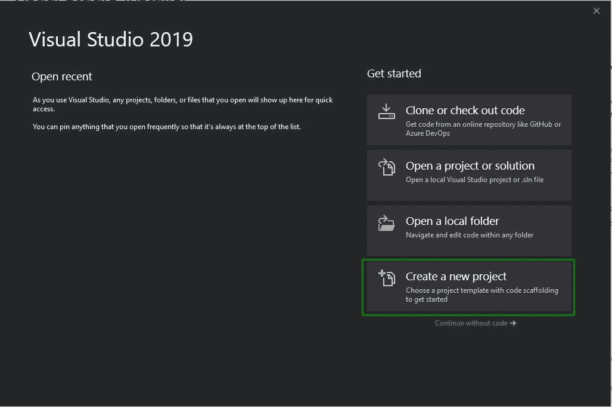
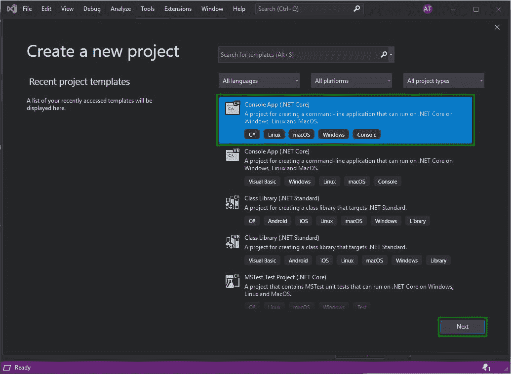
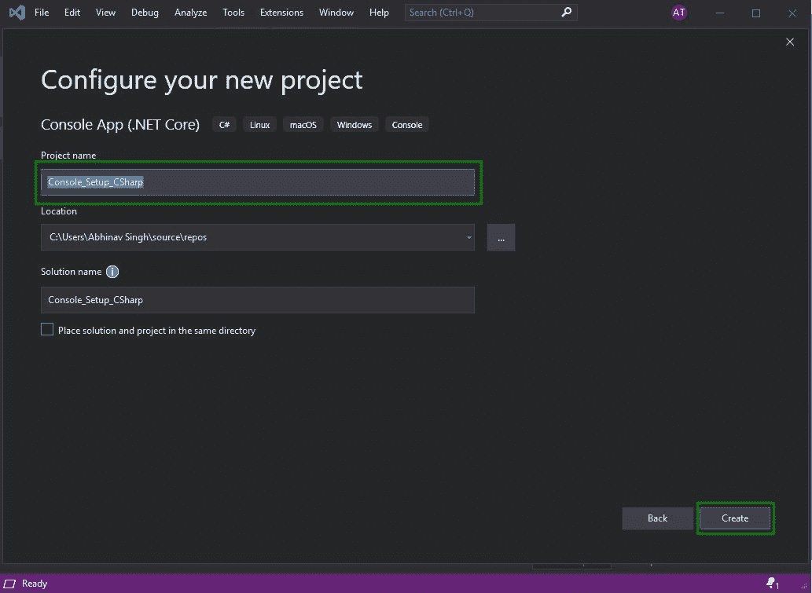
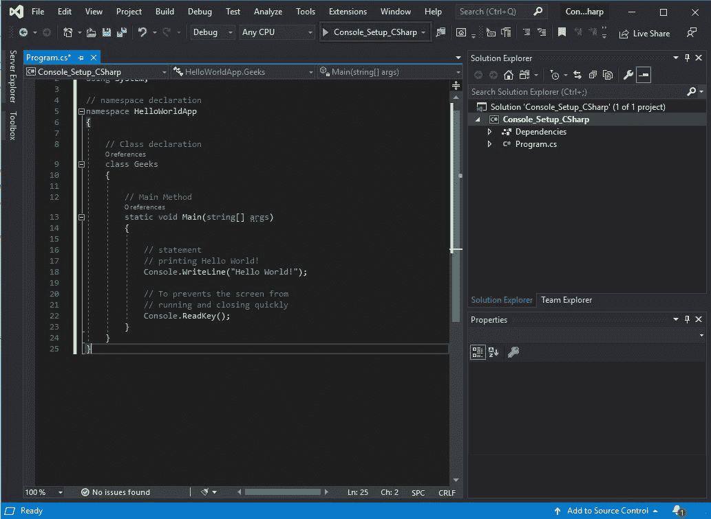
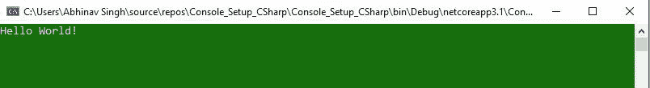

# 如何安装和设置 C# 的 Visual Studio？

> 原文:[https://www . geeksforgeeks . org/如何安装和设置-visual studio-for-c-sharp/](https://www.geeksforgeeks.org/how-to-install-and-setup-visual-studio-for-c-sharp/)

**先决条件:**[c# 入门](https://www.geeksforgeeks.org/introduction-to-c-sharp/)

C# 是一种通用、现代和面向对象的编程语言，发音为**“C sharp”**。它是由微软开发的，由安德斯·海尔斯伯格和他的团队领导。Net 倡议，并获得了欧洲计算机制造商协会(ECMA)和国际标准组织(ISO)的批准。C# 是公共语言基础设施的语言之一，C# 的当前版本是 8.0 版本。C# 在语法上与 Java 有很多相似之处，对于有 [C](https://www.geeksforgeeks.org/c-programming-language/) 、 [C++](https://www.geeksforgeeks.org/c-plus-plus/) 或 [Java](https://www.geeksforgeeks.org/java/) 知识的用户来说，很容易上手。

### C# 安装和设置 Visual Studio 的步骤

**第一步:**首先需要下载 Visual Studio，相同的所有版本在[**【visualstudio.microsoft.com】**](https://visualstudio.microsoft.com/downloads/)上都有

**第二步:**下载完 Visual Studio Installer 后，选择**。NET 桌面开发**选项然后点击**安装**。

**第三步:**现在让 **Visual Studio Installer** 下载软件包并执行安装

**第四步:**安装结束后，通过**登录**到您的 Microsoft 帐户或**创建一个开始 Visual Studio！**现在。您也可以点击**不登录，现在不登录，以后可能会选择**选项。

**第五步:**选择你的色彩主题然后点击**启动 Visual Studio** 按钮。

**步骤 6:** 首先使用 Visual Studio，选择**新建项目**选项，然后开始为 C# 设置环境。

**第七步:**选择**控制台 App(。NET Core)** 选项为 C# 然后点击**下一步**按钮。

**第八步:**通过分配名称和位置来存储项目文件来配置您的新项目，然后点击**创建**按钮。

**第 9 步:**现在开始编写示例代码，然后通过单击**运行**按钮

**运行代码输出:**
