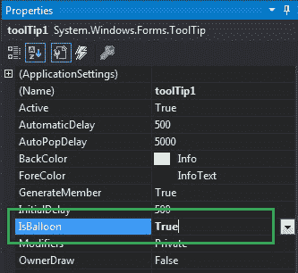
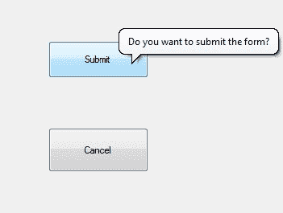
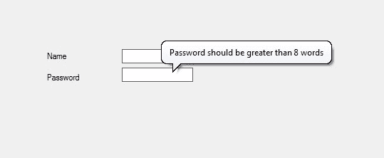

# 如何在 C#中制作气球工具提示窗口？

> 原文:[https://www . geesforgeks . org/如何制作气球-工具提示-c-sharp 中的窗口/](https://www.geeksforgeeks.org/how-to-make-a-balloon-tooltip-window-in-c-sharp/)

在 windows 窗体中，工具提示代表一个微小的弹出框，当您将指针或光标放在控件上时，该框会出现，该控件的目的是提供有关 Windows 窗体中控件的简要说明。在工具提示中，您可以使用**是允许属性**来更改工具提示窗口的形状。
在这个属性的帮助下，你可以将工具提示窗口从标准的矩形窗口改为气球窗口。您可以通过两种不同的方式设置此属性:

**1。设计时:**最简单的方法是按照以下步骤设置 IsBalloon 属性的值:

*   **第一步:**创建如下图所示的窗口表单:
    **Visual Studio->File->New->Project->windows formpp**
    
*   **Step 2:** Drag the ToolTip from the ToolBox and drop it on the form. When you drag and drop this ToolTip on the form it will automatically add to the properties(named as ToolTip on ToolTip1) of every controls present in the current windows from.

    

*   **Step 3:** After drag and drop you will go to the properties of the ToolTip and set the value of the IsBalloon property.
    

    **输出:**
    

**2。运行时:**比上面的方法稍微复杂一点。在此方法中，您可以在给定语法的帮助下以编程方式设置工具提示的 IsBalloon 属性:

```
public bool IsBalloon { get; set; }
```

这里，该属性的值为*系统。布尔*类型。如果该属性的值设置为真，则工具提示窗口为气球窗口。如果此属性的值设置为 false，则工具提示窗口属于标准矩形窗口。此属性的默认值为 false。

以下步骤展示了如何动态设置工具提示的**属性**:

*   **步骤 1:** 使用 ToolTip()构造函数创建工具提示，该构造函数由 ToolTip 类提供。

    ```
    // Creating a ToolTip
    ToolTip t = new ToolTip();

    ```

*   **第二步:**创建工具提示后，设置工具提示类提供的工具提示的 IsBalloon 属性。

    ```
    // Setting the IsBalloon property
    t.IsBalloon = true;

    ```

*   **Step 3:** And last add this ToolTip to the controls using SetToolTip() method. This method contains the control name and the text which you want to display in the ToolTip box.

    ```
     t.SetToolTip(box1, "Name should start with Capital letter");
    ```

    **示例:**

    ```
    using System;
    using System.Collections.Generic;
    using System.ComponentModel;
    using System.Data;
    using System.Drawing;
    using System.Linq;
    using System.Text;
    using System.Threading.Tasks;
    using System.Windows.Forms;

    namespace WindowsFormsApp34 {

    public partial class Form1 : Form {

        public Form1()
        {
            InitializeComponent();
        }

        private void Form1_Load(object sender, EventArgs e)
        {

            // Creating and setting the 
            // properties of the Label
            Label l1 = new Label();
            l1.Location = new Point(140, 122);
            l1.Text = "Name";

            // Adding this Label control to the form
            this.Controls.Add(l1);

            // Creating and setting the 
            // properties of the TextBox
            TextBox box1 = new TextBox();
            box1.Location = new Point(248, 119);
            box1.BorderStyle = BorderStyle.FixedSingle;

            // Adding this TextBox
            // control to the form
            this.Controls.Add(box1);

            // Creating and setting 
            // the properties of Label
            Label l2 = new Label();
            l2.Location = new Point(140, 152);
            l2.Text = "Password";

            // Adding this Label 
            // control to the form
            this.Controls.Add(l2);

            // Creating and setting the
            // properties of the TextBox
            TextBox box2 = new TextBox();
            box2.Location = new Point(248, 145);
            box2.BorderStyle = BorderStyle.FixedSingle;

            // Adding this TextBox 
            // control to the form
            this.Controls.Add(box2);

            // Creating and setting the 
            // properties of the ToolTip
            ToolTip t = new ToolTip();
            t.Active = true;
            t.AutoPopDelay = 4000;
            t.InitialDelay = 600;
            t.IsBalloon = true;
            t.SetToolTip(box1, "Name should start with Capital letter");
            t.SetToolTip(box2, "Password should be greater than 8 words");
        }
    }
    }
    ```

    **输出:**

    