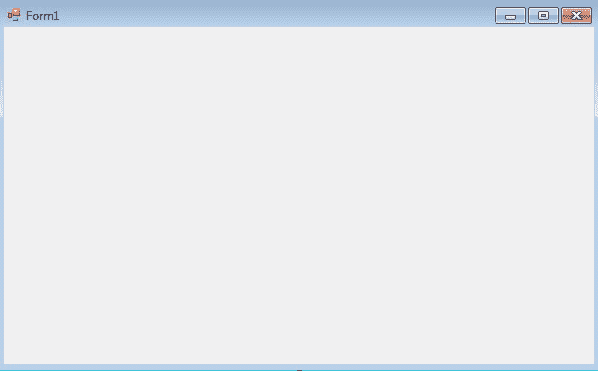
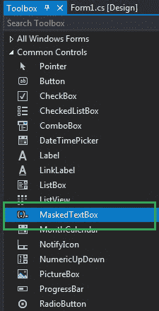
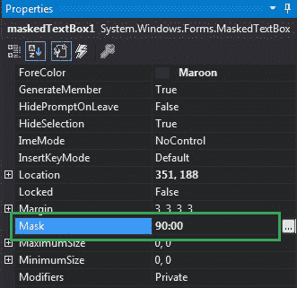
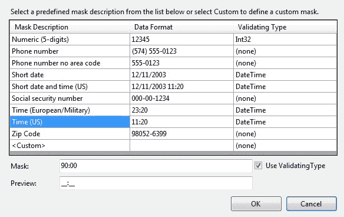
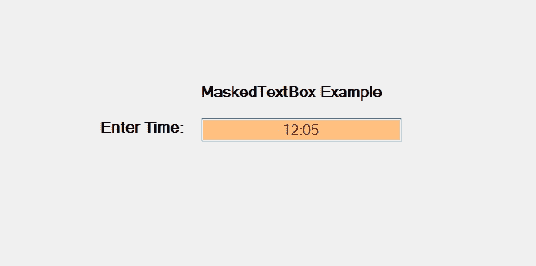
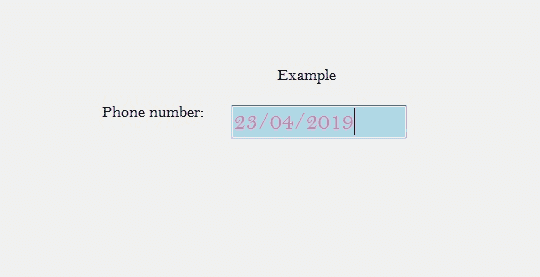

# 如何在 C#中屏蔽文本框中的输入？

> 原文:[https://www . geeksforgeeks . org/如何屏蔽输入-in-masketextbox-in-c-sharp/](https://www.geeksforgeeks.org/how-to-mask-input-in-maskedtextbox-in-c-sharp/)

在 C#中，MaskedTextBox 控件为表单上的用户输入(如日期、电话号码等)提供了一个验证过程。或者换句话说，它被用来提供区分正确和不正确用户输入的屏蔽。在掩码文本框控件中，您可以使用**掩码属性**来屏蔽掩码文本框的输入，该属性将在运行时用于在框中输入某些特定类型的输入。
例如，如果您想在 MaskedTextBox 中输入电话号码，那么您将使用 mask 属性。此属性将输入转换为电话号码格式。这是掩码文本框的默认属性，如果您试图在掩码文本框已经被上一个掩码屏蔽时更改掩码。因此，它将根据新的掩码重新定位该输入，如果重新定位失败，那么它将从掩码文本框中清除现有的输入。此属性的默认值为空字符串，意味着它可以包含任何字符串。您可以通过两种不同的方式设置此属性:

**1。设计时:**设置掩码文本框的掩码属性是最简单的方法，如下步骤所示:

*   **第一步:**创建如下图所示的窗口表单:
    **Visual Studio->File->New->Project->windows formpp**
    
*   **第 2 步:**接下来，将 MaskedTextBox 控件从工具箱拖放到表单上。如下图所示:
    
*   **Step 3:** After drag and drop you will go to the properties of the MaskedTextBox and set the Mask property of the MaskedTextBox. As shown in the below image:

    

    以下是掩码文本框中可用的掩码:

    

    **输出:**

    

**2。运行时:**比上面的方法稍微复杂一点。在此方法中，您可以在给定语法的帮助下，以编程方式设置 MaskedTextBox 控件的 Mask 属性:

```
public string Mask { get; set; }
```

这里，字符串表示当前掩码。如果应用于该属性的字符串不属于有效的掩码，那么它将抛出*InvalidEnumArgumentException*。以下步骤显示了如何动态设置掩码文本框的掩码属性:

*   **步骤 1:** 使用 masketextbox()构造函数创建一个 masketextbox，该构造函数由 masketextbox 类提供。

    ```
    // Creating a MaskedTextBox
    MaskedTextBox m = new MaskedTextBox();

    ```

*   **步骤 2:** 创建 masketextbox 后，设置 masketextbox 类提供的 masketextbox 的 Mask 属性。

    ```
    // Setting the mask
    m.Mask = "00/00/0000"; 

    ```

*   **Step 3:** And last add this MaskedTextBox control to the form using the following statement:

    ```
    // Adding MaskedTextBox control on the form
    this.Controls.Add(m);

    ```

    **示例:**

    ```
    using System;
    using System.Collections.Generic;
    using System.ComponentModel;
    using System.Data;
    using System.Drawing;
    using System.Linq;
    using System.Text;
    using System.Threading.Tasks;
    using System.Windows.Forms;

    namespace WindowsFormsApp38 {

    public partial class Form1 : Form {

        public Form1()
        {
            InitializeComponent();
        }

        private void Form1_Load(object sender, EventArgs e)
        {
            // Creating and setting the  
            // properties of the Label
            Label l1 = new Label();
            l1.Location = new Point(413, 98);
            l1.Size = new Size(176, 20);
            l1.Text = " Example";
            l1.Font = new Font("Bell MT", 12);

            // Adding label on the form
            this.Controls.Add(l1);

            // Creating and setting the 
            // properties of the Label
            Label l2 = new Label();
            l2.Location = new Point(242, 135);
            l2.Size = new Size(126, 20);
            l2.Text = "Phone number:";
            l2.Font = new Font("Bell MT", 12);

            // Adding label on the form
            this.Controls.Add(l2);

            // Creating and setting the 
            // properties of MaskedTextBox
            MaskedTextBox m = new MaskedTextBox();
            m.Location = new Point(374, 137);
            m.Mask = "00/00/0000";
            m.Size = new Size(176, 20);
            m.Name = "MyBox";
            m.BorderStyle = BorderStyle.Fixed3D;
            m.BackColor = Color.LightBlue;
            m.ForeColor = Color.HotPink;
            m.Font = new Font("Bell MT", 18);

            // Adding MaskedTextBox
            // control on the form
            this.Controls.Add(m);
        }
    }
    }
    ```

    **输出:**

    