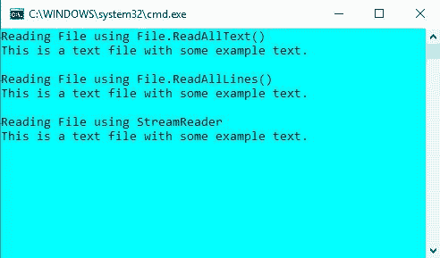
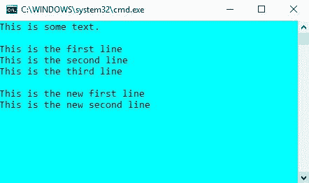
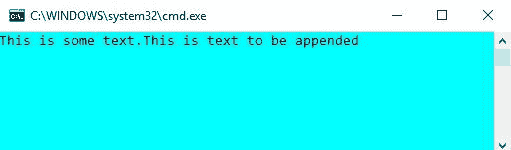

# 如何用 C# 读写文本文件？

> 原文:[https://www . geesforgeks . org/如何读写 c-sharp 中的文本文件/](https://www.geeksforgeeks.org/how-to-read-and-write-a-text-file-in-c-sharp/)

程序的终止会导致所有与之相关的数据被删除。因此，我们需要将数据存储在某个地方。文件用于永久存储和共享数据。C# 可用于检索和操作存储在文本文件中的数据。

**读取文本文件:**c# 中的文件类定义了两种读取文本文件的静态方法，即*文件。ReadAllText()* 和*文件。ReadAllLines()* 。

*   文件。ReadAllText()一次读取整个文件并返回一个字符串。我们需要将这个字符串存储在一个变量中，并使用它在屏幕上显示内容。
*   文件。ReadAllLines()一次读取一行文件，并以字符串格式返回该行。我们需要一个字符串数组来存储每一行。我们使用相同的字符串数组显示文件的内容。

还有另一种读取文件的方法，那就是使用 StreamReader 对象。StreamReader 也一次读取一行，并返回一个字符串。所有上述读取文件的方法都在下面给出的示例代码中进行了说明。

```cs
// C# program to illustrate how 
// to read a file in C#
using System;
using System.IO;

class Program {
    static void Main(string[] args)
    {
        // Store the path of the textfile in your system
        string file = @"M:\Documents\Textfile.txt";

        Console.WriteLine("Reading File using File.ReadAllText()");

        // To read the entire file at once
        if (File.Exists(file)) {
            // Read all the content in one string
            // and display the string
            string str = File.ReadAllText(file);
            Console.WriteLine(str);
        }
        Console.WriteLine();

        Console.WriteLine("Reading File using File.ReadAllLines()");

        // To read a text file line by line
        if (File.Exists(file)) {
            // Store each line in array of strings
            string[] lines = File.ReadAllLines(file);

            foreach(string ln in lines)
                Console.WriteLine(ln);
        }
        Console.WriteLine();

        Console.WriteLine("Reading File using StreamReader");

        // By using StreamReader
        if (File.Exists(file)) {
            // Reads file line by line
            StreamReader Textfile = new StreamReader(file);
            string line;

            while ((line = Textfile.ReadLine()) != null) {
                Console.WriteLine(line);
            }

            Textfile.Close();

            Console.ReadKey();
        }
        Console.WriteLine();
    }
}
```

要运行该程序，用*保存文件。cs* 扩展名，然后可以在 cmd 上使用 *csc filename.cs* 命令执行。或者可以使用 [Visual Studio](https://www.geeksforgeeks.org/how-to-install-and-setup-visual-studio-for-c-sharp/) 。这里，我们有一个名为 *Textfile.txt* 的文本文件，其内容显示在输出中。

**输出:**



**编写文本文件:**c# 中的 File 类定义了两种静态的方法来编写文本文件，即*文件。writeltext()*和*文件。writellines()*。

*   文件。WriteAllText()一次写入整个文件。它需要两个参数，文件的路径和必须写入的文本。
*   文件。WriteAllLines()一次写一行文件。它需要两个参数，文件的路径和必须写入的文本，这是一个字符串数组。

还有另一种写入文件的方法，那就是使用 StreamWriter 对象。StreamWriter 也是一次写一行。如果文件不存在，所有三种写入方法都会创建一个新文件，但是如果文件已经存在于指定的位置，那么它就会被覆盖。上面提到的所有写入文本文件的方法都在下面给出的示例代码中进行了说明。

```cs
// C# program to illustrate how 
// to write a file in C#
using System;
using System.IO;

class Program {
    static void Main(string[] args)
    {
        // Store the path of the textfile in your system
        string file = @"M:\Documents\Textfile.txt";

        // To write all of the text to the file
        string text = "This is some text.";
        File.WriteAllText(file, text);

        // To display current contents of the file
        Console.WriteLine(File.ReadAllText(file));
        Console.WriteLine();

        // To write text to file line by line
        string[] textLines1 = { "This is the first line", 
                               "This is the second line",
                              "This is the third line" };

        File.WriteAllLines(file, textLines1);

        // To display current contents of the file
        Console.WriteLine(File.ReadAllText(file));

        // To write to a file using StreamWriter
        // Writes line by line
        string[] textLines2 = { "This is the new first line",
                             "This is the new second line" };

        using(StreamWriter writer = new StreamWriter(file))
        {
            foreach(string ln in textLines2)
            {
                writer.WriteLine(ln);
            }
        }
        // To display current contents of the file
        Console.WriteLine(File.ReadAllText(file));

        Console.ReadKey();
    }
}
```

要运行该程序，用*保存文件。cs* 扩展名，然后可以在 cmd 上使用 *csc filename.cs* 命令执行。或者可以使用 [Visual Studio](https://www.geeksforgeeks.org/how-to-install-and-setup-visual-studio-for-c-sharp/) 。

**输出:**



如果您想在现有文件中添加更多文本而不覆盖已经存储在其中的数据，可以使用 System.IO 的 file 类提供的追加方法

```cs
using System;
using System.IO;

class Program {
    static void Main(string[] args)
    {
        // Store the path of the textfile in your system
        string file = @"M:\Documents\Textfile.txt";

        // To write all of the text to the file
        string text1 = "This is some text.";
        File.WriteAllText(file, text1);

        // To append text to a file
        string text2 = "This is text to be appended";
        File.AppendAllText(file, text2);

        // To display current contents of the file
        Console.WriteLine(File.ReadAllText(file));
        Console.ReadKey();
    }
}
```

**输出:**

