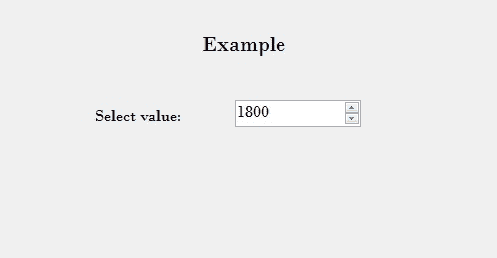

# 如何在 C# 中设置 NumericUpDown 的上下按钮对齐方式？

> 原文:[https://www . geeksforgeeks . org/如何设置 c-sharp 中 numericupdown 按钮的上下对齐方式/](https://www.geeksforgeeks.org/how-to-set-alignment-of-up-and-down-buttons-of-numericupdown-in-c-sharp/)

在 Windows 窗体中，NumericUpDown 控件用于提供显示数值的 Windows 旋转框或上下控件。或者换句话说，NumericUpDown 控件提供了一个使用上下箭头移动并保存一些预定义数值的界面。在 NumericUpDown 控件中，可以使用 **UpDownAlign 属性**设置上下控件的上下按钮的对齐方式。此属性有两个值，这些值是在 LeftRightAlignment 枚举下定义的，这些值是:

*   *左*:对齐 NumericUpDown 控件左侧的上下按钮。
*   *右侧*:将 NumericUpDown 控件右侧的上下按钮对齐。

该属性的默认值是正确的。您可以通过两种不同的方式设置此属性:

**1。设计时间:**最简单的方法是设置 NumericUpDown 的上下按钮的对齐方式，如下步骤所示:

*   **Step 1:** Create a windows form as shown in the below image:

    **Visual Studio->File->New->Project->window formapp**
    

*   **Step 2:** Next, drag and drop the NumericUpDown control from the toolbox on the form as shown in the below image:

    

*   **Step 3:** After drag and drop you will go to the properties of the NumericUpDown and set the alignment of the up and down buttons of the NumericUpDown as shown in the below image:

    

    **输出:**

    

**2。运行时:**比上面的方法稍微复杂一点。在此方法中，您可以借助给定的语法，以编程方式设置 NumericUpDown 控件的向上和向下按钮的对齐方式:

```cs
public System.Windows.Forms.LeftRightAlignment UpDownAlign { get; set; }
```

这里，LeftRightAlignment 表示这个属性的值。如果值不属于左右对齐枚举，它将抛出*InvalidEnumArgumentException*。以下步骤显示了如何动态设置 NumericUpDown 的向上和向下按钮的对齐方式:

*   **步骤 1:** 使用 numericpdown()构造函数创建 numericpdown，该构造函数由 numericpdown 类提供。

    ```cs
    // Creating a NumericUpDown
    NumericUpDown n = new NumericUpDown();

    ```

*   **第二步:**创建 NumericUpDown 后，设置 NumericUpDown 类提供的 NumericUpDown 的 UpDownAlign 属性。

    ```cs
    // Setting the UpDownAlign property
    n.UpDownAlign = LeftRightAlignment.Right; 

    ```

*   **Step 3:** And last add this NumericUpDown control to the form using the following statement:

    ```cs
    // Adding NumericUpDown control on the form
    this.Controls.Add(n);

    ```

    **示例:**

    ```cs
    using System;
    using System.Collections.Generic;
    using System.ComponentModel;
    using System.Data;
    using System.Drawing;
    using System.Linq;
    using System.Text;
    using System.Threading.Tasks;
    using System.Windows.Forms;

    namespace WindowsFormsApp44 {

    public partial class Form1 : Form {

        public Form1()
        {
            InitializeComponent();
        }

        private void Form1_Load(object sender, EventArgs e)
        {
            // Creating and setting the
            // properties of the labels
            Label l1 = new Label();
            l1.Location = new Point(348, 61);
            l1.Size = new Size(215, 25);
            l1.Text = "Example";
            l1.Font = new Font("Bodoni MT", 16);
            this.Controls.Add(l1);

            Label l2 = new Label();
            l2.Location = new Point(242, 136);
            l2.Size = new Size(103, 20);
            l2.Text = "Select value:";
            l2.Font = new Font("Bodoni MT", 12);
            this.Controls.Add(l2);

            // Creating and setting the
            // properties of NumericUpDown
            NumericUpDown n = new NumericUpDown();
            n.Location = new Point(386, 130);
            n.Size = new Size(126, 26);
            n.Font = new Font("Bodoni MT", 12);
            n.Minimum = 1800;
            n.Maximum = 3000;
            n.Increment = 1;
            n.UpDownAlign = LeftRightAlignment.Right;

            // Adding this control
            // to the form
            this.Controls.Add(n);
        }
    }
    }
    ```

    **输出:**

    