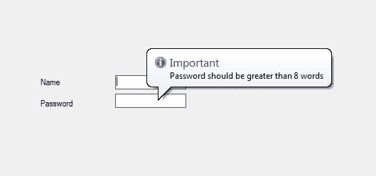

# 如何在 C# 中为 ToolTip 设置自动延迟？

> 原文:[https://www . geeksforgeeks . org/如何设置-自动-延迟-c-sharp 中的工具提示/](https://www.geeksforgeeks.org/how-to-set-automatic-delay-for-tooltip-in-c-sharp/)

在 windows 窗体中，工具提示代表一个微小的弹出框，当您将指针或光标放在控件上时，该框会出现，该控件的目的是提供有关 Windows 窗体中控件的简要说明。在工具提示中，可以使用**自动延迟属性**设置工具提示的自动延迟。
此属性允许您为“自动操作延迟”、“初始延迟”和“刷新延迟”属性设置单独延迟值。每当 AutomaticDelay 属性的值为时，则默认设置以下值:

*   **对于 AutoPopDelay 属性:**默认值为 AutomaticDelay 属性值的 10 倍。
*   **对于 InitialDelay 属性:**默认值等于 AutomaticDelay 属性的值。
*   **对于 ReshowDelay 属性:**默认值为 AutomaticDelay 属性值的 1/5。

这些属性值也可以独立设置。您可以通过两种不同的方式设置此属性:

**1。设计时:**设置 AutomaticDelay 属性值的最简单方法如下步骤所示:

*   **第一步:**创建如下图所示的窗口表单:
    **Visual Studio->File->New->Project->windows formpp**
    
*   **第 2 步:**从工具箱中拖动工具提示并将其放到表单上。当您将此工具提示拖放到窗体上时，它将自动添加到当前窗口中出现的每个控件的属性(在工具提示 1 中命名为工具提示)中。
    T3】
*   **Step 3:** After drag and drop you will go to the properties of the ToolTip and set the value of the AutomaticDelay property.
    

    **输出:**
    

**2。运行时:**比上面的方法稍微复杂一点。在此方法中，您可以借助给定的语法以编程方式设置工具提示的 AutomaticDelay 属性:

```cs
public int AutomaticDelay { get; set; }
```

这里，该属性的值为系统。Int32 类型，延迟总是以毫秒为单位。此属性的默认值为 500。以下步骤显示了如何动态设置工具提示的 AutomaticDelay 属性:

*   **步骤 1:** 使用 ToolTip()构造函数创建工具提示，该构造函数由 ToolTip 类提供。

    ```cs
    // Creating a ToolTip
    ToolTip t = new ToolTip();

    ```

*   **第二步:**创建工具提示后，设置工具提示类提供的工具提示的 AutomaticDelay 属性。

    ```cs
    // Setting the AutomaticDelay property
    t.AutomaticDelay = 600;

    ```

*   **Step 3:** And last add this ToolTip to the controls using SetToolTip() method. This method contains the control name and the text which you want to display in the ToolTip box.

    ```cs
    t.SetToolTip(box1, "Name should start with Capital letter");
    ```

    **示例:**

    ```cs
    using System;
    using System.Collections.Generic;
    using System.ComponentModel;
    using System.Data;
    using System.Drawing;
    using System.Linq;
    using System.Text;
    using System.Threading.Tasks;
    using System.Windows.Forms;

    namespace WindowsFormsApp34 {

    public partial class Form1 : Form {

        public Form1()
        {
            InitializeComponent();
        }

        private void Form1_Load(object sender, EventArgs e)
        {
            // Creating and setting the
            // properties of the Label
            Label l1 = new Label();
            l1.Location = new Point(140, 122);
            l1.Text = "Name";

            // Adding this Label 
            // control to the form
            this.Controls.Add(l1);

            // Creating and setting the 
            // properties of the TextBox
            TextBox box1 = new TextBox();
            box1.Location = new Point(248, 119);
            box1.BorderStyle = BorderStyle.FixedSingle;

            // Adding this TextBox 
            // control to the form
            this.Controls.Add(box1);

            // Creating and setting 
            // the properties of the Label
            Label l2 = new Label();
            l2.Location = new Point(140, 152);
            l2.Text = "Password";

            // Adding this Label 
            // control to the form
            this.Controls.Add(l2);

            // Creating and setting the 
            // properties of the TextBox
            TextBox box2 = new TextBox();
            box2.Location = new Point(248, 145);
            box2.BorderStyle = BorderStyle.FixedSingle;

            // Adding this TextBox 
            // control to the form
            this.Controls.Add(box2);

            // Creating and setting the
            // properties of the ToolTip
            ToolTip t = new ToolTip();
            t.Active = true;
            t.AutoPopDelay = 4000;
            t.InitialDelay = 600;
            t.IsBalloon = true;
            t.ToolTipIcon = ToolTipIcon.Info;
            t.ToolTipTitle = "Important";
            t.AutomaticDelay = 600;
            t.SetToolTip(box1, "Name should start with Capital letter");
            t.SetToolTip(box2, "Password should be greater than 8 words");
        }
    }
    }
    ```

    **输出:**

    