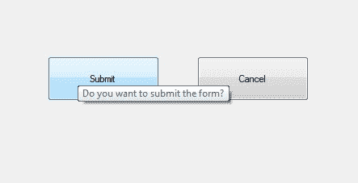
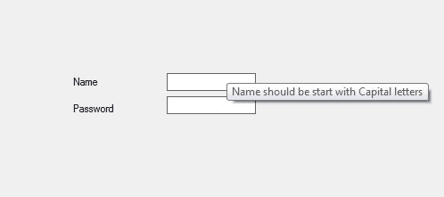

# 如何在 C# 中设置工具提示的自动操作延迟？

> 原文:[https://www . geesforgeks . org/how-set-autoopdelay-of-tooltip-in-c-sharp/](https://www.geeksforgeeks.org/how-to-set-autopopdelay-of-tooltip-in-c-sharp/)

在 windows 窗体中，工具提示代表一个微小的弹出框，当您将指针或光标放在控件上时，该框会出现，该控件的目的是提供有关 Windows 窗体中控件的简要说明。在工具提示中，您可以使用**自动操作延迟属性**设置当指针或光标出现在具有特定工具提示文本的控件上时，工具提示保持可见的时间段。
借助此属性，当光标出现在控件上时，可以增加或减少工具提示框的弹出时间。您可以通过两种不同的方式设置此属性:

**1。设计时:**最简单的方法是设置 AutoPopDelay 属性的值，如以下步骤所示:

*   **第一步:**创建如下图所示的窗口表单:
    **Visual Studio->File->New->Project->windows formpp**
    
*   **Step 2:** Drag the ToolTip from the ToolBox and drop it on the form. When you drag and drop this ToolTip on the form it will automatically add to the properties(named as ToolTip on ToolTip1) of every controls present in the current windows from.

    

*   **Step 3:** After drag and drop you will go to the properties of the ToolTip and set the value of the AutoPopDelay property.
    

    **输出:**
    

**2。运行时:**比上面的方法稍微复杂一点。在此方法中，您可以借助给定的语法以编程方式设置工具提示的自动操作延迟属性:

```cs
public int AutoPopDelay { get; set; }
```

这里，该属性的值为*系统。Int32* 类型，时间周期始终以毫秒为单位。该房产的默认值为 *5000* 。以下步骤显示了如何动态设置工具提示的自动操作延迟属性:

*   **步骤 1:** 使用 ToolTip()构造函数创建工具提示，该构造函数由 ToolTip 类提供。

    ```cs
    // Creating a ToolTip
    ToolTip t = new ToolTip();

    ```

*   **第二步:**创建工具提示后，设置工具提示类提供的工具提示的自动操作延迟属性。

    ```cs
    // Setting the AutoPopDelay property
    t.AutoPopDelay = 4000;

    ```

*   **Step 3:** And last add this ToolTip to the controls using SetToolTip() method. This method contains the control name and the text which you want to display in the ToolTip box.

    ```cs
    t.SetToolTip(box1, "Name should be start with Capital letters");
    ```

    **示例:**

    ```cs
    using System;
    using System.Collections.Generic;
    using System.ComponentModel;
    using System.Data;
    using System.Drawing;
    using System.Linq;
    using System.Text;
    using System.Threading.Tasks;
    using System.Windows.Forms;

    namespace WindowsFormsApp33 {

    public partial class Form1 : Form {

        public Form1()
        {
            InitializeComponent();
        }

        private void Form1_Load(object sender, EventArgs e)
        {
            // Creating and setting the 
            // properties of the Label
            Label l1 = new Label();
            l1.Location = new Point(140, 122);
            l1.Text = "Name";

            // Adding this Label 
            // control to the form
            this.Controls.Add(l1);

            // Creating and setting the 
            // properties of the TextBox
            TextBox box1 = new TextBox();
            box1.Location = new Point(248, 119);
            box1.BorderStyle = BorderStyle.FixedSingle;

            // Adding this TextBox 
            // control to the form
            this.Controls.Add(box1);

            // Creating and setting the
            // properties of the Label
            Label l2 = new Label();
            l2.Location = new Point(140, 152);
            l2.Text = "Password";

            // Adding this Label 
            // control to the form
            this.Controls.Add(l2);

            // Creating and setting the 
            // properties of the TextBox
            TextBox box2 = new TextBox();
            box2.Location = new Point(248, 145);
            box2.BorderStyle = BorderStyle.FixedSingle;

            // Adding this TextBox 
            // control to the form
            this.Controls.Add(box2);

            // Creating and setting the 
            // properties of the ToolTip
            ToolTip t = new ToolTip();
            t.Active = true;
            t.AutoPopDelay = 4000;
            t.SetToolTip(box1, "Name should be start with Capital letters");
            t.SetToolTip(box2, "Password should be greater than 8 words");
        }
    }
    }
    ```

    **输出:**

    