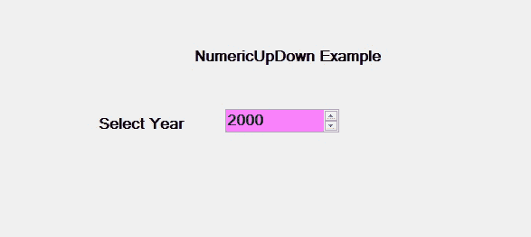

# 如何在 C#中设置 NumericUpDown 中的最小值？

> 原文:[https://www . geeksforgeeks . org/如何设置 c-sharp 中的最小值/numeric up down/](https://www.geeksforgeeks.org/how-to-set-minimum-value-in-numericupdown-in-c-sharp/)

在 windows 窗体中，NumericUpDown 控件用于提供显示数值的 Windows 旋转框或上下控件。或者换句话说，NumericUpDown 控件提供了一个使用上下箭头移动并保存一些预定义数值的界面。在 NumericUpDown 控件中，可以使用**最大属性**设置上下控件的最小值。此属性的默认值为 0。您可以通过两种不同的方式设置该属性:
**1。设计时间:**最简单的方法是按照以下步骤设置数值范围的最小值:

*   **第一步:**创建如下图所示的窗口表单:
    T3】Visual Studio->File->New->Project->windows formapp


*   **步骤 2:** 接下来，如图所示，将 NumericUpDown 控件从工具箱拖放到表单上


*   **步骤 3:** 拖放后，您将进入 numeric pdown 的属性，并设置 numeric pdown 的最小值，如下图所示:


*   **输出:**



**2。运行时:**比上面的方法稍微复杂一点。在此方法中，您可以借助给定的语法以编程方式设置 NumericUpDown 控件的最小值:

```cs
public decimal Minimum { get; set; }
```

这里，这个属性的值代表 NumericUpDown 的最小值。以下步骤显示了如何动态设置 NumericUpDown 的最小值:

*   **第 1 步:**使用 numericpdown()构造函数创建 numericpdown，该构造函数由 numericpdown 类提供。

```cs
// Creating a NumericUpDown
NumericUpDown n = new NumericUpDown();
```

*   **第二步:**创建 numericpdown 后，设置 numericpdown 类提供的 numericpdown 的 Minimum 属性。

```cs
// Setting the minimum value
n.Minimum = 18;
```

*   **第 3 步:**最后使用以下语句将 NumericUpDown 控件添加到表单中:

```cs
// Adding NumericUpDown control on the form
this.Controls.Add(n);
```

*   **示例:**

## c sharp . c sharp . c sharp . c sharp

```cs
using System;
using System.Collections.Generic;
using System.ComponentModel;
using System.Data;
using System.Drawing;
using System.Linq;
using System.Text;
using System.Threading.Tasks;
using System.Windows.Forms;

namespace WindowsFormsApp42 {

public partial class Form1 : Form {

    public Form1()
    {
        InitializeComponent();
    }

    private void Form1_Load(object sender, EventArgs e)
    {
        // Creating and setting the
        // properties of the the labels
        Label l1 = new Label();
        l1.Location = new Point(348, 61);
        l1.Size = new Size(215, 20);
        l1.Text = "Form";
        l1.Font = new Font("Bodoni MT", 12);
        this.Controls.Add(l1);

        Label l2 = new Label();
        l2.Location = new Point(242, 136);
        l2.Size = new Size(103, 20);
        l2.Text = "Enter Age";
        l2.Font = new Font("Bodoni MT", 12);
        this.Controls.Add(l2);

        // Creating and setting the
        // properties of NumericUpDown
        NumericUpDown n = new NumericUpDown();
        n.Location = new Point(386, 130);
        n.Size = new Size(126, 26);
        n.Font = new Font("Bodoni MT", 12);
        n.Value = 18;
        n.Minimum = 18;
        n.Maximum = 30;
        n.BackColor = Color.LightGreen;
        n.ForeColor = Color.DarkGreen;
        n.Increment = 1;
        n.Name = "MySpinBox";

        // Adding this control
        // to the form
        this.Controls.Add(n);
    }
}
}
```

*   **输出:**

