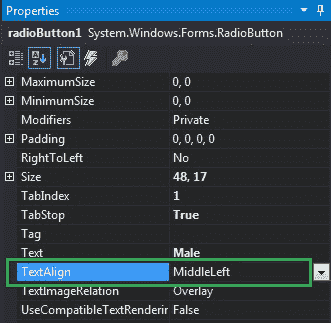
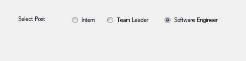

# 如何在 C#中设置单选按钮中文本的对齐方式？

> 原文:[https://www . geesforgeks . org/如何设置 c-sharp 中 radiobutton 中文本的对齐方式/](https://www.geeksforgeeks.org/how-to-set-the-alignment-of-the-text-in-radiobutton-in-c-sharp/)

在 Windows 窗体中，单选按钮控件用于从选项组中选择一个选项。例如，从给定的列表中选择您的性别，因此您将在三个选项中仅选择一个选项，如男性或女性或变性者。在 Windows 窗体中，您可以使用单选按钮的**文本对齐属性**来调整单选按钮的对齐方式。
此属性的值由 ContentAlignment 枚举指定，它包含 9 种不同类型的文本对齐值，即底部居中、底部向左、底部向右、中间居中、中间向左、中间向右、顶部居中、顶部向左和顶部向右。这个属性的默认值是 MiddleLeft。您可以通过两种不同的方式设置此属性:

**1。设计时:**最简单的方法是设置单选按钮文本的对齐方式，如下步骤所示:

*   **第一步:**创建如下图所示的窗口表单:
    **Visual Studio->File->New->Project->windows formpp**
    
*   **步骤 2:** 从工具箱中拖动 RadioButton 控件，并将其放到 windows 窗体上。您可以根据需要在 windows 窗体上的任何位置放置一个 RadioButton 控件。
    T3】
*   **Step 3:** After drag and drop you will go to the properties of the RadioButton control to set the alignment of the text of the RadioButton.
    

    **输出:**
    

**2。运行时:**比上面的方法稍微复杂一点。在此方法中，您可以借助给定的语法以编程方式设置单选按钮控件的文本对齐方式:

```
public override System.Drawing.ContentAlignment TextAlign { get; set; }
```

这里，内容对齐是内容对齐的值。如果该值不属于 ContentAlignment 的值，它将引发*InvalidEnumArgumentException*。以下步骤显示了如何动态设置单选按钮文本的对齐方式:

*   **步骤 1:** 使用 RadioButton 类提供的 radio button()构造函数创建单选按钮。

    ```
    // Creating radio button
    RadioButton r1 = new RadioButton();

    ```

*   **步骤 2:** 创建单选按钮后，设置单选按钮类提供的单选按钮的 TextAlign 属性。

    ```
    // Setting the alignment of the text of the radio button
    r2.TextAlign = ContentAlignment.MiddleLeft;

    ```

*   **Step 3:** And last add this RadioButton control to the form using Add() method.

    ```
    // Add this radio button to the form
    this.Controls.Add(r1);

    ```

    **示例:**

    ```
    using System;
    using System.Collections.Generic;
    using System.ComponentModel;
    using System.Data;
    using System.Drawing;
    using System.Linq;
    using System.Text;
    using System.Threading.Tasks;
    using System.Windows.Forms;

    namespace WindowsFormsApp23 {

    public partial class Form1 : Form {

        public Form1()
        {
            InitializeComponent();
        }

        private void Form1_Load(object sender,
                                 EventArgs e)
        {
            // Creating and setting label
            Label l = new Label();
            l.AutoSize = true;
            l.Location = new Point(176, 40);
            l.Text = "Select Post";

            // Adding this label to the form
            this.Controls.Add(l);

            // Creating and setting the
            // properties of the RadioButton
            RadioButton r1 = new RadioButton();
            r1.AutoSize = true;
            r1.Text = "Intern";
            r1.Location = new Point(286, 40);
            r1.TextAlign = ContentAlignment.MiddleLeft;

            // Adding this label to the form
            this.Controls.Add(r1);

            // Creating and setting the 
            // properties of the RadioButton
            RadioButton r2 = new RadioButton();
            r2.AutoSize = true;
            r2.Text = "Team Leader";
            r2.Location = new Point(356, 40);
            r2.TextAlign = ContentAlignment.MiddleLeft;

            // Adding this label to the form
            this.Controls.Add(r2);

            // Creating and setting the
            // properties of the RadioButton
            RadioButton r3 = new RadioButton();
            r3.AutoSize = true;
            r3.Text = "Software Engineer";
            r3.Location = new Point(470, 40);
            r3.TextAlign = ContentAlignment.MiddleLeft;

            // Adding this label to the form
            this.Controls.Add(r3);
        }
    }
    }
    ```

    **输出:**

    