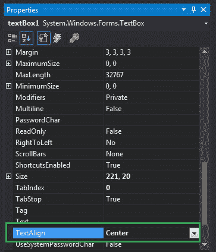

# 如何在 C#中设置文本框中文本的对齐方式？

> 原文:[https://www . geeksforgeeks . org/如何设置 c-sharp 文本框中文本的对齐方式/](https://www.geeksforgeeks.org/how-to-set-the-alignment-of-the-text-in-the-textbox-in-c-sharp/)

在 Windows 窗体中，文本框扮演着重要的角色。在文本框的帮助下，用户可以在应用程序中输入数据，可以是单行的，也可以是多行的。在文本框中，您可以使用文本框的**文本对齐属性**来设置文本框中文本的对齐方式。该属性的默认值为*水平对齐左侧*。在 Windows 窗体中，可以通过两种不同的方式设置此属性:

**1。设计时:**设置文本框的 TextAlign 属性是最简单的方法，如下步骤所示:

*   **步骤 1:** 创建一个窗口表单。
    **Visual Studio - >文件- >新建- >项目- >窗口形式程序**
    T6】
*   **步骤 2:** 从工具箱中拖动 TextBox 控件，并将其放到窗口窗体上。您可以根据需要将文本框放置在 windows 窗体上的任何位置。
    T3】
*   **Step 3:** After drag and drop you will go to the properties of the TextBox control to set the TextAlign property of the TextBox.
    

    **输出:**
    

**2。运行时:**比上面的方法稍微复杂一点。在此方法中，您可以借助给定的语法以编程方式设置文本框的 TextAlign 属性:

```
public System.Windows.Forms.HorizontalAlignment TextAlign { get; set; }
```

这里，*水平对齐*用于表示*水平对齐*枚举值，指定文本在文本框控件中的对齐方式。以下步骤用于设置文本框的文本对齐属性:

*   **步骤 1 :** 使用文本框类提供的*文本框()构造函数*创建一个文本框。

    ```
    // Creating textbox
    TextBox Mytextbox = new TextBox();

    ```

*   **步骤 2 :** 创建文本框后，设置文本框类提供的文本框的 *TextAlign* 属性。

    ```
    // Set TextAlign property
    Mytextbox.TextAlign = HorizontalAlignment.Center;

    ```

*   **Step 3 :** And last add this textbox control to from using Add() method.

    ```
    // Add this textbox to form
    this.Controls.Add(Mytextbox);

    ```

    **示例:**

    ```
    using System;
    using System.Collections.Generic;
    using System.ComponentModel;
    using System.Data;
    using System.Drawing;
    using System.Linq;
    using System.Text;
    using System.Threading.Tasks;
    using System.Windows.Forms;

    namespace my {

    public partial class Form1 : Form {

        public Form1()
        {
            InitializeComponent();
        }

        private void Form1_Load(object sender, EventArgs e)
        {

            // Creating and setting the properties of Lable1
            Label Mylablel = new Label();
            Mylablel.Location = new Point(96, 54);
            Mylablel.Text = "Enter City";
            Mylablel.AutoSize = true;
            Mylablel.BackColor = Color.LightGray;

            // Add this label to form
            this.Controls.Add(Mylablel);

            // Creating and setting the properties of TextBox1
            TextBox Mytextbox = new TextBox();
            Mytextbox.Location = new Point(187, 51);
            Mytextbox.BackColor = Color.LightGray;
            Mytextbox.ForeColor = Color.DarkOliveGreen;
            Mytextbox.AutoSize = true;
            Mytextbox.Name = "text_box1";
            Mytextbox.TextAlign = HorizontalAlignment.Center;

            // Add this textbox to form
            this.Controls.Add(Mytextbox);
        }
    }
    }
    ```

    **输出:**
    